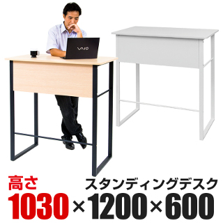

自宅にスタンディングデスクを導入して1年が経ちます。
オフィスでもスタンディングデスクが導入されつつあるので、これを機に感想を書いてみます。

[{{}}](http://www.office-com.jp/products/detail.php?product_id=181898)

買ったのは1万円ちょっとの、安物のデスク。

結論
----

結論から述べると、導入してよかったと思えるし、椅子の生活には戻れません。
健康のために無理して使い続けているわけではなく、**立った姿勢が快適だから**です。

一般的に長時間の座りながらの作業は健康に悪いとされており、そういった職業の人間にはスタンディングデスクが勧められます。
あいにく自分は医者でもなければ整体師でも無いので、医学的根拠や利点は書けません。
なので、自分が自宅に導入してみた感想を書いてみます。

重い腰を上げることが無くなった
------------------------------

例えば外出の予定があるとき、外出の直前まで作業をするとします。
椅子から立ち上がる時、疲労感がなかったとしても腰は重く感じます。
スタンディングデスクではその感覚がなく**腰が軽い**です。
つまり、立ち上がりの「よっこいしょ」がありません。
なぜなら腰を下ろしていないからです。 
作業をさっと切り上げて、姿勢を変えずに玄関まで歩いていけます。

オフィスでも打ち合わせに行く時、椅子での作業では頭と体の切り替えが必要でした。
しかしスタンディングデスクだと、その足で打ち合わせに向かうことができます。
些細な差かもしれませんが、明らかに身の軽さが違います。
姿勢の切り替わりがなくなり、心もスムーズに切り替えることができました。

椅子がいらない
--------------

そもそもの導入のきっかけは、去年の春の引っ越しでした。
デスクがなく買う必要があったのですが、思い切ってスタンディングデスクを購入してみた。
結果として、椅子を買う必要がなくなりました。

椅子のない生活は部屋を広く使えるだけでなく、掃除の手間も減ります。
それだけでなく、椅子で床を傷つけることもなければ寝落ちの心配もありません。
中途半端に安い椅子で腰を傷めず、家具の出費も最小限に抑えることができました。

疲れないの？
------------

最初の1週間ほど、**体に馴染むまで疲れました**。
それだけでなく、普段あまりない姿勢で長時間立つため、体が痛いです。
特に、硬い床に対して一番圧がかかる、かかとが痛かったのを覚えています。
しかしその1周間がすぎると、疲れることは特に無いですし、体が痛かったことも忘れました。

今すぐ導入すべきか？
--------------------

自分はあまり、人にスタンディングを勧めません。
スタンディングデスクを導入するには、2・3日の試用だけでは不十分です。
短い期間だけ使ってみると、たいてい不満しか出てこないです。
しかし体に馴染んでからは、驚くほどに疲れないので、本気で導入するには覚悟が必要となります。
それでも、もし高い椅子の購入を考えているのなら、スタンディングデスクも考慮に入れてみてはどうでしょうか。

