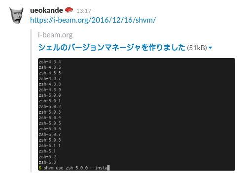

このブログは[Middleman Blog](https://middlemanapp.com/basics/blogging/)で構築していますが、今更ながらOpen Graph protocolに対応しました。その設定方法についてまとめます。

Open Graph protocolとは
-----------------------

Open Graph property (OGP) とは、Facebookが提案した、リンク先のWebページのの情報を表示してくれる仕組みです。
現在ではTwitterやSlackもOGPに対応しています。

{{}}  

TwitterはOGPだけでなく独自の[Twitter Cards](https://dev.twitter.com/cards/overview)にも対応しており、よりTwitterに特化した情報を記述できます。

WebページをOGPに対応させるには、HTMLに`<meta>`タグでそのページの情報を埋め込みます。
例えばこの記事は以下のようなタグをページ内に使用しています。

```html
<meta property="og:type" content="article">
<meta property="og:title" content="Middleman BlogでOpen Graph protocol">
<meta property="og:description" content="このブログはMiddleman Blogで構築していますが、今更ながらOpen Graph protocol に対応しました。その設定方法についてまとめます。">
<meta property="og:url" content="https://i-beam.org/2017/06/25/middleman-blog-open-graph/">
<meta property="og:image" content="https://i-beam.org/2017/06/25/middleman-blog-open-graph/og-slack.png">
```

少しのRubyコードを書くことで、Middleman Blogで`<meta>`タグページ内に埋め込むことができます。

ヘルパメソッドを書く
--------------------

`<meta>`タグに指定するための、３つの情報を取得するヘルパメソッドを作ります。

1. 記事のURL
2. 記事のサマリーテキスト
3. 記事のサムネイル画像のURL

まず画像や記事のURLをMiddlemanのビルド時に知るために、`config.rb`にページのエンドポイントを指定します。

```rb
# config.rb
set :endpoint, 'https://i-beam.org/'
```

これで`config[:endpoint]`で、ブログのルートパスを取得できます。

次に、[BlogArticle](http://www.rubydoc.info/github/middleman/middleman-blog/Middleman/Blog/BlogArticle)オブジェクトから、サマリーやサムネイル画像のURLを取得するメソッドを書きます。
ヘルパメソッドは`lib/article_helpers.rb`に定義します。
記事のサマリーテキストとサムネイル画像のURLは、それぞれ最初の`<p>`タグ、``タグから取得します。

```rb
# lib/article_helpers.rb

module ArticleHelpers

  # 記事のURLを返す。
  def href(article)
    URI.join(config[:endpoint], article.url).to_s
  end

  # 記事のサマリーを返す。
  def first_paragraph_text(article)
    rendered = article.render(layout: false, keep_separator: false)
    tags = Nokogiri::HTML.parse(rendered).css('p')
    text = tags.map(&:text).find {|content| !content.empty? }
    text ? text.delete("\n") : article.title
  end

  # 記事のサムネイル画像のURLを返す。
  def first_img_href(article)
    rendered = article.render(layout: false, keep_separator: false)
    img = Nokogiri::HTML.parse(rendered).css('img').first
    return nil unless img

    src = img.attribute("src").value
    URI.join(config[:endpoint], src).to_s
  end

end
```

そしてページ内からヘルパメソッドを呼び出すために、`config.rb`で設定します。

```rb
# config.rb
require 'lib/article_helpers'

helpers ArticleHelpers
```

`<meta>`タグを記述する
----------------------

`<meta>`タグをHTMLに埋め込みます。
Middleman Blogのデフォルトの設定では、 `source/layouts/post_layout.erb`が各記事のページのレイアウトファイルとなります。
このファイルに`<head>`の中に、`<meta>`タグを記述します。

```erb
<!-- source/layouts/post_layout.erb -->
<meta property="og:type" content="article"/>
<meta property="og:title" content="<%= current_article.title %>"/>
<meta property="og:description" content="<%= first_paragraph_text(current_article) %>"/>
<meta property="og:url" content="<%= href(current_article) %>"/>
<meta property="og:image" content="<%= first_img_href(current_article) %>">
```

Slackの自分チャネルや、[Twitter Card Validator](https://cards-dev.twitter.com/validator)で表示が確認されればOKです。
