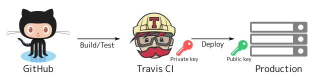

このブログは[Middleman Blog](https://middlemanapp.com/basics/blogging/)で構築していますが、今更ながら**継続的デリバリー**できる仕組みを整えました。
以前は手元で`middleman build`して温かみある手動scpでデプロイしてましたが、2017年にもなって自動化もできてないのは笑われるので、Travis CIから自分のVPSに自動デプロイできるようにしました。

構成
----



よくある感じです。GitHub上へmasterブランチがPushされると、Travis CIが自動でビルドしてProductionにデプロイします。
Travis CIにSSHの秘密鍵、Productionに公開鍵を登録しておいき、その鍵で認証します。

デプロイされたファイルはタイムスタンプのディレクトリに格納され、`current` というシンボリックリンクが最新のディレクトリを指します。
フロントのWebサーバは `current` をドキュメントのルートディレクトリになるよう設定します。

```console
$ ls -l /home/www/
total 20
drwxr-xr-x 18 www www 4096 Jun 25 15:03 2017-06-25T20:56:47.097207716Z
drwxr-xr-x 17 www www 4096 Jun 25 21:00 2017-06-25T21:01:02.149269682Z
drwxr-xr-x 17 www www 4096 Jun 25 21:04 2017-06-25T21:04:35.115184087Z
drwxr-xr-x 17 www www 4096 Jun 25 21:33 2017-06-25T21:33:41.943710869Z
drwxr-xr-x 17 www www 4096 Jun 25 21:40 2017-06-25T21:41:16.808334145Z
lrwxrwxrwx  1 www www   30 Jun 25 21:41 current -> 2017-06-25T21:41:16.808334145Z
```

SSH鍵を作る
-----------

Travis CIからProductionに認証するためのSSH鍵を作ります。

```console
$ ssh-keygen -t rsa -N '' -f deploy_key
```

秘密鍵をTravis CIが提供しているCLIツールから行います。
ファイルは暗号化して保存され、リポジトリにひも付きます。
詳しくは[公式ドキュメント][encrypting-files]をどうぞ。

```console
$ gem install travis
$ travis login
$ travis encrypt-file deploy_key  -r organization/repository
```

ファイル登録時に複合鍵（`*.enc`ファイル）と復元方法が表示されるので、そのファイルはリポジトリに追加します。
その複合鍵を使って、デプロイ時に秘密鍵を復元します（後述）。

Web用のユーザを作る
-------------------

Productionにwwwユーザを作ります。
このユーザのホームディレクトリに生成物がデプロイされます。

```console
$ sudo sh <<EOF
  groupadd www
  useradd -g www -s /bin/sh www
  mkdir -p /home/www/
  chmod www:www /home/www/
EOF
```

そして公開鍵を埋め込みます。

```console
$ sudo -u www sh <<EOF
  mkdir /home/www/.ssh
  chmod 700 /home/www/.ssh
  echo 'sh-rsa XXXXXXXXXXXXXXXXXXXXXXXXXXXXXXX' >>/home/www/.ssh/authorized_keys
  chmod 600 /home/www/.ssh/authorized_keys
EOF
```

デプロイスクリプトを書く
------------------------

デプロイ先情報はリポジトリではなくTravis CIに保存したいので、Travis CIのRepository Settingsから `REMOTE_HOST`, `REMOTE_PORT`, `REMOTE_USER` を設定します。
これで第三者はデプロイ先を見ることができません。
詳しくは[公式ドキュメント][variables]をどうぞ。

次にデプロイスクリプトをシェルスクリプトで書きます。

```bash
#!/bin/bash -e

fatal() {
  echo $@
  exit 1
}

# sshコマンドのラップ
remote() {
  ssh -q -o "StrictHostKeyChecking no" -i deploy_key -l "$REMOTE_USER" -p "$REMOTE_PORT" "$REMOTE_HOST" $@
}

[ -z "$REMOTE_HOST" ] && fatal 'REMOTE_HOST is not set'
[ -z "$REMOTE_PORT" ] && fatal 'REMOTE_PORT is not set'
[ -z "$REMOTE_USER" ] && fatal 'REMOTE_USER is not set'

# buildディレクトリをProductionにコピー
tar cvf - build | remote tar xvf -

remote <<EOF
  set -e

  # buildディレクトリをタイムスタンプにmvして、currentを更新
  last_built=\$(date +'%Y-%m-%dT%H:%M:%S.%NZ')
  mv build \$last_built
  ln -sf \$last_built -T current.tmp
  mv -T current.tmp current

  # 5件より古いファイルは削除
  rm -rf \$(ls -I current | head -n-5)
EOF
```

最後に`.travis.yml`にビルド処理とデプロイ処理を書きます。
`before_deploy`に、先ほど作成した秘密鍵を復元する処理を書きます。
そして `deploy` に、記述したスクリプトを呼び出します。

```yaml
# .travis.yml
script:
  - bundle exec middleman build
before_deploy:
  - openssl aes-256-cbc -K $encrypted_xxxxxxxxxxxx_key -iv $encrypted_xxxxxxxxxxxx_iv -in deploy_key.enc -out deploy_key -d
  - chmod 600 deploy_key
deploy:
  provider: script
  script:
    - "./bin/deploy"
  on:
    branch: master
```

以上で設定は終わりです。
masterにpushしてみて、Productionに生成物が配置されて`current`が切り替わればOKです。
念の為Travis CIのログに、見られたらいけない情報が流れていないかも念入りにチェックしましょう。

[encrypting-files]: https://docs.travis-ci.com/user/encrypting-files/
[variables]: https://docs.travis-ci.com/user/environment-variables/#Defining-Variables-in-Repository-Settings
