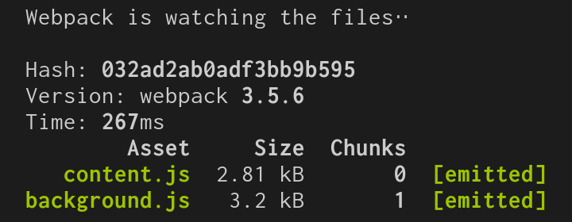

Firefoxはバージョン48からWebExtensionsのサポートを始め、そして2017年11月にリリースされるバージョン57で、旧APIを使ったAdd-onsのサポートを打ち切ります。
この意向に嘆くFirefoxユーザも少なくないでしょうが、Mozillaも脆弱性の温床だった旧Add-ons APIを早く捨てたかったんじゃないでしょうか。
Microsoft EdgeもWebExtensionsをサポートしているそうで、よりWebExtensionsの機運が高まってます。

この記事ではwebpackとbabelを使ったモダンな、WebExtensionsの開発環境を構築する方法を紹介します。
完成品はGitHubで公開してます。

![github][ueokande/web-extensions-tutorial]


ビルド環境を整える
------------------

ビルド環境は、webpackとbabelを使ってES2015のJavaScriptをビルドして、バンドルされたJavaScriptを出力したいと思います。
まずnpmで必要なパッケージをインストールします。

```sh
npm init
npm install -D webpack babel-loader babel-core babel-preset-es2015
```

次に `webpack.config.js` をプロジェクトのルートに配置します。

```javascript
const path = require('path');

const src = path.resolve(__dirname, 'src');
const dist = path.resolve(__dirname, 'build');

module.exports = {
  entry: {
    content: path.join(src, 'content'),
    background: path.join(src, 'background')
  },

  output: {
    path: dist,
    filename: '[name].js'
  },

  module: {
    loaders: [
      {
        test: /\.js$/,
        exclude: /node_modules/,
        loader: 'babel-loader',
        query: {
          presets: [ 'es2015' ]
        }
      },
    ]
  },

  resolve: {
    extensions: [ '.js' ]
  }
};
```

この設定で、`background.js` と`content.js` の2つのJavaScriptを生成します。
`content.js`はcontent scriptsと呼ばれるもので、HTML上でロードされるファイルです。
`background.js` はbackground scriptsと呼ばれるもので、contet scriptsと独立したプロセスで動作します。

webpackは`src/content`, `src/background`に配置したjavaScriptをビルドして、バンドルされたJavaScriptを`build`ディレクトリに生成します。
空のJavaScriptを配置して、webpackがビルドできるようにします。

```sh
mkdir -p src/{background,content}
touch src/{background,content}/index.js
```

webpackが正常にビルドできるか確認します。
ビルドすると`build`ディレクトリに`content.js`と`background.js`が生成されるはずです。

```sh
node_modules/.bin/webpack
```

開発用に`package.json`にビルドスクリプト`"start": "webpack -w --debug"`を登録しましょう。

マニフェストファイルを配置する
------------------------------

WebExtensionsはマニフェストファイルが必要になります。
プロジェクトのルートに`manifest.json`をファイルを作ります。

```json
{
  "manifest_version": 2,
  "name": "Web Extension Template",
  "description": "Web Extensions tutorial for Google Chrome/Chromium and Firefox.",
  "version": "1.0.0",
  "content_scripts": [
    {
      "matches": [ "http://*/*", "https://*/*" ],
      "js": [ "build/content.js" ]
    }
  ],
  "background": {
    "scripts": [
      "build/background.js"
    ]
  }
}
```

そしてブラウザでプラグインをロードします。
Firefoxの場合は`about:config`を開き「Load Temporary Add-ons」からロードします。
Google Chrome/Chromiumは`chrome://extensions`を開き「Load unbacked extension...」からロードします。
これでエラーが表示されなければOKです。

WebExtensionsの開発を始める
---------------------------

ここまでで必要な環境は揃いました。
簡単なWebExtensionsを記述してみましょう。
まずは先程登録した`npm start`で`webpack`を起動してます。
これでwebpackがファイル変更を検知して、自動でビルドします。

`h`/`l`キーでタブの切り替えをできる簡単なWebExtensionsを作ってみます。
まずは`src/content/index.js`からです。

```javascript
//  src/content/index.js
window.addEventListener("keypress", (e) => {
  if (e.key === 'h') {
    chrome.runtime.sendMessage({ type: 'tabs.prev' });
  } else if (e.key  === 'l') { // L
    chrome.runtime.sendMessage({ type: 'tabs.next' });
  } else {
    return;
  }

  e.stopPropagation();
  e.preventDefault();
});
```

content scriptsからは`window`やDOM操作ができます。
そして`chrome`オブジェクトでWebExtensions APIにアクセスできます。
この例ではキーが押されると`chrome.runtime.sendMessage()`を呼び出して、background scriptsにメッセージを送ります。

つぎにbackground scripts側です。
`chrome.runtime.onMessage.addListener()`で、メッセージのイベントリスナを登録します。
この例ではメッセージを受け取った気にタブを切り替える処理を記述しています。

```javascript
//  src/background/index.js
function selectPrevTab(current) {
  chrome.tabs.query({ currentWindow: true }, (tabs) => {
    let index = (current.index - 1 + tabs.length) % tabs.length;
    chrome.tabs.update(tabs[index].id, { active: true });
  });
};

function selectNextTab(current) {
  chrome.tabs.query({ currentWindow: true }, (tabs) => {
    let index = (current.index + 1) % tabs.length;
    chrome.tabs.update(tabs[index].id, { active: true });
  });
};

chrome.runtime.onMessage.addListener((request, sender) => {
  switch (request.type) {
  case 'tabs.prev':
    selectPrevTab(sender.tab);
    break;
  case 'tabs.next':
    selectNextTab(sender.tab);
    break;
  }
});
```

以上で全ての手順は終了です。
WebExtensionsも基本的にJavaScriptなので、モダンな環境で開発を始められます。
またESLintやmochaといった既存の資源を使って、普通のJavaScriptと同じように開発を進めることができます。
