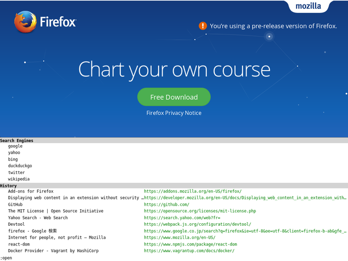
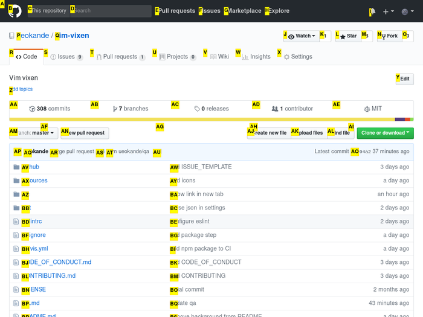

Twitterでは何度も告知しているのですが、FirefoxでVi 風の操作ができる「Vim Vixen」というプラグインを作りました。

{{}}
{{}}



## 背景

FirefoxはこれまでAdd-onsを記述するのに、Firefox独自のAPIを提供していました。
しかしMozillaは従来のAdd-ons APIを廃止することを決定し、代わりにChrome Extensions互換のWebExtensions APIを使ったアドオンに移行すると[発表しました](https://blog.mozilla.org/addons/2015/08/21/the-future-of-developing-firefox-add-ons/)（もう2年も前の話です）。
そしてFirefox 57からは、旧Add-ons APIを完全に廃止します。

さてこの意向に誰が困るかと言うと、多くのFirefoxユーザです。
現状多くのAdd-onsが旧AP を使っています。
そして自分も、旧APIをふんだんに使っているVimperatorやVimFxのユーザだったので、Firefox 57からはマウスでWebブラウジングするはめとなります。

同じコンセプトのChrome Extensionとして[Vimium](https://github.com/philc/vimium)があります。
こちらも5年以上前から存在する、歴史あるプラグインです。
その分、安定性などはありますが、ちょっと使ってみてVimperatorと目指しているものが少し違うような気がしました。

さてどうしようかと迷った結果、自分で作ることを決意しました。

## Vim Vixenのこれから

Vim Vixenはまだリリースされて間もないアドオンです。
そのためまだまだ足りない機能も多く、不安定な部分もあります。
使用していて何か気づいたときは遠慮なく[Issues](https://github.com/ueokande/vim-vixen/issues)までどうぞ。

