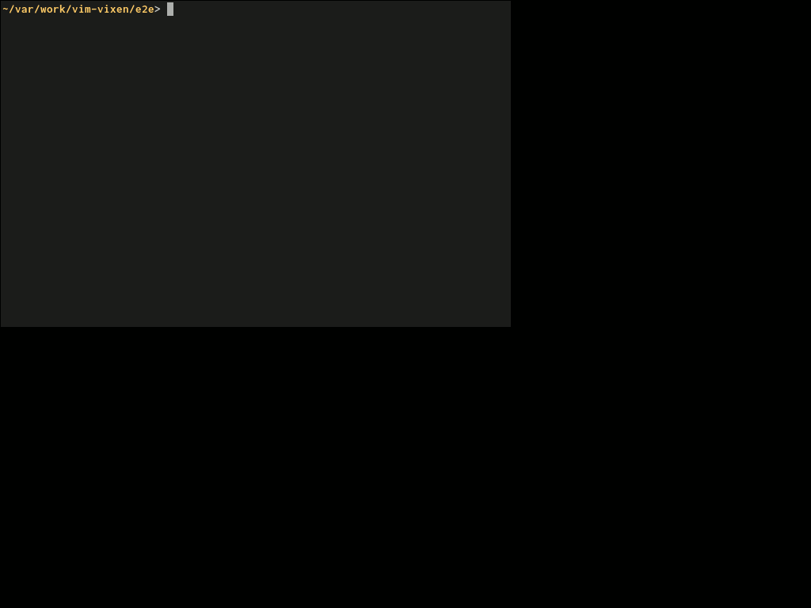

Vim Vixenの開発では、開発スピードではなく品質を重視しており、毎リリース直前にフルリグレッションテストを行ってます。
それらの試験を手動で行っており、各リリース前に[QA Pull Req.](https://github.com/ueokande/vim-vixen/pull/314)に試験結果を記録してます。

現在の試験項目は100を超えてます。
品質は大事にするとはいえ、各リリース毎に手動で試験を行うのは、地道で退屈な作業です。
今後機能追加などで更に試験項目数や複雑な試験が増えることは予想されます。
このままでは将来、同様の品質を保つのは難しいと思い、Vim VixenでもE2Eテストの自動化を始めることにしました。

## 構成

WebExtensionsをテストするには、テストのセットアップや実行結果を観測するために、WebExtensionsと同等の権限が必要です。
KarmaのFirefox launcher上で実行するJavaScriptは、ページにロードされるJavaScriptなので、そこまでの権限はありません。
そこでWebExtensionsをテストするための、ヘルパー的なWebExtensionsを新たに作りました。
これを **ambassadorアドオン** と名付けています。

Karmaで実行されるJavaScriptから、Vim Vixenのテストのセットアップや実行結果を取得するフローは次の図のようになります。
Karma上のJavaScriptから、ambassadorアドオンを介して、タブの状態の取得や、他のタブのページの情報を取得します。


## ambassadorアドオン

Page ScriptからContent Scriptにメッセージを送るには、Page Scriptが自身のWindowに`window.postMessage()`でメッセージを発行します。
WebExtensionsのContent Scriptは、ページと同じWindowにアクセスできます。
そのためPage Scriptから投げられたメッセージは、Content Scriptでも受け取れます。
ambassadorアドオンのContent Scriptは `window.addEventListener('message', callback)` でメッセージを受け取ります。

ambassadorアドオンのContent Scriptがメッセージを受け取ると、その先はWebExtensionsにある `runtime.sendMessage()` でambassadorアドオンのBackground Scriptにメッセージを送信します。
新たなタブを作成したり、他のタブ情報の取得は、Background Scriptから取得できます。
その結果を再びPage Scriptに返すには、Content Scriptに`sendResponse()`で結果を返し、Content Scriptから`window.postMessage()`でメッセージをPage Scriptに返します。

Vim Vixenのメッセージは、Background Scriptだけでなく、他のタブにメッセージを送ることが多いです。
その場合は宛先のタブIDをメッセージに付与させ、それをBackground Scriptを経由して、他のタブのContent Scriptに送ります。
Karmaが実行しているタブを閉じるとテストが終了するので、試験は新たに作成したウィンドウ上で試験します。
そのためKarmaから他のタブに対して、キーボード入力をしたり、ページの結果(スクロール量など)を取得します。

## Karma launcher

Karmaが提供している[karma-firefox-launcher](https://github.com/karma-runner/karma-firefox-launcher)はWebExtensionsに対応してません。
そのためVim Vixenやambassadorアドオンのロードができません。
そこでMozillaが提供している、WebExtensions開発ツールである[web-ext](https://github.com/mozilla/web-ext)を使うことにしました。
web-extはWebExtensionsのアーカイブを作成したり、WebExtensionsをロードしたFirefoxを起動したりできるツールです。

本家のweb-extは、現在は複数のWebExtensionsができません（[Issueはあがってる](https://github.com/mozilla/web-ext/issues/1107)）。
なので自分で複数のWebExtensionsをロードできるよう修正しました。
そしてKarma用のlauncherを定義して、修正したweb-extを起動するようにします。
以上でKarmaからVim VixenとambassadorアドオンをロードしたFirefoxが起動できるようになりました。
具体的な実装はここらへんです。

- [web-extの修正](https://github.com/mozilla/web-ext/compare/master...ueokande:patched-2.3.2?expand=1)
- [Karma launcherの実装](https://github.com/ueokande/vim-vixen/blob/master/e2e/karma-webext-launcher.js)


## テストを書く。

Karmaからambassadorアドオンとのやり取りは、クライアントライブラリとしてメッセージ送信をラップして、ambassadorアドオンに含めました。
以下の例は、`gg` を押すとページのトップにスクロールするかの試験です。

```javascript
import * as windows from "../ambassador/src/client/windows";
import * as tabs from "../ambassador/src/client/tabs";
import * as keys from "../ambassador/src/client/keys";
import * as scrolls from "../ambassador/src/client/scrolls";

describe("scroll test", () => {
  let targetWindow;
  let targetTab;

  before(() => {
    return windows.create().then((win) => {
      targetWindow = win;
      return tabs.create(targetWindow.id, "localhost:11111");
    }).then((tab) => {
      targetTab = tab;
    });
  });

  it('scrolls top by gg', () => {
    return scrolls.set(targetTab.id, 100, 100).then(() => {
      return keys.press(targetTab.id, 'g');
    }).then(() => {
      return keys.press(targetTab.id, 'g');
    }).then(() => {
      return scrolls.get(targetTab.id);
    }).then((actual) => {
      expect(actual.y).to.be.equals(0);
    });
  });
});
```

まず `before()` メソッドで、試験前に`windows.create()`メソッドでテスト用のウィンドウを作成します。
Windowが作成できたら(Promiseがresolveされたら)、そのWindow IDに対して新たにタブを作成します。
そしてタブが作成できてページがロードされたら、作成されたタブの情報を`targetTab`に格納します。

試験では、まず`scrolls.set()` で、`targetTab` のスクロール量を(100, 100)にセットします。
そして`g`キーを2度送信し、最後に`scrolls.get()`で現在のスクロール量取得します。

改めて見るとES7の`await`構文と親和性が高そうですね。そのうち書き直します。

## おわりに

この記事を公開した現在、まだ1割程度の試験しか自動化できてないです。
これから機能が増えると試験項目は増えますが、全ての試験を自動化できるとは思いません。
しかし自動化は良いことなので、これからも継続的に試験の自動化を行いたいと思います。
