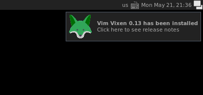

お待たせしました。先日Vim Vixen0.13をリリースしました。

- [Vim Vixen – Add-ons for Firefox][vim-vixen-amo]

このバージョンでは多くの機能が追加されました。
主な機能を簡単に紹介したいと思います。

## ページソースの表示

現在のタブの、ページソースを表示できるようになりました。
デフォルトは<kbd>g</kbd><kbd>f</kbd>に設定されます。
古いバージョンから更新したユーザーは、以下の設定を設定画面の`"keymaps"`以下に追加してください。

```json
{
  "keymaps": {
    "gf": { "type": "page.source" }
  }
}
```

## リンクフォローの強化

リンクフォロー（<kbd>F</kbd>キー）で開くタブの機能が強化されました。
新たなタブをバックグラウンドで開くことができるようになりました。
この機能はキーマップで変更可能です。

```json
{
  "keymaps": {
    "F": { "type": "follow.start", "newTab": true, "background": false }
  }
}
```

新たなタブを、現在のタブの隣に開くことができるようになりました。
この機能はプロパティで設定可能です。

```json
{
  "properties": {
    "adjacenttab": true
  }
}
```

あるいはコマンドラインから一時的に機能を有効・無効を切り替えられます。

```vim
:set adjacenttab        " 有効化
:set noadjacenttab      " 無効化
```

## 更新ポップアップの表示

このバージョンから、Vim Vixenを新規インストールまたはバージョンアップしたとき、ユーザーにポップアップで通知するようになりました。
ポップアップをクリックすると、リリースノートを参照できます。
これまでは。Add-onがバージョンアップされたときにユーザーに通知がされませんでした。
そのためバージョンアップで新しい機能が入っても、それをユーザーに通知する術がありませんでした。。
バージョン0.13以降では、ユーザーはVim Vixenの変更点や新しい機能にいち早く気づくことができます。

{{}}

## `quit`/`bdelete`/`bdeletes`コマンドの追加

コマンドラインからのタブを閉じれるようになりました。`quit`コマンドは、現在開いてるタブを閉じます。

```vim
:quit
```

`bdelete`タブは入力したキーワードまたはURLに一致する単一のタブを削除し、`blodetes`はキーボードに一致する複数のタブの削除します。
これらのコマンドはピン留めされてないタブのみを削除できます。
ピン留めしたタブを閉じるには `bdelete!`、`blodetes!` コマンドを使います。

```vim
:bdelete <keywords>       " キーワードにマッチする単一のタブを閉じる（ピン留めされたタブは除外）
:bdelete! <keywords>      " キーワードにマッチする単一のタブを閉じる（ピン留めされたタブを含む）
:bdeletes <keywords>      " キーワードにマッチするすべてのタブを閉じる（ピン留めされたタブは除外）
:bdeletes! <keywords>     " キーワードにマッチするすべてのタブを閉じる（ピン留めされたタブを含む）
```

## ツールバーアイコン

ブラウザーのツールバーに、アイコンを表示するようになりました。
このアイコンは、Vim Vixenの有効・無効状態（<kbd>Shift</kbd>+<kbd>Esc</kbd>で切り替えや、[ブラックリスト][blacklist]で設定できます）を表示します。
またこのアイコンをクリックすることで、Vim Vixenの有効・無効状態を切り替えることができるようになりました。

<div>
  
  </p>
</div>

## ブックマーク操作の対応

これまで多くの要望が上がってた、ブックマーク周りの機能を強化しました。
まず、 `:open`, `:tabopen`, `:winopen` コマンドのURLを、ブックマークから補完するようにしました。
コマンドの引数に適当なキーワードを入力すると、そのタイトルまたはURLにマッチするブックマークを表示します。

{{}}

また`addbookmark` コマンドで、ブックマークの作成に対応しました。

```vim
:addbookmark My favorite page
```

`addbookmark` コマンドのショートカットに、キーマップで`command.show.addbookmark`に設定すると、素早くブックマークを作成できます（デフォルトは<kbd>a</kbd>キー）。

```json
"a": { "type": "command.show.addbookmark", "alter": true },
```

[vim-vixen-amo]: https://addons.mozilla.org/en-US/firefox/addon/vim-vixen/
[blacklist]: https://github.com/ueokande/vim-vixen#blacklist
