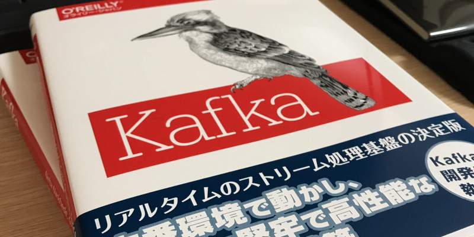

2018年8月3日に、オライリー・ジャパンから「Kafka: The Definitive Guide」の日本語訳が発売されます。
自分はこの本で、監訳という形で出版に携わらせてもらいました。

この本について
--------------

原書「Kafka: The Definitive Guide」は、Apache Kafkaの開発者たちによって執筆されてます。
本書はその和訳版です。

本書は、リアルタイムのストリーム処理基盤であるKafkaを使ったシステムの構築方法や、本番環境で運用するための手続きについて紹介しています。
本書ではKafkaのインストールから、Kafka APIを使ったアプリケーション、データパイプラインの構築方法、そしてKafka運用に必要なモニタリングやオペレーションをカバーしています。
またKafkaを使ったサービスのデザインパターンや、Kafkaの内部構造についても紹介しています。
これからKafkaの導入を考えてる人や、すでにKafkaのアプリケーションを開発・運用している人にとって必携の一冊です。

原書との違い
------------

原書「Kafka: The Definitive Guide」が発行されたのは2017年9月です。
Kafkaはそれ以降もアップデートを繰り返して、遂に2017年11月に安定バージョンの1.0.0もリリースされました。
本書の対象は、執筆同時の最新版であるKafka 1.1.0を対象としています。

本書と原著との大きな変更点は、以下のとおりです。

**第3章**  
Kafka 0.11.0から新たに「レコードヘッダ」が追加されました。
第3章にレコードヘッダを利用したデータの書き込みについて追記しました。

**第9章**  
一部のKafkaの管理ツールが新しくなりました。
管理機能の強化やパラメーターの変更などが含まれます。
第9章でもKafka 1.1.0に付属するツールにあわせて書き換えています

**第11章**  
Kafka Stream APIが、バージョン1.0.0から大幅に変更されました。 それに伴い古いバージョンのAPIの利用は非推奨となりました。
第11章でも古いAPIを利用していた部分を、新しいバージョン1.0.0のAPIを利用するように変更いたしました。

その他、全体を通してプロパティー名やデフォルト値を、新しいKafkaのバージョンに合わせて変更いたしました。
また原書で指摘されていた、100件を超えるエラッタやサンプルコードのミスを訂正しました。

この本の見どころ
----------------

特に面白いのが、「5章 Kafka内部」および「6章 信頼性の高いデータ配信」です。
5章では、Kafkaの要であるパーティションとレプリケーションの仕組みや、分散環境でKafkaがどのように動作してるかを紹介しています。
Kafkaを本番環境で運用するときには欠かせない内容です。
この章の内容は、運用しているKafkaで問題が発生した時にきっと役に立つはずです。

また6章は、もう一つのKafkaの大事な機能である、高信頼なメッセージ配信に関して記述しています。
メッセージロスが許されないアプリケーションでは、必ず必要になってくる知識です。
Kafkaがどうやって高信頼なデータ配信するか、また高信頼なデータ配信をするための設定などが紹介されています。

おわりに
--------

実は自分にとって書籍の出版に携わるのは、今回が初めてです。
この本を執筆するにあたって、多くの方に手助けしてもらいました。
本書を翻訳をした笹井さん、オライリー・ジャパン担当の高さん、そして原作者のNeha Narkhedeさん、Gwen Shapiraさん、Todd Palinoさんには深く感謝いたします。

本書がKafkaを運用している人や、ストリーム処理基盤の導入を考えている方の手助けになると幸いです。
