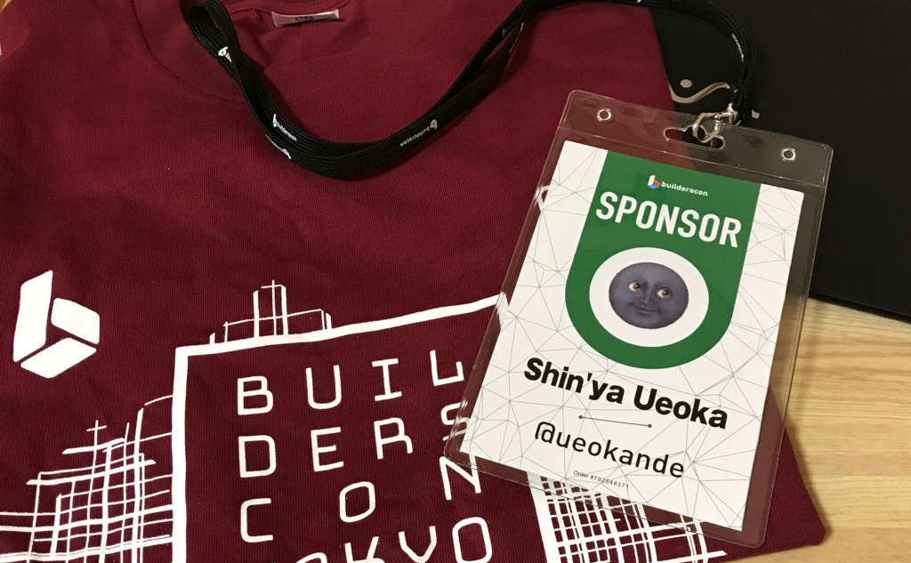

builderscon1日目に行ってきたので、忘れる前に参加レポートです。
buildersconは弊社からもスポンサーをしており、その招待チケットを頂いたのでbuildersconに行くことにしました。

buildersconは**「知らなかった、を聞く」**をテーマとした技術を愛する全てのギーク達のお祭りです。

- [builderscon tokyo 2018](https://builderscon.io/tokyo/2018)

buildersconの発表は最大5並列で行われ、ジャンルは組み込み系からWebフロントエンドまで様々です。
今年は（今年も？）ゲストスピーカーが豪華でNetflixやLyftのエンジニアなども招待されてました。
1日目の全体的な所感として、Kubernetesやマイクロサービスなどのモダンなインフラの話が熱い印象で、人が入り切らず途中で締め切るセッションも続出しました。

buildersconの参加は初めてだったのですが、一言で表現すると最高でした。
以下、自分が参加したセッションと簡単な感想を述べてゆきたいと思います。

Envoy internals deep dive
-------------------------

まず1発目は[mattklein123][@mattklein123]氏による発表でした。

この発表はLyftがどのようにしてマイクロサービスを構築して、なぜEnvoyの開発に至ったかという話に始まりました。
そしてタイトルにもあるように、Envoyの内部アーキテクチャや設計についても踏み込みました。

Lyftがマイクロサービスを構築したとき、いろいろな問題が発生しました。
サービス間のリトライ・タイムアウト処理が一部しか適用できてなかったり、可観測性の低下などです。
それらを統一するためのライブラリを作るには、各サービスで利用してる言語やフレームワーク、プロトコル毎に実装する必要もあります。
そこでライブラリではなくプロキシとして、Envoyを開発・導入しました。
Envoyの設計で[Read-copy-update](https://en.wikipedia.org/wiki/Read-copy-update)や[Thread-local storage](https://en.wikipedia.org/wiki/Thread-local_storage)をどのように使ってるかや、スケールするスレッドモデルの紹介がありました。

Envoyの名前は知ってたのですが、その必要があった背景などを知って、マイクロサービスで発生する課題も知ることができました。
余談ですが、この発表が終わった後ちょこっとEnvoyのコードを除いてみたのですが、非常にキレイに書かれている印象でした。
また暇があればコードを追ってみたいと思います。

Building and operating a service mesh at mid-size company
---------------------------------------------------------

2つめは[taiki45][@taiki45]氏による発表でした。

- [スライド](https://speakerdeck.com/taiki45/building-and-operating-service-mesh-at-mid-size-company)

このお話はCookpadがどのようにサービスメッシュを構築したのかというお話と、Envoyの導入事例です。
1本目の発表でもあったとおり、マイクロサービスでは言語毎にライブラリを提供するのは大変です。
そのためCookpadでもEnvoyを導入しました。

Cookpadではサービスメッシュ全体の適用を更新するために、開発者は生のEnvoyの設定ではなく容易なシンタックスで記述します。
それをGitHub EnterpriseにPushすると、CIがEnvoyの設定に変換して適用します。
Envoyとそのデプロイシステムを構築することで、簡易なトラブルシュートや素早いデプロイが可能になったそうです。

極限まで自動化して開発効率を上げたり、新しいことにチャレンジする姿勢はCookpadらしくてワクワクしました。
今後のインフラの進化にも期待です。

事前知識なしで理解する、静的検査のいろは
----------------------------------------

3本目は[Kuniwak][@orga_chem]氏の発表でした。

- [スライド](https://speakerdeck.com/orgachem/introduction-about-static-analysis-without-previous-knowledge)

この発表はソースコードの静的解析はどのように動作してるかのお話でした。
実際Kuniwakさんは、静的検査を使って、コードレビューのコストを減らしたり、モジュール間の依存関係を可視化したりと、実業務でも有効に活用してるそうです。
今回の説明では抽象構文木を再帰下降法をどのように設計・実装するかのお話でした。

構文解析の知識自体は学生時代に履修してたのですが、スライドもキレイで非常に分かりやすかったです。
またこの話を聞きながら「業務でもおんなじ観点でレビューすることが何回もあるなー」と思って聞いてました。
GoやPythonではすでに標準ライブラリに構文解析器があるので、暇があったら遊んでみたいと思います。

イノベーションを止めずに、端末管理と運用を行う方法
--------------------------------------------------

4本目は[kenchan0130][@kenchan0130]氏による発表でした。

- [スライド](https://speakerdeck.com/kenchan0130/ifalsebesiyonwozhi-mezuni-duan-mo-guan-li-toyun-yong-woxing-ufang-fa)

この発表では、社内のコンピューターや携帯端末をどのように管理すればよいかというプラクティス集でした。
Mac OSやWindows、そしてiOSとAndroidの端末を、ユーザー（従業員）が快適かつ安全に利用できる管理体制と仕組みづくりのお話でした。

普段自分が快適に開発を進めれるのも、自分の知らないところで情シスが環境を整備してくれてるからだろうなーと思いました。
また従業員が増えても大丈夫なようにスケールする管理方法を模索してるのが、インフラ管理と似ているなーと思いながら聞いてました。

Webサービスの品質とは何か？アラート地獄と監視の失敗、サービスレベル目標設計から学んだ3つの答え
----------------------------------------------------------------------------------------------

5つめはTakuya Onda氏による、アラートにまつわるお話です。

- [スライド](https://speakerdeck.com/takuya542/websabisufalsepin-zhi-tohahe-ka-aratodi-yu-tojian-shi-falseshi-bai-sabisureberumu-biao-she-ji-karaxue-nda3tufalseda-e)

eurekaではアラートをアラートであるために、つまり「本当の異常事態」を知らせるものにするために、システムと運用方針を変えました。
そのためにアラートの対象は本当にアクションが必要なものを対象とし、即座に対応が可能なアーキテクチャも構築しました。
また管理を楽にするために、AWSのマネージドサービスをフルに活用して、複数環境の構成も同じ技術スタックで統一しました。

健全なアラートが開発・運用者だけでなく組織としても必要だというのが印象的でした。
また全体的にAWSを前提としたアーキテクチャでしたが、オンプレミスなデータセンターでもすぐに代替の計算資源が確保できるのが良いのかなと思いました。

lld − 開発ツールの主要コンポーネントの1つをスクラッチから作成した話
-------------------------------------------------------------------

1日目最後は[rui314][@rui314]さんが、LLVMのリンカ実装であるLLDを書き直したという話です。

以前のLLDの実装は複数のプラットフォーム対応のためにコードの共有化をしており、それがパフォーマンスやメンテナンス性に影響してました。
リライトの結果としてGNU Goldというリンカ実装よりも、少ないコード量で高いパフォーマンスを実現できました。
リライトするかどうかメーリングリストでは賛否両論だったそうですが、リライトしてパフォーマンスやメンテナンス性が向上したことで新しいメンテナが増えたそうです。

LLDに限らず、全体的にソフトウェアエンジニアとしてためになる話でした。
レガシーソフトウェア改善ガイドではソフトウェアのリライトはデメリットが大きいとありましたが、LLDはその例外だったようです。
自分もソフトウェアをリライトしたいと思うことは度々ありますが、それによって何が得られるかなどを考えて手を打とうと思います。

1日目まとめ
-----------

まだ1日目ですが、どのセッションも面白い内容ばかりでした。
聞きたいセッションもパラレルに開催されていて、全部聞けなかったのが残念ですが、体は1つなので仕方がないですね。
明日も聞きたい発表がいっぱいあるので楽しみにしてます！

[@mattklein123]: https://twitter.com/mattklein123
[@taiki45]: https://twitter.com/taiki45
[@orga_chem]: https://twitter.com/orga_chem
[@kenchan0130]: https://twitter.com/kenchan0130
[@rui314]: https://twitter.com/rui314
