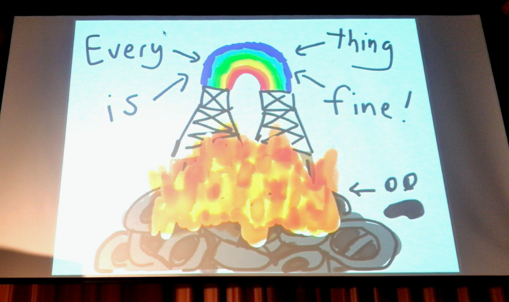

builderscon2日目レポートです。
今日も豪華なスピーカーが勢揃いで、最高の1日でした。

  
※ 画像はaphyrさんのスライドからです

Security, privacy, performance of the upcoming transport protocols
------------------------------------------------------------------

1本目は、[kazuho][@kazuho]氏による次世代のインターネットプロトコルのお話でした。

- [スライド](http://blog.kazuhooku.com/2018/09/quic-builderscon.html)

インターネット・プロトコルは変革期で、次々と新しいプロトコルが生まれています。
セキュリティという観点では、パブリックWi-Fiの普及やスノーデンの話をきっかけに、完全なネットワークで暗号化が必要となっています。
現在、あるいは近い将来にDNS over HTTPSやQUICなどの次世代のプロトコルが必要になっています。

この発表では、TLS 1.3とQUICについて詳しく説明がありました。
それぞれについて、今のTLS1.2とTCPでは何が危険でどういう攻撃が想定されるかという説明もあって、非常に興味深い内容でした。

Jepsen 10
---------

2つめは[aphyr][@aphyr]氏による、Japsen 10というフレームワークと、分散データベースにまつわるお話です。
Jepsenとは分散システムの試験をするフレームワークで、実際の著名な分散データベースの不具合を発見しています。

分散システムが難しいのは以前からですが、aphyr氏が言っていたのは、ソフトウェアのドキュメントをよく読み、自分でテストするのが大事だと言ってました。
自分でデザインした分散システムでも、障害例について参考になりそうなので、Jepsenプロジェクトを追ってみたいと思います。

また発表が手書きのスライドだったのが印象的でした。
別のカンファレンスでの発表ですが、そのユニークなスライドがYouTubeから拝見できます。

- [Keynote - Jepsen 7: Anna Concurrenina by Kyle Kingsbury](https://www.youtube.com/watch?v=eSaFVX4izsQ)

なぜエンジニアはパフォーマンス計測しないのか
--------------------------------------------

3つめは[mogetta][@mogetta]氏による、（体の）パフォーマンス計測に関するお話です。

- [スライド](https://speakerdeck.com/mogeta/why-dont-you-measure-your-performance) 

徹底的に体のメトリクスを計測して、生活の質を改善しています。
あらゆるメトリクス（心拍・集中力・睡眠時間）などを計測して、それぞれのメトリクスを計測してます。
カフェインやお酒がどのように影響してるかを調べて見るために、自分でA/Bテストを実施してたのが面白かったです。

チューニングをするにもまずはメトリクスの測定から、人体も実際のインフラも同じですね。
体のパフォーマンスが生産性に影響があるのは、ヘルシープログラマでも述べられてるのを思い出しました。
デバイスも安いらしいので、自分も買ってみようかな。

業務時間で書いたパッチは誰のもの？OSS活動にまつわる罠
-------------------------------------------------------

4つめは[uchan\_nos][@uchan_nos]氏による、サイボウズのOSSポリシーの紹介でした。
話ではポリシーの内容と、ポリシー制定に至った経緯をお話してました。
Q&Aタイムも盛り上がって、他の企業の人たちも業務時間中に書いたOSSについて気になってるんだなぁと思いました。

Building Self-Hosted Kubernetes
-------------------------------

5つめは[nasa9084][@nasa9084]氏によるSelf-Hosted Kubernetesを構築するというお話でした。

- [スライド](https://gitpitch.com/nasa9084/slides/builderscon18#/)

Self-Hosted Kubernetesに関しては、メリットと構築の難しさは以前調べたことがあるので、ある程度知識としてありました。
etcdのSelf-HostingやKubernetesのデプロイツールがまだProduction readyじゃないですが、そのへんは今後に期待ですね。

Extending Kubernetes with Custom Resources and Operator Frameworks
------------------------------------------------------------------

6つめは[IanMLewis][@IanMLewis]氏によるKubernetesを拡張する方法についてです。
KubernetesにはCustom ResourcesとOperator Frameworksという仕組みがあり、Kubernetes自体のカスタマイズができるようになっています。
スライドでは
[Operator SDK](https://github.com/operator-framework/operator-sdk)と[kubebuilder](https://github.com/kubernetes-sigs/kubebuilder)
と呼ばれるCustom ResourcesのためのSDKが紹介されてました。

オンプレミスや特殊な環境でKubernetesを構築するにはいろいろな工夫が必要で、そのへんも工夫が必要だなと思いました。
ボイラープレートの作成がデモであったのですが、実際にリソースを作ってみたいと思います。

Lightning Talks
---------------

LTは14タイトルと盛りだくさんでした。
内容はマイクロサービスアーキテクチャのログ基盤やネットワークレイヤの障害試験と、LTとは思えないほど濃い話しばかりでした。
全ての内容はここでは書けませんが、非常に充実した14本でした。

おわりに
--------

2日間通して、豪華なスピーカーが多くて最高の体験でした。
また最高のbuildersconを実行した運営の皆様お疲れ様でした。

機会があれば来年も参加したいと思います。  
\# 体力があればぜひ参加者側として

[@kazuho]: https://twitter.com/kazuho
[@aphyr]: https://twitter.com/aphyr
[@mogetta]: https://twitter.com/mogetta
[@uchan_nos]: https://twitter.com/uchan_nos
[@nasa9084]: https://twitter.com/nasa9084
[@IanMLewis]: https://twitter.com/IanMLewis
