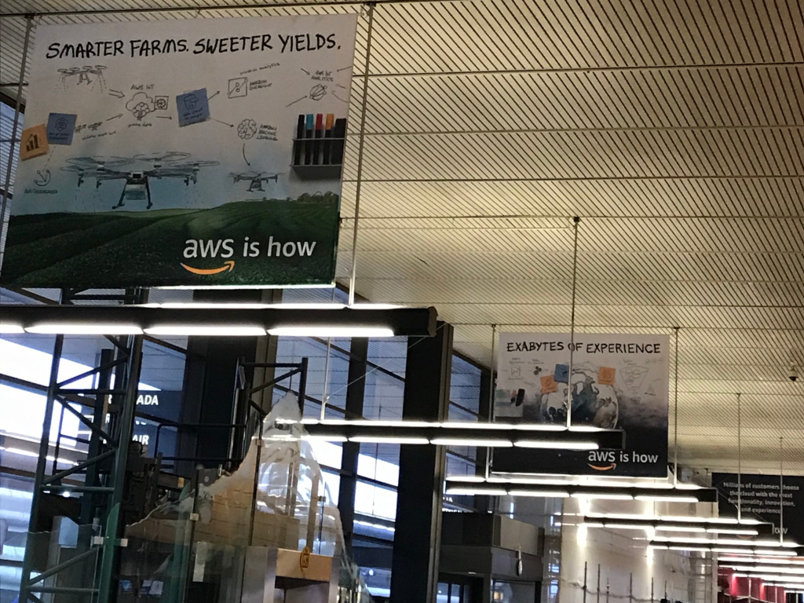
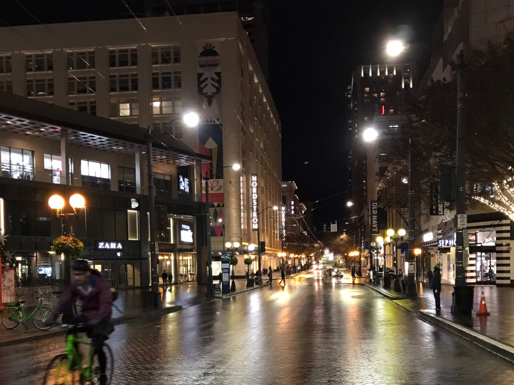
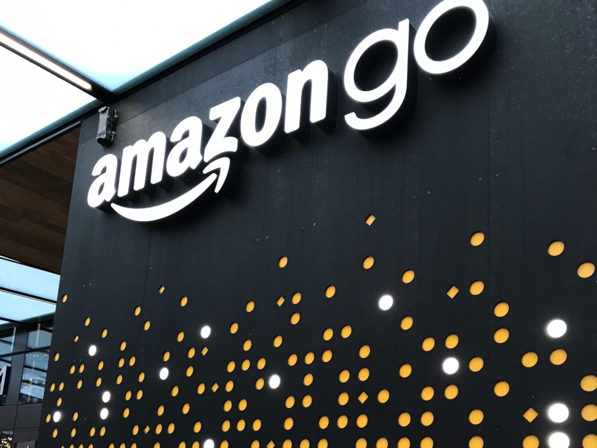

12月10日から13日の4日間、北アメリカのシアトルで[KubeCon + CloudNativeCon North America][kubecon]が開催されました。
自分も今のチームメンバーと一緒に参加しました。

イベント自体の報告は会社のブログで公開してるので、そちらを参考にしてください。

- [KubeCon + CloudNativeCon North America 2018 現地レポート 0日目][day0]
- [KubeCon + CloudNativeCon North America 2018 現地レポート 1日目][day1]
- [KubeCon + CloudNativeCon North America 2018 現地レポート 2日目][day2]
- [KubeCon + CloudNativeCon North America 2018 現地レポート 3日目][day3]

自分はこれまで、シンガポールや台湾などには行ったことがありますが、アメリカほど地理的にも文化的にも遠い場所に行ったのは初めてです。
いろいろと初めてのことばかりで戸惑うことも多かったですが、今後の海外渡航に役立てれるようにメモを残しておきます。

出国から入国まで
----------------

2009年からアメリカにVISA無しで入国するには、[ESTA][]の取得が必須となりました。
ESTAの申請はパスポートの情報や住所をポチポチ入力すると、3営業日程度で取得できます。

飛行機の搭乗までは基本的に国際線と同じですが、アメリカ行きの飛行機ではさらに、手荷物を第3者から預かってないかなどのチェックもされました（簡単な質問に答えるだけです）。
アメリカ入国は年々厳しくなってるらしいですが、入国審査も思った以上に質問攻めでした。
渡航目的だけでなく、どういったカンファレンスの種類や、自分の会社の職種まで効かれました。

シアトルはAmazonの本社もあるので、空港ではAWSの広告も見えました。

ライドシェアの文化
------------------

飛行機に着いたら会場までUberを利用して移動しました。
アメリカではUberやLyftなどのライドシェアが非常に浸透しているようでした。
空港の駐車場にもUber・Lyft用の駐車場が確保してました。

Uber・Lyftの呼び出しから到着までも早くて、大体5分ほどで車が到着します。
慣れている現地の人たちは車が到着したら1-2分で車に乗り込んで出発をして、駐車場ではすごい勢いでライドシェア用の車が入れ替わり立ち替わりでお客さんを運んでました。
現地ではタクシーもあるそうですが、Uber・Lyftがみるみる乗客をさばいてる姿は壮絶でした。
自分たちのドライバーはUberで来てもらいましたが、曰く大体のドライバーはUberとLyft両方対応してるそうです。

シアトルという街
----------------

シアトルは冬の雨季で、ほぼ毎日が雨でした。
夜は日本の夜のように、イルミネーションが飾られてキレイでした。

海外渡航で特に気になるのは現地の治安です。
シアトルは比較的治安のよい都市だそうです。
同じアメリカ国内でも場所によって治安が全然違います（日本でも地域によって手榴弾が転がってたりしますね）。

今回は移動範囲が徒歩圏というのもあり、間違って裏通りに入らない限り特に身の危険があったということはなかったです。
ホテルの周りやKubeCon会場はビジネス街というのもあり、常識的な人ばかりでした。
ホテルから3ブロック先に24時間営業のセブンイレブンがあったので朝に散歩してみました。
そこだけ少し治安が悪いようにみえて、セブンイレブンに入るのを断念しました。

また物乞いが多かった印象です。
1つのブロックに数人出くわす程度の人数で出くわしました。

Amazon Go
---------

Amazonはコンピューター・ビジョンやディープ・ラーニングを使った次世代のスーパーマーケット「Amazon Go」を展開しています。
シアトルにもその店舗があるということで行ってきました。
Amazon Goはレジが無く、購入者の行動を追跡して購入する商品を特定します。
店内には数週のセンサーがあり、ユーザーをトラッキングして商品を購入します。
Amazon Go入店時にAmazonアカウントに紐付けられたQRコードをタッチして、アカウントに紐付けられたクレジットカードで支払われます。

店内は無人という事ではなく、日本のコンビニ程度にはスタッフがいました。
店のゲートには案内役がいましたし、アルコールコーナーには年齢確認のスタッフが、そして商品を陳列するスタッフもいました。
運用コストを下げることが目的じゃないとは思いますが、レジを通さずに商品を購入できるのは新鮮でした。
まだまだ実験段階だとは思いますが、早く日本にも来てくれるといいですね。

カードとチップ文化
------------------

お店のクレジットカード対応は日本以上に進んでおり、シアトルなどの都市部ではほぼ確実にクレジットカードを使えます。
日本と違い、スーパーやスターバックスでカードを使うときは、自分たちでカードを通す必要がありました。
はじめそれを知らず、支払いに手間取りました。

アメリカにはチップ文化がありますが、キャッシュレス化も同時に進んで、チップをクレジットカードで支払うことができます。
クレジットカードでチップ代を払うには、会計時レシートをもらった後に、チップをいくら払うかをこちらが記入します。
お店によってはすでにチップ料金が指定されてることもありますが、そこから更に追加のチップを払うこともできます。

カードでのチップ支払いでややこしいのは、カードで会計した後にチップ額を決めるという点です。
つまり「お会計をする」→「カードで支払う」→「チップの額を決める」という手順で、チップの額を決めて改めてクレジットカードを提示する必要はないです。
どういう仕組みかわかりませんが、どの店でも会計を済ませた後にチップ額を決めました。
チップを決めるタイミングは、領収書と一緒にペンがついてきて、こちらが額を記入します。

結局この旅行では、レストランやスーパーでは現金を全く使いませんでした。
唯一現金が必要になったのは、ホテルのベッドメイキングで渡すチップくらいです。
シアトルなどの大都市への旅行は、2-3ドルを宿泊日数分用意すれば十分に思えます。

ご飯
----

食事は朝食・昼食はKubeCon会場で提供されましたが、夜はチームメンバーと一緒にレストランで食べました。
レストランのメニューは基本的美味しかったですが、量はアメリカンサイズで日本人には多いくらいです。
メニューに書いてあるサラダですらとてつもない量が出てきて、付け合せという量ではなかったです。
アメリカではサラダを食事のメインとしても食べるらしく（おかずサラダのような感じ）、個人的には野菜不足になりがちな海外旅行ではありがたかったです。

健康志向も多いアメリカでは、メニューにカロリーが書いてある事が多いです。
カロリーから大体の量や脂分が予想できるので、頼む前の参考になります。
とくに面白かったのは、デザートのチョコレートケーキが **1,700 kcal** もありました。
おかげで1人1品頼むことなく、シェアするという判断に至れました。
滞在3日目くらいには**「1,000 kcal未満なので健康」**という謎の会話が繰り出されるほどに、カロリーの感覚が鈍りました。

アメリカは高カロリーな食べ物が多いというイメージですが、
健康志向・ベジタリアンに気遣ったメニューも多いので、それを選べばある程度健康な食事も取れることができます。

まとめ
------

KubeCon + CloudNativeConが楽しかったのはもちろん、アメリカという国を少し知れたので良かったです。
しかし自分は英語が達者じゃないので、アメリカ生活で戸惑う事もありました。
KubeCon + CloudNativeConで得られたものもたくさんありますが、自分の課題もいろいろと見えてきました。
特に技術をやっている立場として、英語ができないのがすごくハンデに感じました。
コミュニティや開発者と円滑なコミュニケーションが取れてれば、更に楽しめたと思います。
これを糧に、技術だけでなく英語のスキルももっと伸ばしていきたいと思います（と学生時代から言ってる気がする）。

[kubecon]: https://events.linuxfoundation.org/events/kubecon-cloudnativecon-north-america-2018/
[ESTA]: https://esta.cbp.dhs.gov/esta/
[day0]: https://blog.cybozu.io/entry/2018/12/11/163849
[day1]: https://blog.cybozu.io/entry/2018/12/12/170634
[day2]: https://blog.cybozu.io/entry/2018/12/13/164541
[day3]: https://blog.cybozu.io/entry/2018/12/14/145744
