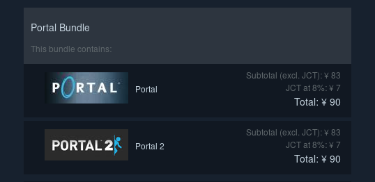
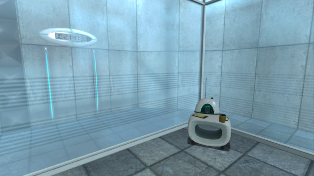

PortalとPortal 2がセットで180円という電波を受信したので早速買いました。
自分のマシンはArch Linuxということで、Linux環境でSteamをインストールしてゲームの起動までチャレンジしました。
結果を先に言うと、**普通にプレイできました**。
大きな障害もなくて驚きです。

SteamのLinuxサポートはかなり前からニュースになってました。
正式にサポートしてるOSはUbuntuまたはSteamOS(Debianベース)のみですが、Arch Linuxでも動かしてみました。
自分の環境は以下のとおりです。

- Arch Linux
- nVIDIA GeForce GT 1030

依存パッケージのインストール
----------------------------

まずはゲームを起動するための依存パッケージをインストールします。
Steamのゲームは32ビットバイナリでビルドされてるので、必要なパッケージをインストールします。
64ビット版のArch Linuxではデフォルトでは32ビットパッケージが有効になってません。
32ビット版のパッケージは `multilib` リポジトリに含まれます。
このレポジトリを有効にして、32ビット版パッケージをインストールできるようにします。

pacmanの設定ファイル `/etc/pacman.conf` でコメントアウトされてるので、それを外して `multilib` レポジトリを有効にします。

```conf
# /etc/pacman.conf
[multilib]
Include = /etc/pacman.d/mirrorlist
```

続いてパッケージのインストールします。
使ってるビデオカードの種類によって必要なビデオカードのドライバ（32ビット版）をインストールします。
自分のグラフィックカードはnVIDIAなので、 `lib32-nvidia-utils` をインストールする必要がありました。
そしてゲーム本体が利用するパッケージもインストールします。

```console
$ sudo pacman -S lib32-nvidia-utils
$ sudo pacman -S lib32-fontconfig lib32-gtk2 lib32-libxi lib32-nss lib32-libpng12 \
    lib32-alsa-lib lib32-pango lib32-cairo lib32-sdl2 lib32-libgcrypt15
```

SteamCMDのインストールとログイン
--------------------------------

SteamのクライアントはGUI版とCUI版があり、Linux向けに両方提供されています。
CUI版はSteamCMDと呼ばれています。
SteamCMDのドキュメントがValve開発チームによって公開されています。

- [SteamCMD - Valve Developer Community](https://developer.valvesoftware.com/wiki/SteamCMD)

まずはSteamCMDをインストールします。
基本的にどこでも良いのですが、ドキュメントに従ってホームディレクトリの `Steam` 以下にインストールします。

```console
$ mkdir ~/Steam && cd ~/Steam
$ curl -sqL "https://steamcdn-a.akamaihd.net/client/installer/steamcmd_linux.tar.gz" | tar zxvf -
```

アーカイブを展開したら `~/Steam/steamcmd.sh` に実行ファイルが展開されます。
これを実行するとSteamCMDのプロンプトが表示されます。
このプロンプト上でゲームのインストールができます。

```console
$ ./steamcmd.sh
......
Loading Steam API...OK.

Steam>
```

まずはSteamにログインします。
ログインは `login` コマンドでできます。
初回ログイン時はメールに認証用コードが送られるので入力します。

```console
Steam>login <username>

Logging in user '<username>' to Steam Public...
password:
Login Failure: Account Logon Denied

This computer has not been authenticated for your account using Steam Guard.
Please check your email for the message from Steam, and enter the Steam Guard
 code from that message.
You can also enter this code at any time using 'set_steam_guard_code'
 at the console.
Steam Guard code:******
Logged in OK
Waiting for user info...OK
```

ゲームのインストール
--------------------

ログインができたらゲームをインストールをします。
ゲームには固有のIDが割り当てられています。
インストールにはゲームのIDを確認する必要があります。
ゲームのタイトルとIDは以下のリンクにまとめられています。

- [Steam Application IDs - Valve Developer Community](https://developer.valvesoftware.com/wiki/Steam_Application_IDs)

ゲームのIDはSteamのページのURLからも確認できます。
たとえば「Goat Simulator」のURLは [store.steampowered.com/app/265930/Goat_Simulator/](https://store.steampowered.com/app/265930/Goat_Simulator/) で、そのIDは265930になります。

IDを確認できたらSteamCMDの `app_update` コマンドでインストールできます。
Portalは400なので、`app_update 400` を実行します。

```console
Steam>app_update 400
.........
 Update state (0x61) downloading, progress: 100.00 (4102862811 / 4102864369)
Success! App '400' fully installed.
```

起動！
-----

インストールしたゲームは `~/Steam/steamapps/common` 以下に展開されます。
その下にゲーム毎にディレクトリが作成されまず。
起動方法はゲームによって違いしますが、Portalは以下の手順で起動できます。

```console
$ cd ~/Steam/steamapps/common/Portal
$ ./hl2.sh -game portal
```

これでPortalが起動します！

[](portal_screenshot.png)

自分の環境は4Kディスプレイなのですが、Portal程度ならGT 1030でも普通に遊べる程度でした（ただし10分ほどで3D酔をしたので長くは遊べません）。

トラブルシューティング
----------------------

### 起動に失敗する

起動に失敗するときはたいてい必要なライブラリが不足しているときです。
そのときは`ldd`コマンドで、ロードするライブラリをチェックできます。
Portalの場合、`bin` 以下にPortal本体が利用するいくつかのライブラリを含んでいます。

```console
$ cd ~/Steam/steamapps/common/Portal
$ LD_LIBRARY_PATH=bin ldd bin/vguimatsurface.so      
        linux-gate.so.1 (0xf7f7d000)
        libtier0.so => not found
        libvstdlib.so => not found
......
```

`"not found"` と表示されるライブラリは見つけられなかったものなので、追加でパッケージをインストールします。

### 音が出ない

自分の場合ALSAが利用するデフォルトのデバイスを設定する必要がありました。


```console
# /usr/share/alsa/alsa.conf 
defaults.ctl.card 2
defaults.pcm.card 2
```

PulseAudioにもサポートしてるようですが、詳しくないのでGitHubのIssueを貼っておきます。

- [No sound in certain games when started from Steam. - Issue #2968 - ValveSoftware/steam-for-linux](https://github.com/ValveSoftware/steam-for-linux/issues/2968)

まとめ
------

SteamがLinuxをサポートしたとはかなり前から聞いてましたが、案外あっさり動いて感動しました。
GeForce GT 1030も値段の割に意外と頑張ってくれてすごいです。
全てのゲームがLinux対応されたわけではないですが、ざっと見たところ150タイトルくらいがLinuxに対応してるようでした。

- [SteamOS + Linux on Steam](https://store.steampowered.com/linux)

地道にマルチプラットフォーム化を進めてくれてる開発者に感謝です。

[SteamCMD]: https://developer.valvesoftware.com/wiki/SteamCMD
