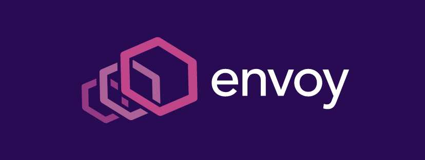
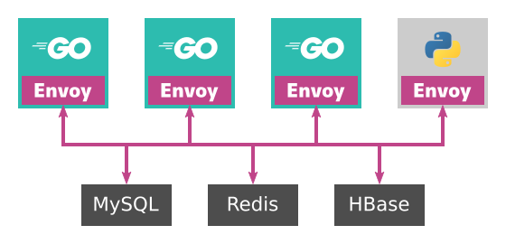
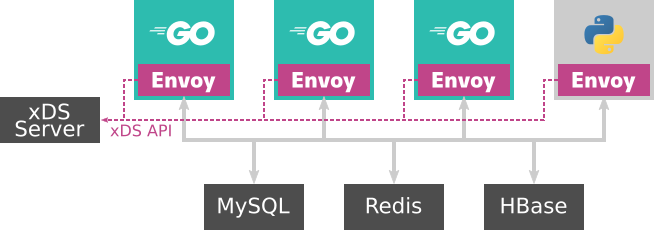

{{}}

最近Kubernetes周りの技術をよく触るのですが、Envoy Proxy (Envoy)もよく耳にするので勉強しました。

- [Envoy Proxy][]

Envoyとは？
-----------

EnvoyはクラウドネイティブなWebサービスのために設計されたロードバランサーです。
元はLyftが開発しており、現在はCNCF (Cloud Network Computing Foundation) によって管理されています。
Envoyには大きく２つの用途があります。

- サービスメッシュの通信バス: サービスメッシュ内の各サービス間の通信を制御するプロキシ。サービスディスカバリーや流量の制御をする。
- エッジプロキシ: サービス内のプライベートネットワークとサービス外をつなぐプロキシ。データセンターやKubernetesクラスタの外からのアクセスを受け付ける。

### 背景

モノリスで巨大なWebシステムが成長するとき、開発者はマイクロサービス化という選択肢を迫られます。
しかしマイクロサービスなどの分散システムを構築・運用するには、モノリスなシステムと比較して新たな難しさも見えてきます。
Lyftも初めはモノリスなアーキテクチャでしが、成長と共にサービス数が増えて、ネットワークの制御に苦労するようになりました。
そこでLyftはEnvoyを開発しました。

マイクロサービスアーキテクチャを運用する上で、サービス間のネットワーク制御は不可欠です。
たとえばリトライやサーキットブレーカー、帯域制限が必要です。
またデバッグ時に利用する分散トレーシングやログ情報も必要になります。

ネットワーク制御の仕組みをライブラリとして提供すると、各サービスで採用してる言語やフレームワークに応じて用意して、それをメンテナンスする必要があります。
マイクロサービスではそれぞれのサービスが自由な言語・フレームワークが使えるというメリットがある一方、こういったライブラリが使いにくいという課題もあります。
そこでLyftはライブラリではなく**ネットワークプロキシ**として利用できるEnvoyが開発されました。

### Envoyの利用実績

Envoyは現在多くのサービスで採用されています。
巨大なクラウド企業であるGoogle、AWS、Microsoftや、国内でもCookpadやYahoo! JAPANなどで採用されてます。
Kubernetesと共にサービスメッシュ化も加速し、今後もユースケースが増えるでしょう。
Envoyは直接デプロイして利用することもできますし、[Istio][]や[Heptio Contour][]などのEnvoyをラップしたアプリケーションも存在します。

2018年11月、Graduated CNCF Projectに認定され、CNCFの中でも十分成熟したプロジェクトとして認定されました。
他にGraduated CNCF GraduatedとなったプロジェクトにKubernetesとPrometheusがあります。
そのためEnvoyはこれらと肩を並べるほどの利用実績と信頼性があるということです。

Envoyのデザイン
---------------

### 基本コンセプト

Envoyは次の思想のもと開発されました。

> ネットワークはアプリケーションに対して透過的 (*transparent*) であるべきだ。
> なぜならネットワークまたはアプリケーションに問題が発生したとき原因の特定が簡単だからだ。

Envoyはサービス間のネットワーク制御を、ライブラリではなくネットワークプロキシとして開発しました。
それぞれのサービスはEnvoyを経由して別のサービスに接続します。

Envoyを利用したアーキテクチャでは、アプリケーションと同じホスト（正確にはネットワークを共有してるホスト）上にEnvoyを構築します。
Kubernetesなどでは、Envoyを各アプリケーションのサイドカーコンテナとしてデプロイします。
各サービスは別のサービスを直接参照するのではなく、`localhost`に建てられたEnvoyに接続します。

サイドカーとして立てられたEnvoyでは、別サービスのIPアドレスなどを知っています。
アプリケーション自体が別のサービスのIPアドレスを知らなくとも、`localhost`にあるEnvoyのポートのみを知ればよいです。
経路制御やサービスのIPアドレスが変わったときも、Envoyの設定を更新さえすれば、アプリケーションはネットワークで何が起こったかを知る必要がありません。

{{}}

### 基本用語

クライアントがEnvoyに接続する側をDownstreamと呼び、Envoyがサーバー接続する側をUpstreamと呼びます。
Envoyのプロキシ設定は、ListenerとClusterのペアを設定します。

- **Cluster**:
EnvoyがUpstreamに接続するホストグループです。
- **Endpoint**:
Cluster内にあるメンバーの1つで、Upstreamのホストです。
- **Listener**:
DownstreamがEnvoyに接続するための情報で、アドレス・ポートやUNIXドメインソケットを指定できます。
- **Route**:
URLやHTTPヘッダからどのClusterに接続するかの経路情報です。

### 動的な設定変更とxDS

Envoyの設定は全て静的なファイルで与えることができますし、Envoyをシャットダウンせず設定の更新もできます。
設定を動的に変更するにはgRPC、REST APIや、ファイルの更新などがサポートされいます。
gRPCとREST APIによる設定変更は、Envoy"が"制御サーバーにEnvoyの設定を問い合わせます。
REST APIではサーバーをポーリングして設定をリロードし、gRPCではgRPCストリームを使って新しい設定をロードします。
EnvoyではこのAPI提供する制御サーバーを**コントロールプレーン**と呼び、Envoy側を**データプレーン**と呼びます。

設定を取得するAPIは、Envoyの各種項目毎に用意されてます。
たとえばListenerの設定を取得するAPIはListener Discovery Service (LDS) と呼びます。
またClusterの設定を取得するAPIはCluster Discovery Service (CDS) と呼びます。
これらのAPIをまとめて、**xDS API**と呼びます。

xDS APIには以下のAPIが含まれます。

- Listener Discovery Service (LDS)
- Route Discovery Service (RDS)
- Cluster Discovery Service (CDS)
- Endpoint Discovery Service (EDS)
- Secret Discovery Service (SDS)

これらのAPI毎に独立したgRPCストリームを利用できますが、Aggregated Discovery Services (ADS)を使うと単一のストリームで複数のxDS APIを利用できます。

{{}}

Envoyの利用例
-------------

### サービスディスカバリー

サービスメッシュ内であるサービスが別のサービスに接続するには、接続先のIPアドレスを知る必要があります。
特にKubernetesのようにIPアドレスが不定の環境では必要な仕組みです。
一番単純なサービスディスカバリーの実装はDNSです。
KubernetesではユーザーがServiceリソースを作成すると、対応するDNSレコードがDNSサーバーに登録されます。
しかしDNSは詳細な経路設定ができませんし、負荷分散のルールも設定できません（KubernetesのServiceリソースはラウンドロビンでPodを選びます）。

Envoyではより柔軟なサービスディスカバリーを実装できます。
この機能を使うと、たとえば一部のユーザーにのみ新しいサービスを提供できたり、データベースを分割してる環境で欲しいデータのあるインスタンスを見つけたりできます。
Envoyを利用するとこういった柔軟な設定ができます。
アプリケーションは宛先のインスタンスを直接知らずとも、Envoyを経由して透過的に目的のサービスに到達できます。
コントロールプレーンとデータプレーンが役割ごとに別れて、わかりやすいアーキテクチャになっています。

### エッジプロキシ

サービスディスカバリーの仕組みを使うと、エッジプロキシとしても役立てる事ができます。
EnvoyはNGINXのように、HTTPリクエストのヘッダーやパスに応じた経路を設定したり、複数経路を重み付けでロードバランシングできます。
そのためBlue-Greenデプロイやカナリアリリースに必要な機能が備わっています。

Heptio ContourはバックエンドにEnvoyを採用したKubernetesで利用できるエッジプロキシです。
KubernetesのIngress ControllerではBlue-Greenデプロイやカナリアリリースをできるほどの柔軟性がありません。
Heptio ContourはIngress Controllerで足りない機能をCustom Resource Definitionとして提供します。

Heptio Contourのお話はKubeCon + CloudNativeConでもあったので時間のある人はぜひ。

- [Front-end Application Deployment Patterns - Ross Kukulinski, Heptio][]

まとめ
------

Envoyを軽く触って最初に思ったのは「高級なL7LBだなぁ」という感想程度でした。
機能自体は目新しいものは少ないですが、素な機能のみを提供してるため使い方は無限大です。
そしてxDS APIなどの設計は良くできてるなという感想です。
他のロードバンサーの実装と違い、クラウドネイティブなアプリケーションでは大活躍できそうだと思いました。

今後もちまちまと調査を進めて、もう少し実用的な記事も書いていきたいと思います。

参考
----

- [Envoy公式ページ](https://www.envoyproxy.io/)
- [Envoy documentation](https://www.envoyproxy.io/docs/envoy/v1.9.0/)
- [Data plane API](https://github.com/envoyproxy/data-plane-api/)

[Envoy Proxy]: https://envoyproxy.io/
[Heptio Contour]: https://github.com/heptio/contour
[Istio]: https://istio.io/
[Front-end Application Deployment Patterns - Ross Kukulinski, Heptio]: https://kccna18.sched.com/event/GrR3

