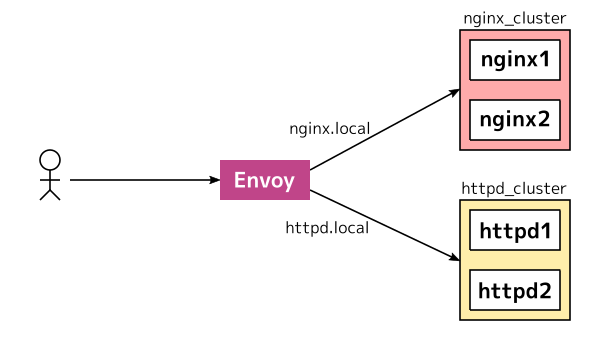

Envoy Proxyに入門してポチポチ勉強を進めてます。
Envoy Proxyは動的な設定とxDS APIが魅力的ですが、手始めに静的な設定ファイルで動かしてみましょう。
この記事ではHTTPロードバランサーをEnvoyで構築します。
完成図は以下の図になります。

{{}}

HTTPロードバランサーの後ろには、目的の異なる2つのクラスタがあります。
今回はNGINXとApache httpdを使っています。
それぞれのクラスタは`nginx.local`と`httpd.local`というホスト名（バーチャルホスト）で経路を分岐します。

Envoyの設定ファイル
-------------------

Envoyをどういう環境で利用するにも**Bootstrap Configuration**が必要です。
静的な設定ファイルでEnvoyを利用する場合も必要ですし、xDS APIを利用する場合もxDSサービスの設定を書きます。
Bootstrap Configurationには他にも、ノードの識別子や管理画面を設定できます。

Envoyの設定の仕様は公式ドキュメントにあります。

- [v2 API reference][]

Envoyの設定はv1 APIとv2 APIの2つのバージョンがあります。
公式ドキュメントもv1 APIに関する項目が削除され、将来使えなくなる可能性があるので、本記事もv2 APiのみを対象とします。

クラスタの起動
--------------

実験のためにまずはHTTPサーバーを建てます。NGINXとhttpdはDocker Hubのnginxを使います。
これらのコンテナイメージは`docker run`するだけでHTTPサーバーが起動します。
またHTTPにアクセスするとログにアクセスログが出ます。
それぞれ4つのターミナル上で立ち上げてログを眺めましょう。

```sh
$ docker run --rm --name nginx1 nginx
$ docker run --rm --name nginx2 nginx
$ docker run --rm --name httpd1 httpd
$ docker run --rm --name httpd2 httpd
```

どういう結果を確かめるには、Dockerコンテナに直接アクセスしてみたらわかるでしょう。

```sh
$ curl $(docker inspect nginx1 | jq -r '.[].NetworkSettings.IPAddress')
$ curl $(docker inspect httpd1 | jq -r '.[].NetworkSettings.IPAddress')
```

設定を書く
----------

Bootstrap configを書きましょう。
以下の設定を `/tmp/envoy/envoy.yaml` に保存します。

```yaml
# /tmp/envoy/envoy.yaml
static_resources:
  listeners:
  - name: listener_0
    address:
      socket_address: { address: 0.0.0.0,  port_value: 80 }
    filter_chains:
    - filters:
      - name: envoy.http_connection_manager
        config:
          stat_prefix: ingress_http
          http_filters:
          - name: envoy.router
          route_config:
            name: route
            virtual_hosts:
            - name: nginx_service
              domains: ["nginx.local"]
              routes:
              - match:
                  prefix: "/"
                route:
                  cluster: nginx_cluster
            - name: nginx_service
              domains: ["httpd.local"]
              routes:
              - match:
                  prefix: "/"
                route:
                  cluster: httpd_cluster
  clusters:
  - name: nginx_cluster
    type: STRICT_DNS
    connect_timeout: 0.25s
    lb_policy: ROUND_ROBIN
    hosts:
      - socket_address: { address: nginx1, port_value: 80 }
      - socket_address: { address: nginx2, port_value: 80 }
  - name: httpd_cluster
    type: STRICT_DNS
    connect_timeout: 0.25s
    lb_policy: ROUND_ROBIN
    hosts:
      - socket_address: { address: httpd1, port_value: 80 }
      - socket_address: { address: httpd2, port_value: 80 }
```

Envoyを起動
-----------

Envoyは公式イメージがDocker Hubで配布されてるものを使います。
このDockerイメージは`/etc/envoy/envoy.yaml`から設定をロードします。
手元で記述した設定ファイルはコンテナ内にマウントします。
また先程のHTTPサーバーを名前解決するために `--link` オプションでそれぞれのDockerコンテナ名を指定します。

```sh
$ docker run \
    --name envoy --rm --publish 80:80 \
    --link nginx1 --link nginx2 --link httpd1 --link httpd2 \
    -v /tmp/envoy:/etc/envoy \
    envoyproxy/envoy:v1.9.0
```

ここまででEnvoyによるロードバランサーが完成しました。
バーチャルホスト名でEnvoyに到達できるように、`/etc/hosts`に以下の２つのエントリを追加します。

```conf
# /etc/hosts
127.0.0.1 nginx.local
127.0.0.1 httpd.local
```

Envoyが起動したら、`nginx.local` と `httpd.local` にアクセスしてみましょう。

```sh
$ curl nginx.local
$ curl httpd.local
```

`nginx.local` でアクセスすると「Welcome to nginx!」が表示され、`httpd.local`でアクセスすると「It works!」が表示されると思います。

設定ファイルを眺める
--------------------

それでは順を追って設定ファイルを読んでいきましょう。
上記の設定は必要最低限なフィールドのみ埋めています。
それぞれのフィールドの定義は適宜ドキュメントへのリンクを貼ってあるので、必要に応じて参照してください。

1行目の`static_resources` はその名の通り静的なリソースを記述できます（定義は[StaticResources][]にあります）。
ほかにも`dynamic_resources` などがあります。

```yaml
static_resources:
```

`listeners`には[Listener][]の設定を記述します。


```yaml
  listeners:
  - name: listener_0
    address:
      socket_address: { address: 0.0.0.0,  port_value: 8000 }
    filter_chains:
    - filters:
```

Listenerの設定には待ち受けるアドレス・ポートと、受け取ったパケットをどう処理するかを決める**フィルター**を記述します。
Listenerは[FilterChain][]の設定を持ち、さらにFilterChainが[Filter][]の設定を持ちます。

ここでは1つのフィルターを定義しています。

```yaml
      - name: envoy.http_connection_manager
        config:
          http_filters:
          - name: envoy.router
          stat_prefix: ingress_http
          route_config:
            name: route
            virtual_hosts:
```

`name` フィールドは利用するフィルターの種類です。
`envoy.http_connection_manager`はEnvoyの組み込みフィルターで、HTTP (L7レイヤー) の情報に基づいて処理します。
`envoy.http_connection_manager`を指定する場合は、`config`フィールドに[HttpConnectionManager][] を指定します。

`http_filters` フィールドはHTTP connection managerがどういうHTTPフィルタを行うかを指定します。
ここでは `envoy.router` という経路制御のためのHTTPフィルタを利用します。
`stat_prefix` はモニタリング用途に使うメトリクス名のプレフィクスです。

`envoy.router` では `route_config` フィールドで[Route Configuration][]を設定します。
その中の `virtual_hosts` フィールドで[VirtualHost][route.VirtualHost]を設定します。
ここではバーチャルホストに基づいて2つのクラスタに経路を設定します。
他にもURLなどに基づいて経路を制御可能です。

```yaml
            - name: nginx_service
              domains: ["nginx.local"]
              routes:
              - match:
                  prefix: "/"
                route:
                  cluster: nginx_cluster
            - name: nginx_service
              domains: ["httpd.local"]
              routes:
              - match:
                  prefix: "/"
                route:
                  cluster: httpd_cluster
```

最後にClusterを定義します。
各Clusterにはそれぞれ2つのEndpointがあり、ラウンドロビンで接続先を決定します。

```yaml
  clusters:
  - name: nginx_cluster
    type: STRICT_DNS
    connect_timeout: 0.25s
    lb_policy: ROUND_ROBIN
    hosts:
      - socket_address: { address: nginx1, port_value: 80 }
      - socket_address: { address: nginx2, port_value: 80 }
  - name: httpd_cluster
    type: STRICT_DNS
    connect_timeout: 0.25s
    lb_policy: ROUND_ROBIN
    hosts:
      - socket_address: { address: httpd1, port_value: 80 }
      - socket_address: { address: httpd2, port_value: 80 }
```

まとめ
------

この記事ではEnvoyでL7LBを構築しました。
これだけだとNGINXとどう違うんだと感じるかも知れません。
Envoyの真髄はクラウドネイティブなアプリケーションで利用できる、柔軟性や可観測性です。
それらの記事については追々書いていきたいと思います。


[v2 API reference]: https://www.envoyproxy.io/docs/envoy/latest/api-v2/api
[StaticResources]: https://www.envoyproxy.io/docs/envoy/latest/api-v2/config/bootstrap/v2/bootstrap.proto#config-bootstrap-v2-bootstrap-staticresources
[Listener]: https://www.envoyproxy.io/docs/envoy/latest/api-v2/api/v2/lds.proto#envoy-api-msg-listener
[HttpConnectionManager]: https://www.envoyproxy.io/docs/envoy/latest/api-v2/config/filter/network/http_connection_manager/v2/http_connection_manager.proto.html?highlight=http_connection_manager#config-filter-network-http-connection-manager-v2-httpconnectionmanager
[FilterChain]: https://www.envoyproxy.io/docs/envoy/v1.8.0/api-v2/api/v2/listener/listener.proto#envoy-api-msg-listener-filterchain
[Filter]: https://www.envoyproxy.io/docs/envoy/v1.8.0/api-v2/api/v2/listener/listener.proto#envoy-api-msg-listener-filter
[Route Configuration]: https://www.envoyproxy.io/docs/envoy/latest/api-v2/api/v2/rds.proto#envoy-api-msg-routeconfiguration
[route.VirtualHost]: https://www.envoyproxy.io/docs/envoy/latest/api-v2/api/v2/route/route.proto#envoy-api-msg-route-virtualhost
[route.Route]: https://www.envoyproxy.io/docs/envoy/latest/api-v2/api/v2/route/route.proto#envoy-api-msg-route-route
