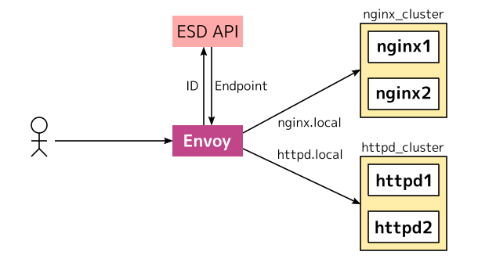

いよいよEnvoyの肝であるxDSサーバーを使いたいと思います。
まず手始めにエンドポイントを設定できるEndpoint Discovery Service (EDS) を提供するサービスを実装します。

xDSおさらい
-----------

EnvoyではgRPCまたはREST API経由で動的に設定変更できます。
これはEnvoyにリクエストを送るのではなく、EnvoyがAPIを提供するサーバーに繋ぎにいきます。
APIには、エンドポイントの設定を提供する Endpoint Discovery Service (EDS) や、クラスタの設定を提供する Cluster Discovery Service (CDS) などがあります。
これらをまとめて**xDS API**と呼びます。

xDS APIのデータ構造はProtocol Bufferによって定義されています。
[v2 API reference][]も大体はこのProtocol Bufferに基づきます。
またEnvoy起動時にロードする静的な設定も、ほとんどの設定項目がこの構造体の定義に基づきます。

xDS APIを提供するサーバーを**コントロールプレーン**と呼び、Envoy側を**データプレーン**と呼びます。

構成図
------

今回構築する構成は以下の図のとおりです。

{{}}

基本的なクラスタ構成は[前回の記事][]と似ています。
Envoyはバーチャルホストに基づいて、ユーザーからのリクエストを2つのクラスタに分岐します。

前回と違う点は、Envoyは起動時に転送先のエンドポイント（アドレスとポート）を知りません。
かわりにEDS APIからエンドポイントの設定をロードして、接続先ホストのアドレスやポートを知ります。

エンドポイントを保持するEDS APIは、接続するEnvoyのIDに基づいた適切なエンドポイントを返します（今回はとりあえず固定です）。


GoのXDSサーバー実装
------------

Envoyのコントロールプレーンは、EnvoyのプロトコルにしたがったAPIを提供します。
公式でProtocol Bufferが提供されてますが、go-control-planeという公式の便利Go実装があります。



go-config-planeはxDS APIが使えるだけでなく、キャッシュ機能などの実運用に必要な機能もあります。

クラスタを起動
--------------

前回と同じくnginxクラスタとhttpdクラスタをあらかじめ起動します。

```console
$ docker run --rm --name nginx1 nginx
$ docker run --rm --name nginx2 nginx
$ docker run --rm --name httpd1 httpd
$ docker run --rm --name httpd2 httpd
```

エンドポイントを知るために雑なシェル芸を叩きます。
ここで取得したIPアドレスを後ほどxDS APIで利用します。

```console
$ for h in nginx1 nginx2 httpd1 httpd2; do docker inspect $h | jq -r '.[].NetworkSettings.IPAddress'; done
```

Envoyを起動
-----------

まずはEnvoyの設定ファイルをゴシゴシと書きます。

```yaml
# /tmp/envoy/envoy.yaml
node:
  id: node0
  cluster: cluster.local

static_resources:
  listeners:
  - name: listener_0
    address:
      socket_address: { address: 0.0.0.0, port_value: 80 }
    filter_chains:
    - filters:
      - name: envoy.http_connection_manager
        config:
          stat_prefix: ingress_http
          route_config:
            name: route
            virtual_hosts:
            - name: nginx_service
              domains: ["nginx.local"]
              routes:
              - match: { prefix: "/" }
                route: { cluster: nginx_cluster }
            - name: httpd_service
              domains: ["httpd.local"]
              routes:
              - match: { prefix: "/" }
                route: { cluster: httpd_cluster }
          http_filters:
          - name: envoy.router
  clusters:
  - name: nginx_cluster
    connect_timeout: 0.25s
    lb_policy: ROUND_ROBIN
    type: EDS
    eds_cluster_config:
      eds_config:
        api_config_source:
          api_type: GRPC
          grpc_services:
            envoy_grpc:
              cluster_name: xds_cluster
  - name: httpd_cluster
    connect_timeout: 0.25s
    lb_policy: ROUND_ROBIN
    type: EDS
    eds_cluster_config:
      eds_config:
        api_config_source:
          api_type: GRPC
          grpc_services:
            envoy_grpc:
              cluster_name: xds_cluster
  - name: xds_cluster
    connect_timeout: 0.25s
    lb_policy: ROUND_ROBIN
    http2_protocol_options: {}
    load_assignment:
      cluster_name: xds_cluster
      endpoints:
      - lb_endpoints:
        - endpoint:
            address:
              socket_address: {address: 127.0.0.1, port_value: 20000 }
```

### `node` セクション

前回にはなかった `node` セクションには、Envoyの識別子を書きます。
`node`セクションはxDS APIを利用する場合は必須となります。

### `cluster` セクション

前回と同く`httpd_cluster`と`nginx_cluster`を`clusters`セクションに記述します。
前回と違いエンドポイントを与えるのではなく、EDSを利用することを宣言します。
EDSを利用するには、`type: EDS` を指定して、`eds_cluster_config`にEDSの設定を記述します。

EDSの接続先もまた、`clusters` 以下に定義します。
ここにEDSのクラスタ名 `xds_cluster` を宣言します。
`xds_cluster`自体は前回と同じように`load_assignment`で明示的にエンドポイントを与えます。
この `xds_cluster` を、上記の `eds_cluster_config` 内で指定します。


以上でEnvoyの設定はおわりです。
試しにEnvoyを起動してみます。
するとxds_clusterに接続を試みますが、まだxDS APIに接続できないためリトライし続けます。

```console
$ docker run \
    --name envoy --rm --network host \
    -v /tmp/envoy:/etc/envoy \
    envoyproxy/envoy:v1.9.0
```

xDS APIの実装
-------------

さて本題のxDS APIを実装します。
基本的に以下のコードをコピペすれば動きます。
ただし`github.com/envoyproxy/go-control-plane` は最近APIの変更が入ったので **v0.6.6** を使ってください。


```go
package main

import (
	"flag"
	"fmt"
	"log"
	"net"
	"os"

	api "github.com/envoyproxy/go-control-plane/envoy/api/v2"
	core "github.com/envoyproxy/go-control-plane/envoy/api/v2/core"
	"github.com/envoyproxy/go-control-plane/envoy/api/v2/endpoint"
	"github.com/envoyproxy/go-control-plane/pkg/cache"
	xds "github.com/envoyproxy/go-control-plane/pkg/server"
	"google.golang.org/grpc"
)

// NodeHash interfaceの実装。Envoyの識別子から文字列をかえすハッシュ関数を実装する。
type hash struct{}

func (hash) ID(node *core.Node) string {
	if node == nil {
		return "unknown"
	}
	return node.Cluster + "/" + node.Id
}

var upstreams = map[string][]struct {
	Address string
	Port    uint32
}{
	// ここはコンテナのアドレス
	"nginx_cluster": {{"172.17.0.2", 80}, {"172.17.0.3", 80}},
	"httpd_cluster": {{"172.17.0.4", 80}, {"172.17.0.5", 80}},
}

// スナップショットを返す。構造体の形はProtocol Bufferの定義と同じ。
func defaultSnapshot() cache.Snapshot {
	var resources []cache.Resource
	for cluster, ups := range upstreams {
		eps := make([]endpoint.LocalityLbEndpoints, len(ups))
		for i, up := range ups {
			eps[i] = endpoint.LocalityLbEndpoints{
				LbEndpoints: []endpoint.LbEndpoint{{
					Endpoint: &endpoint.Endpoint{
						Address: &core.Address{
							Address: &core.Address_SocketAddress{
								SocketAddress: &core.SocketAddress{
									Address:       up.Address,
									PortSpecifier: &core.SocketAddress_PortValue{PortValue: up.Port},
								},
							},
						},
					},
				}},
			}
		}
		assignment := &api.ClusterLoadAssignment{
			ClusterName: cluster,
			Endpoints:   eps,
		}
		resources = append(resources, assignment)
	}

	return cache.NewSnapshot("0.0", resources, nil, nil, nil)
}

func run(listen string) error {
	// xDSの結果をキャッシュとして設定すると、いい感じにxDS APIとして返してくれる。
	snapshotCache := cache.NewSnapshotCache(false, hash{}, nil)
	server := xds.NewServer(snapshotCache, nil)

        // NodeHashで返ってくるハッシュ値とその設定のスナップショットをキャッシュとして覚える
	err := snapshotCache.SetSnapshot("cluster.local/node0", defaultSnapshot())
	if err != nil {
		return err
	}

        // gRCPサーバーを起動してAPIを提供
	grpcServer := grpc.NewServer()
	api.RegisterEndpointDiscoveryServiceServer(grpcServer, server)

	lsn, err := net.Listen("tcp", listen)
	if err != nil {
		return err
	}
	return grpcServer.Serve(lsn)
}

func main() {
	var listen string
	flag.StringVar(&listen, "listen", ":20000", "listen port")
	flag.Parse()

	log.Printf("Starting server with -listen=%s", listen)

	err := run(listen)
	if err != nil {
		fmt.Println(os.Stderr, err)
		os.Exit(1)
	}
}
```

`pkg/cache` パッケージや `pkg/server` パッケージは、xDS APIを提供するための高位なライブラリです。
これらはxDSの設定を内部でキャッシュして、Envoyが渡す識別子に紐づく適切な設定をxDS APIで返します。

デフォルトでスナップショット形式のキャッシュ実装が用意されてます。
これはEnvoy識別子と設定値を内部で持ち、Envoy識別子に対応する設定値を返します。
キャッシュはinterfaceとして定義されてるので、必要ならばキャッシュを自前で実装できます。
もちろん高級すぎて使いにくいという人は、ナイーブなライブラリも用意されてます。

さあ、必要なライブラリをインストールしてこのコードを`go run`すればコントロールプレーンは起動します。
Envoyがコントロールプレーンに接続できると、繰り返し出力されてた警告が収まるはずです。
うまくいけばxDS APIを使って適切なエンドポイントを取得できているでしょう。

試しに以下のコマンドを打ってみてください。
それぞれhttpdクラスタとnginxクラスタに接続できれば成功です。

```console
$ curl -H'Host: httpd.local' 127.0.0.1
$ curl -H'Host: nginx.local' 127.0.0.1
```

おわりに
--------

コードだらけの記事になってしまいましたが、なんとなくxDS APIで何ができるか伝われば幸いです。
そしてEnvoyでは通常のHTTPプロキシ以上の事ができるのがなんとなくわかったと思います。
これを応用すれば、マイクロサービスに必要なサービスディスカバリやネットワーク制御もEnvoyでできることがわかるでしょう。

まだまだEnvoyを探求して、他のトピックについてもまた記事を書きたいと思います！

[前回の記事]: http://localhost:1313/2019/02/03/envoy-static-load-balancer/
[v2 API reference]: https://www.envoyproxy.io/docs/envoy/latest/api-v2/api
[core.Node]: https://www.envoyproxy.io/docs/envoy/latest/api-v2/api/v2/core/base.proto#envoy-api-msg-core-node
