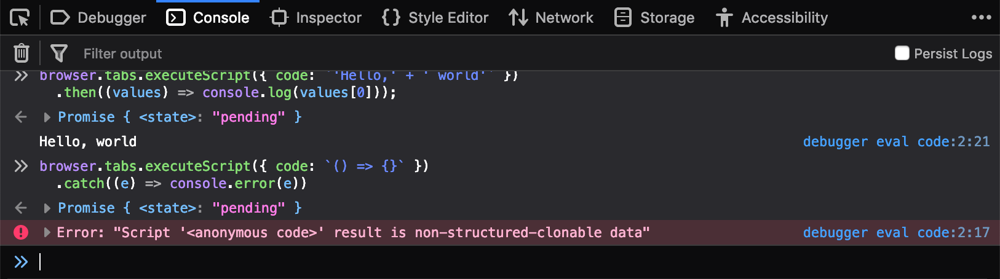

{{}}

WebExtensionsの[`tabs.executeScript()`][tabs.executeScript()]メソッドは、Background ScriptからContent Script上にJavaScriptを注入できます。
たまたま調べる機会があって挙動が面白かったので簡単に記事にまとめました。

基本動作
--------

`executeScript()`はContent Script上で任意のスクリプトを実行して最後に評価した値を返します。
`executeScript()`はPromiseを返す非同期関数で、評価した値はthenの引数から取得できます。
最後に評価した値は、例えば以下の例では`'my result'`になります。

```javascript
var foo='my result';foo;
```

`executeScript()` の結果は各フレームで評価された値がArrayに格納されます（フレームを指定しないとトップウィンドウのみで実行します）。
以下のコードはすべてのタブのURLがBackground Scriptのコンソールに表示されます。

```javascript
// すべてのタブを取得
browser.tabs.query({}).then((tabs) => {
  for (let tab of tabs) {
    // 各タブでwindow.location.hrefを返す
    browser.tabs.executeScript(tab.id, {
      code: `window.location.href`
    }).then((values) => {
      // 返した値をコンソールに出力
      console.log(values[0])
    });
  }
});
```

`executeScript()`の第1引数は省略可能で、指定しないとアクティブなタブ上で実行します。
次の例はアクティブなタブのURLをBackground Scriptのコンソールに表示します。

```javascript
browser.tabs.executeScript({
  code: `window.location.href`
}).then((values) => {
  // 返した値をコンソールに出力
  console.log(values[0])
});
```


返す値の型
----------

`executeScript()` は文字列以外の型を返すことができます。
返すことのできる値の型は[structured clonable][structured clonable]という制約があります。

```javascript
// Number
browser.tabs.executeScript({ code: `100 + 200` })
  .then((values) => console.log(values[0]));

// String
browser.tabs.executeScript({ code: `'Hello,' + ' world'` })
  .then((values) => console.log(values[0]));

// Array
browser.tabs.executeScript({ code: `[10, 20].concat([30])` })
  .then((values) => console.log(values[0]));

// Object
browser.tabs.executeScript({ code: `({ key1: 123, key2: 456})` })
  .then((values) => console.log(values[0]));

// RegExp
browser.tabs.executeScript({ code: `/-pattern-/` })
  .then((values) => console.log(values[0]));
```

一方Functionはstructured clonableではないので返すことができません。

```javascript
browser.tabs.executeScript({ code: `() => {}` })
  .catch((e) => console.error(e))
// Error: Script '<anonymous code>' result is non-structured-clonable data
```

例外
----

実行したスクリプト内で発生した例外も、Background Scriptで受け取ることができます。
受け取るには`executeScript()`が返すPromiseで例外をキャッチします。
ただしスタックトレースは正しく取得できません。

```javascript
browser.tabs.executeScript({ code: `throw new Error('err')` })
  .catch((e) => console.error(e));
```

非同期処理
----------

返す値は即値だけでなくPromiseを使って非同期で返すことができます。
Promiseが最後に解決した値をBackground Scriptに返します。

```javascript
browser.tabs.executeScript({
  code: `new Promise((resolve, reject) => setTimeout(() => resolve(new Date()), 3000))`
}).then((values) => console.log(values[0]));
```

もちろんrejectもできます。

```javascript
browser.tabs.executeScript({
  code: `new Promise((resolve, reject) => setTimeout(() => reject(new Error('err')), 3000))`
}).catch((e) => console.error(e));
```

ファイルからロードする
----------------------

`code`ではなく`file`プロパティを指定すると、スクリプトをファイルからロードします。

```javascript
// page.js
fetch('https://example.com/user/1')
  .then((resp) => resp.json())
```

```javascript
// background.js
browser.tabs.executeScript({
  file: 'page.js'
}).then((values) => console.log(values[0]));
// Object { id: 1, name: "alice", age: 12 }
```

ただしロードするスクリプトを記述するとき、トランスパイルなどの利用には注意が必要です。
トランスパイルは振る舞いが等価なコードを生成しますが、最後に評価する値が変わることがあります。

Webpackでは以下のように`(function(){ ... })()`で囲われたコードが出力されます。
これは名前空間の汚染対策ですが、function内でreturnをしてないため、最終的に評価される値`undefinied`となります。
そのためBackground Scriptで値が返ってくることを期待しても`undefinied`しか返ってきません。

```javascript
// 変換前
'Hello, world'
```

```javascript
// 変換後
(function() {
  'Hello, world'
})();
```

まとめ
------

`executeScript()`は柔軟でいろいろな応用ができそうです。
しかし複雑な処理が必要になったときは、素直にContent Scriptを書いて非同期メッセージを送ったほうが懸命です。
このあたりの使い分けはスクリプトの規模感やビルド環境に合わせて調整してください。

[tabs.executeScript()]: https://developer.mozilla.org/en-US/docs/Mozilla/Add-ons/WebExtensions/API/tabs/executeScript
[activeTab permission]: https://developer.mozilla.org/en-US/docs/Mozilla/Add-ons/WebExtensions/manifest.json/permissions#activeTab_permission
[host permission]: https://developer.mozilla.org/en-US/docs/Mozilla/Add-ons/WebExtensions/manifest.json/permissions#Host_permissions
[structured clonable]: https://developer.mozilla.org/en-US/docs/Web/API/Web_Workers_API/Structured_clone_algorithm
