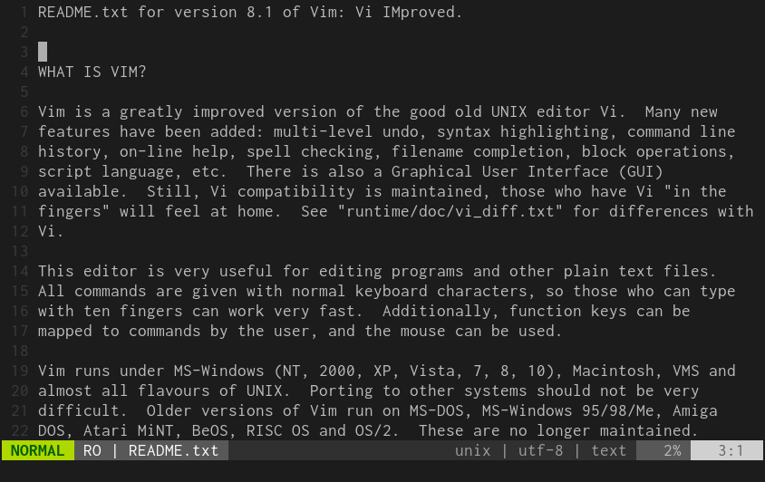
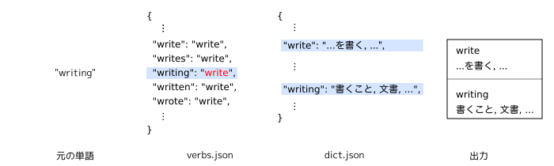

ついこの間、Vimにpopupが実装されたという話題と、[Mouse Dictionary][]がタイムラインに流れてきました。
自分もVimのPopupを使って英単語の意味を調べるプラグインを作ってみました。

{{}}

GitHubレポジトリはこちらです。



## 使い方

dein.vimやvim-plugのパッケージマネージャーでインストールできるはずです。

```vim
" vim-plug
Plug 'ueokande/popupdict.vim'

" dein.vim:
dein#add('ueokande/popupdict.vim')

" NeoBundle
NeoBundle 'ueokande/popupdict.vim'
```

設定可能な変数は以下の2つです。

| name              | default | description             |
|---                |---      |---                      |
| `g:popup_enabled` | `1`     | `1` ならPopupを表示する |
| `g:popup_width`   | `60`    | Popupの横幅             |

## 内部構造

今回はとりあえず動くものを作りたかったので、単語の候補と意味はキーバリューのオブジェクトに格納しました。
また動詞の過去形や現在進行系から意味を取れないので、動詞を現在形に正規化する処理をします。
これも動詞の変化形と原形をキーバリューに持つオブジェクトに格納します。

辞書データに元の単語と原形両方の意味があれば、2つとも表示します。
なぜなら一部の名詞となった動詞は、別の意味を持つ可能性があるからです。

{{}}

動詞の原形および辞書のデータは以下のレポジトリのものを使用させていただきました。

- https://github.com/monolithpl/verb.forms.dictionary
- https://github.com/kujirahand/EJDict

実装する上での懸念点として、パフォーマンスの点で懸念がありました。
動詞の変形の辞書は26,605エントリ、翻訳の辞書は46,840エントリあります。
これを快適に表示できるか、起動が遅くならないかが気になりました。
実際に実装してみて、それは気にするほどにパフォーマンスに影響はありませんでした。

## まとめ

自分はVimプラグインの経験は浅くちょこっとした小物を作った程度した。
これも実装料は大したことはありませんが、Vimの力強さを改めて認識しました。
標準機能だと物足りなかったことが、ちょっとしたスクリプトを書いて便利にするという点では、ブラウザ拡張と似ているなと思いました。

[Mouse Dictionary]: https://qiita.com/wtetsu/items/c43232c6c44918e977c9
