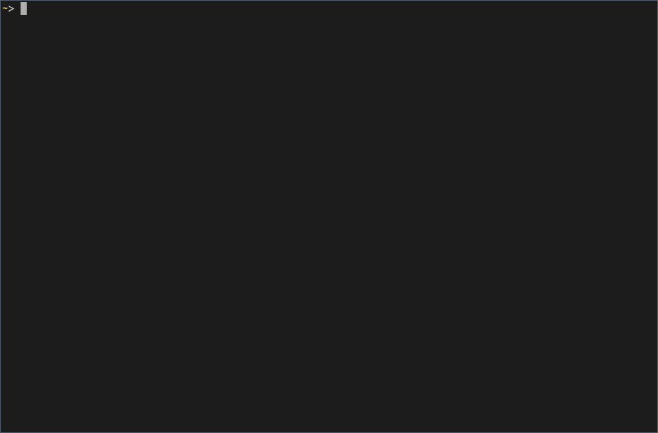

Kubernetesのログビューア**Logbook**を作りました。
Kubernetesやその周辺ツールは船に関する名前から由来されることが多いです。
英語で *logbook* は航海日誌のことを指します。
航海日誌のようにログをパラパラとログを閲覧できる、そんなツールを作りました。

{{}}




## なぜ作ったの？

Webサービスにおいてログは大変重要なものです。
Kubernetesでもログを閲覧するコマンド`kubectl logs`コマンドがあります。
しかしログを追う時、`kubectl pods`と`kubectl logs`を何往復もすることが割と面倒です（自分だけかも知れませんが）。

複数コンテナにまたがるログを`tail`できる[stern][]は大変便利なツールです。
しかし時として、特定のコンテナのログをじっくり眺めたいときがあります。
そんなツールが欲しくてlogbookを作りました。

## 使い方

Goのツールなので、`go get`でインストールできます。

```console
$ go get -u github.com/ueokande/logbook
```

起動はkubeconfigとnamespaceを指定できます。

```console
$ logbook [--kubeconfig KUBECONFIG] [--namespace NAMESPACE]
```

よく使うキーバインドは以下のとおりです。

- <kbd>Ctrl</kbd>+<kbd>n</kbd>/<kbd>Ctrl</kbd>+<kbd>p</kbd>: Podを選択
- <kbd>Tab</kbd>: コンテナの切り替え
- <kbd>j</kbd>/<kbd>k</kbd>: 上下にスクロール
- <kbd>Ctrl</kbd>+<kbd>D</kbd>/<kbd>Ctrl</kbd>+<kbd>U</kbd>: 半ページスクロール
- <kbd>Ctrl</kbd>+<kbd>F</kbd>/<kbd>Ctrl</kbd>+<kbd>B</kbd>: 1ページスクロール
- <kbd>G</kbd>/<kbd>g</kbd>: 最下部、最上部にスクロール
- <kbd>q</kbd>: 閉じる

## 使用技術

### Kubernetes API

Kubernetesとの通信はk8s.io以下で配布されてるクライアントライブラリを使いました。
ログ取得の[API][PodExpansion]も公式で提供されてるので簡単に取得できました。

デバッグ用にKubernetesクラスタが欲しかったので、今回[kind][]というツールを試して見ました。
kindはDocker上でKubernetesクラスタを容易に建てられるツールです。
個人的な感想ですが、minikubeよりもトラブルが少なく使いやすという感じでした。

### TUIライブラリ

TUI(Terminal User Interface)はもう1つの技術的チャレンジです。
logbookは単発のコマンドラインツールではなく、リッチなUIを描画します。
使用したライブラリは[tcell][tcell]です。

TUIライブラリの有名どころといえば、[termbox][]とそのGo実装の[termbox-go][]です。
しかし現在termbox-goはメンテナンスされておらず、作者もtcellを勧めてました（ただし本人は使ったことがないらしい）。
自分も初めて使ってみましたが、なかなか癖のあるAPIでした。
tcellに関しては情報が共に少ないので、また時間を見つけて記事を書きたいと思います。

## まとめ

今回初めてKubernetesの周辺ツールを作ってみました。
Kubernetes APIは何度か触ったことはあるのですが、周辺ツールやTUIアプリケーションと新しいチャレンジが多かったです。
logbookはとりあえず動くものを公開しただけなので、これから機能追加も続けていきたいと思います。

[PodExpansion]: https://godoc.org/k8s.io/client-go/kubernetes/typed/core/v1#PodExpansion
[stern]: https://github.com/wercker/stern
[kind]: https://github.com/kubernetes-sigs/kind
[tcell]: https://github.com/gdamore/tcell
[termbox]: https://github.com/nsf/termbox
[termbox-go]: https://github.com/nsf/termbox-go
