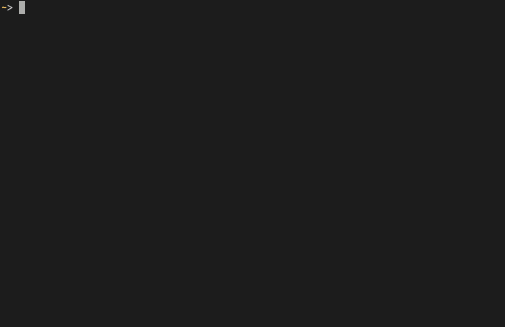

Kubernetesの複数コンテナ上で、並列のコマンドを実行できるツール **bow** を作りました。
英語で *bow* は船首を意味します。

{{}}



## なぜ作ったの？

`kubectl exec` コマンドは、Kubernetes上のアプリケーションのデバッグや、障害調査に役立てることができます。
しかし水平スケールが柔軟にできるKubernetesでは、特定のコンテナでコマンドを実行するというのはあまり適切ではありません。
規模によってはコンテナの数が数個から数十個になることもあります。
そういった環境でコンテナ1つずつ`kubectl exec`するのは大変だというのが容易に想像ができるでしょう。

また別のケースを考えてみます。
Kubernetes上のアプリケーションは、標準出力 (STDOUT) に出したログはKubernetesの仕組みを使って閲覧できます。
しかし時折、標準出力以外にログを出したい場合もあります。
そういったログを閲覧するには、`kubectl logs`コマンドではなく、`kubectl exec`などでログインして、`cat`や`tail -F`で閲覧します。
この方法も、数十個のコンテナが実行している環境ではもはや通用しません。

そこで複数のPod上でコマンドを実行できるツールを作りました。
このコマンドのアイディアは、複数Podでログを閲覧できる[stern][]から得ました。
Sternと同じような操作で`kubectl exec`を実行できるツールを作りました。

## 使い方

Goのツールなので、`go get`でインストールできます。

```console
$ go get -u github.com/ueokande/bow
```

Sternと同じように、第1引数に対象Podを指定します。

```console
$ bow [OPTIONS] POD_SELECTOR -- COMMAND ARG...
Flags:
  -c, --container string    Container name when multiple containers in pod
  -h, --help                help for bow
      --kubeconfig string   Path to kubeconfig file to use
  -n, --namespace string    Kubernetes namespace to use.
      --no-hosts            Do not print hosts
```

例えばfrontendにマッチするPod（名前に含むか、ラベルの値に持つか）に対して、`hostname`コマンドを実行するのは以下のとおりです。

```console
$ bow frontend hostname
frontend-74bdf9b58d-542b9 sidecar| frontend-74bdf9b58d-542b9
frontend-74bdf9b58d-bgsmk sidecar| frontend-74bdf9b58d-bgsmk
frontend-74bdf9b58d-mkf2d php-redis| frontend-74bdf9b58d-mkf2d
frontend-74bdf9b58d-bgsmk php-redis| frontend-74bdf9b58d-bgsmk
frontend-74bdf9b58d-mkf2d sidecar| frontend-74bdf9b58d-mkf2d
frontend-74bdf9b58d-542b9 php-redis| frontend-74bdf9b58d-542b9
```

コンテナを指定しないと全てのコンテナで実行します。
実行するコンテナを明示的に指定するには`-c`オプションを使います。

```console
$ bow frontend -c php-redis hostname
frontend-74bdf9b58d-bgsmk php-redis| frontend-74bdf9b58d-bgsmk
frontend-74bdf9b58d-542b9 php-redis| frontend-74bdf9b58d-542b9
frontend-74bdf9b58d-mkf2d php-redis| frontend-74bdf9b58d-mkf2d
```

ファイルのログを`tail -F`するには以下のとおりです。
`bow`ではなく実行するコマンドにオプションを渡すために、コマンドの直前に`--`を付けます。

```console
$ bow frontend -c php-redis -- tail -F /var/log/apache2/access.log
```

## まとめ

[logbook][prevarticle]に引き続き、Kubernetes周辺ツールを作ってみました。
今回実装で一番苦労した点は、`kubectl exec`相当のAPIをGoから利用する点でした（詳しくは後日また改めて書きます）。
そこは公式の`kubectl`のソースコードを参考にしました。

業務で利用するKubernetesクラスタがどんどん大きくなるにつれ、標準の`kubectl`ではカバーできない事が多くなってきました。
Kubernetes API自体も簡単なので、繰り返して入力してるコマンドや面倒と思ったことは、どんどんツール化してみようと思います。

[stern]: https://github.com/wercker/stern
[kind]: https://github.com/kubernetes-sigs/kind
[prevarticle]: https://i-beam.org/2019/07/15/logbook/

