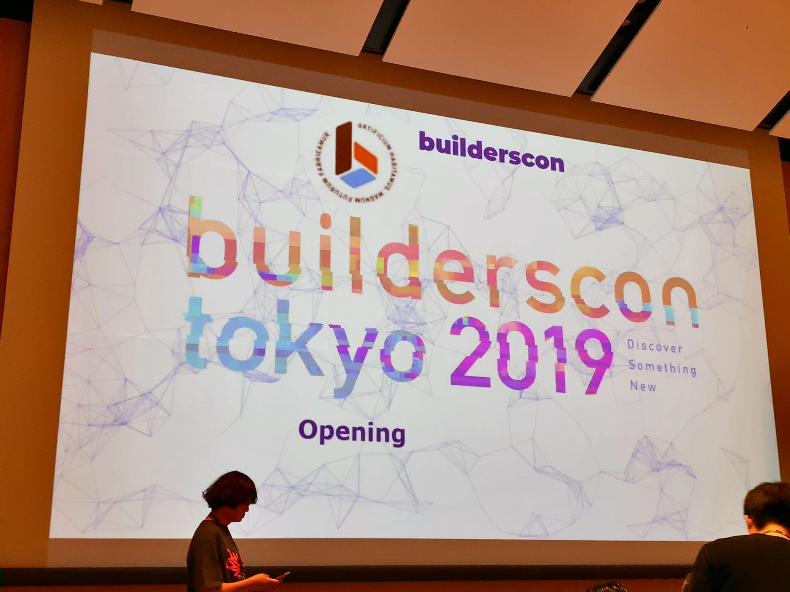

{{}}

Builderscon Tokyo 2019の1日目に参加してきました。
本日は朝から晩まで参加しましたが、その中でも個人的に気になった3セッションを紹介します。

## Open SKT: メルペイ開発の裏側 (@kazegusuri)

1つめはメルペイの[@kazegusuri][]さんによる発表です。
Open SKTはメルペイで行われているアーキテクチャ研修の名称です。

メルペイのアーキテクチャはマイクロサービスで構成されます。
それぞれのサービスが協調して各サービスの一貫性を保証して、システム全体での一貫性を保証する必要があります。

各サービス間の整合性は2相コミットしてるとのことです。
それに加えてサービスは他のサービスのデータを確認して、サービス感で発生した差分を吸収しています (reconsile)。
前者の2相コミットだけでも各サービスの一貫性は（理論上は）保証できるはずですが、
後から質問をしたところreconcileは保険として実行してるみたいでした。

そして分散システムは難しいと改めて再認識しました。

## RDBのトラブルの現場を追え！ (@soudai1025)

2つめはオミカレの[@soudai1025][]さんの発表です。
RDBMS (MySQL/PosgreSQL/Oracle SQL) のパフォーマンスや障害にまつわるお話でした。

内容はRDBMSにおける「スロークエリ」「不正データ」「パフォーマンス」「障害」の4つのテーマに別れてました。
自分はRDBMSの知識といえば、SQLを利用できるけどパフォーマンスチューニングなどの深いところには踏み入れたことが無いというレベルでした。
そんな自分にもとてもわかりやすい内容で、なぜパフォーマンスが出ないかなどの理由もきちんと説明されてました。

また全体的に感じたのは、RDBエンジンの違いやバージョン間の差分などもスラスラと口からでてきて、
現場で長くRDBMSを触ってるんだなぁと思いました。

## 現在フロントエンドに欠かせないwebpackとBabelを理解しよう (@\_\_sakito\_\_)

3つめはサイボウズの[@\_\_sakito\_\_][]さんです。
webpackとBabelのお話でした。

自分自身もVim VixenでBabelとwebpackを使ってますが、構成が難しすぎていつも雰囲気で使ってました。
そんな自分にもわかるような、内部処理やBabelのビルドプロセスなど詳しく紹介されてました。
またBabelがトランスパイルするときASTに一度落としてから処理するのを見ると、言語処理などの計算機科学の知識がこんなところでも役に立つんだなと思いました。

内部構造だけでなくBabelやwebpackの歴史も大変興味深かったです。
昔は6to5だったが後にトランスパイラとしての機能が多くなったBabel。
webmakeでCode Splittingの提案が取り入れられずプロジェクトが分離したwebpack。
なんとなく使ってるルールも生まれた経緯とかを知るとまた違った視点で見えてきます。

## まとま

以上Builderscon Tokyo 2019 1日目の参加レポートでした。
昨年同様Webサービスに関するお話が大半でしたが、様々なレイヤーのお話が聞けてよかったです。
明日も参加する予定なので、2日目の参加レポートも楽しみにしてください！

[@soudai1025]: https://twitter.com/soudai1025
[@kazegusuri]: https://twitter.com/kazegusuri
[@\_\_sakito\_\_]: https://twitter.com/__sakito__

