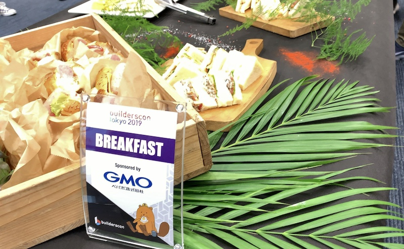

{{}}

Builderscon Tokyo 2019の2日目に参加してきました。
本日も朝から晩まで参加しました。
その中でも個人的に気になった3セッションを紹介します。

## OSS Security the hard way

1つめは[@hsbt][]さんによる発表です。
Rubyを例にした、オープンソースソフトウェアとセキュリティに関する発表でした。

<iframe src="//www.slideshare.net/slideshow/embed_code/key/CPoga1wtd1hgHy" width="595" height="485" frameborder="0" marginwidth="0" marginheight="0" scrolling="no" style="border:1px solid #CCC; border-width:1px; margin-bottom:5px; max-width: 100%;" allowfullscreen> </iframe> 
 <strong> <a href="//www.slideshare.net/hsbt/oss-security-the-hard-way" title="OSS Security the hard way" target="_blank">OSS Security the hard way</a> </strong> from <strong><a href="https://www.slideshare.net/hsbt" target="_blank">Hiroshi SHIBATA</a></strong> 

Rybyの脆弱性が報告された後の対応が特に興味深かったです。
OSSであっても報告された脆弱性は修正されるまでは外部に公開できません。
Rubyも同じで、脆弱性に関するやり取りや修正コードも対応が終わるまで公開されません。
レビューもトピックブランチを切るのではなく、昔ながらのパッチのやり取りで進めるという味わい深いものでした。

オープンにする文化と親和性が高いOSSも、ユーザーを守るために脆弱性の取り扱いには慎重というのが認識できました。

## Building, and Upkeeping Super Kamiokande

2つめは[早戸先生][]による、スーパーカミオカンデにお話でした。

物理の話を真面目に聞けたのは学生時代が最後でした。
また素粒子物理学の知識はあまりありませんでしたが、とても面白くてわかり易い説明でした。

後半にカミオカンデ、スーパーカミオカンデの構造の話になり、どのようにカミオカンデがニュートリノを感知し、どうやってコンピュータで処理するかの説明がありました。
そこで物理の話が急にコンピュータサイエンスに結びついて鳥肌が立ちました。
ニュートリノを感知・情報処理するために、画像処理やコンピューターアーキテクチャ、ネットワークの話など、聞き覚えがある話もたくさんありました。

このセッションは「盛り上がったで賞」に選ばれるくらいに盛り上がり、非常に良いお話が聞けました。

## Peddle the Pedal to the Metal slideshow

3つめは[Howard Chu][@hyc_symas]さんによる発表です。
OpenLDAPのチューニングに関するお話でした。

[スライド](http://highlandsun.com/hyc/20190831-BuildersCon-Metal.pdf)

OpenLDAPはチューニングによりパフォーマンスが100倍向上したそうです。
OpenLDAPはC言語で記述されてますが、C意外にも応用できそうな内容でした。

パフォーマンスを計測すると、実行時間の殆どがCライブラリの呼び出しでした。
Don't Repeat Yourself (DRY) の原則をパフォーマンスでも適用します。
例えば文字列の長さなどは一度計算した内容を、structのフィールドに保持して再利用します。

Webサービスにおいても、パフォーマンスはユーザーへの価値に結び付けられることができます。
JVMやスクリプト言語では、C言語と同じチューニングはできないですが、DRYなどの原則などは使えるかなと思いました。

## まとめ

以上Builderscon Tokyo 2019 2日目の参加レポートでした。
2日間とても充実した日で、とてもよい刺激になりました。
また運営スタッフの皆さんありがとうございます。

実は自分はBuildersconのCfPに応募したのですが、残念ながら採用されませんでした。
来年こそは登壇者側で参加したいです。

[@hsbt]: https://twitter.com/hsbt
[@hyc_symas]: https://twitter.com/hyc_symas
[早戸先生]: http://www-sk.icrr.u-tokyo.ac.jp/graduate/yhayato.html
