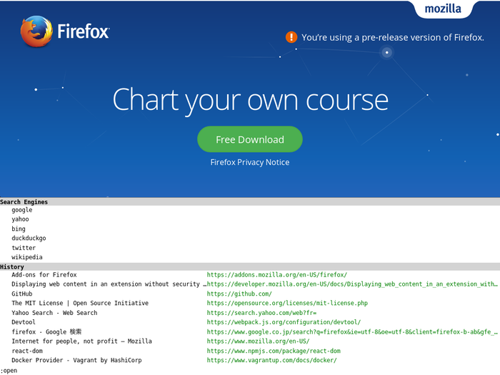

{{}}

本日、2019年10月11日は、Vim Vixenリリースからちょうど2年が経過します。
昨日リリースした0.25が最新バーションで、今後も引き続き開発を続けていく予定です。
現在はおかげさまでユーザー数は12,000を超えて、GitHubスター数も1,500を超えました。

この2年間のVim Vixenを振り返って行きたいと思います。

## 2年間の実績

まずは2年間の開発実績を見ていきます。
最初のコミットは2017年8月11日なので、この日が開発開始と言えるでしょう。

この2年間でリリースした回数は25回で、コミット数は1,285です。
現在はTypeScriptで記述しており、コード量は本体コードが8,795行、テストは7,263行になりました。
このコードには自分以外に30人のコントリビューターから送られたPull Req.も含みます。
基本的にメインメンテナーは自分ひとりで、新規機能やバグフィックスはGitHub上で行ってます。

2年間でCloseしたIssueの数は246件です。
着手するIssueの優先度は、:thumbs_up: が多い物を優先的に取り組んでますが、基本的に自分が欲しい機能から実装してます。

## 2年間のリリースの歴史

Vim Vixenのバージョンは特にメジャーバージョン・マイナーバージョンを意識するのが面倒だったので、0.xxというナンバリングにしています。
初期の頃は機能追加とバグフィックスを交互にリリースしてましたが、現在は各リリースの変更サイズをできるだけ揃えるようにしてますが、大抵は気まぐれです。

### バージョン0.1

最初のリリースです。
スクロール、タブ切り替え、リンクオープンなどの基本的なブラウザ操作をできるのを第一目標にリリースしました。
こ最初はBabel + webpackという構成で、ES2015をES5にトランスパイルしてます。
また内部の状態管理にはRedux風のオレオレライブラリを実装して、HTMLの描画は素朴なDOM APIを使ってます。

### バージョン0.2

主な新規機能は以下のとおりです。

- リンクのfollowモードで、frame/iframe対応をしました。

followモードのframe/iframeは機能としては小粒ですが、frame/iframeではそれぞれ個別にプラグインがロードされるので、
アンカーの採番やリンククリックなどを実装するために`postMessage()`を使って協調動作するのが大変だった記憶があります。

### バージョン0.3

主な新規機能は以下のとおりです。

- <kbd>Shift</kbd>+<kbd>Esc</kbd>でアドオンの有効・無効を切り替えるようにしました。
- Blacklistを導入し、URLにマッチするページでアドオンを無効化できるようにしました。

このリリース以降、急激にGitHubスター数が増え始めました。
それと同時にIssueも報告されはじめ、1日10件以上の報告が毎日続いた期間がありました。

### バージョン0.4

主な新規機能は以下のとおりです。

- `<area>` タグ内のリンクをfollowモードで開けるようにしました。

`<area>` タグ内のリンクを開けるようにしたのは、自分がよく利用する気象庁のページでよく利用されてるためです。

### バージョン0.5

主な新規機能は以下のとおりです。

- <kbd>g</kbd><kbd>0</kbd>/<kbd>g</kbd><kbd>$</kbd>で先頭・末尾のタブを選択するようにしました
- <kbd>z</kbd><kbd>p</kbd>でタブのピン留めを切り替えるようにしました
- <kbd>z</kbd><kbd>d</kbd>でタブを複製するようにしました
- <kbd>/</kbd>キーでページ内検索に対応しました。

### バージョン0.6

バグフィックスと細かなユーザーエクスペリエンスの向上です。

### バージョン0.7

主な新規機能は以下のとおりです。

- GUIの設定画面をサポートしました

JSONで設定してたのを、GUIのフォーム画面にも対応しました。
フォーム画面の描画にはPreactを採用しました。

### バージョン0.8

バグフィックスと細かなユーザーエクスペリエンスの向上です。

### バージョン0.9

不具合があったのでリリーススキップです。

### バージョン0.10

不具合があったのでリリーススキップです。

### バージョン0.11

バージョン0.9と0.10で不具合があったので、緊急リリースしたバージョンです。
主な新規機能は以下のとおりです。

- プロパティという概念を導入しました。`smoothscroll`プロパティと`hintchars`プロパティを追加しました。
- <kbd>g</kbd><kbd>i</kbd>で最初の`<input>`タグにフォーカスするようにしました。
- <kbd>!</kbd><kbd>d</kbd>でピン留めされたタブを閉じるようにしました。
- <kbd>p</kbd>/<kbd>P</kbd>でクリップボードからURLを開くようにしました。

このバージョンでアドオンパッケージをシェルスクリプトからNodeに移行しました。
その時にパッケージ作成に失敗して、AMOアップロード後にロードできないというのに気づきました。

その修正後、改めてリリースすると、新たに導入したプロパティにも不具合があり、プラグインが動作しないというのに気付きました。
結果として2バージョンもリリースを中止しました。

### バージョン0.12

バグフィックスと細かなユーザーエクスペリエンスの向上です。

このリリースからリリース前に実施してた試験項目を、自動化への移行を始めました。
またこのリリース前後で、GitHubスターが1,000も超えました。

### バージョン0.13

不具合があったのでリリーススキップです。

### バージョン0.14

バージョン0.13で不具合があったので、緊急リリースしたバージョンです。
主な新規機能は以下のとおりです。

- このバージョンからFirefoxのツールバーにVim Vixeのアイコンが表示されるようになりました。アイコンをクリックすることで、Vim Vixenを有効・無効を切り替えることができます。
- Vim Vixenの更新があった時、ユーザーに通知するようにしました。
- <kbd>g</kbd><kbd>g</kbd>でページのソースを開くようにしました。
- `:addbookmark` コマンドを追加して、コンソールからブックマークを作成できるようにしました。
- `:quit` コマンドを追加して、コンソールから現在のタブを閉じられるようにしました
- `:bdelete`/`:bdeletes` コマンドを追加して、コンソールからキーワードにマッチするタブを閉じられるようにしました。

またTravis CIからCircleCIに移行しました。

### バージョン0.15

バグフィックスと細かなユーザーエクスペリエンスの向上です。

PromiseではなくES6のasync/awaitを利用するようにしました。
Babel使ってるからもっと早くにasync/await使えばよかった。

### バージョン0.16

主な新規機能は以下のとおりです。

- `:buffer` コマンドで、`#`/`%`でタブを選択できるようにしました。
- 全てのタブを閉じる `:quitall` コマンドを追加しました。
- <kbd>p</kbd>/<kbd>P</kbd>でクリップボードからキーワード検索できるようにしました。
- `:quitall` コマンドで全てのタブを閉じるようにしました。

### バージョン0.17

バージョン0.16でFirefox60 ESR上の動作に不具合があったので緊急リリースしたバージョンです。
Mozillaが公式にサポートしてるFirefox上での動作を保証するために、ユニットテストの実行環境をサポートしてる一番古いFirefox ESRにしました。

状態管理で実装したオレオレRedux風ライブラリから、公式のReduxパッケージを利用することにしました。
またBackground scriptの設計をReduxではなく、Clean Archtectureにほぼフルスクラッチで書き直しました。

### バージョン0.18

バグフィックスと細かなユーザーエクスペリエンスの向上です。

### バージョン0.19

主な新規機能は以下のとおりです。

- ページ内マーク<kbd>m</kbd>とジャンプ<kbd>'</kbd>に対応しました。
- `complete`プロパティを追加して、タブを開くときの補完を管理できるようにしました。

CircleCI 2.1に移行しました。

### バージョン0.20

主な新規機能は以下のとおりです。

- <kbd>g</kbd><kbd>h</kbd>/<kbd>g</kbd><kbd>H</kbd>キーで、ホームページを開くようにしました

コンソールの描画にPreactを使って描画するようにしました。
またfollowモードでメッセージ送信に`postMessage()`使ってた部分を、セキュリティの理由でWebExtensions APIを使うようにしました。

### バージョン0.21

バグフィックスと細かなユーザーエクスペリエンスの向上です。

### バージョン0.22

バグフィックスと細かなユーザーエクスペリエンスの向上です。

E2Eテスト自動化ツールとして、プロジェクトの内部ライブラリして実装してましたが、
1から作り直してnpmパッケージに[切り出しました][lanthan]（ドキュメントはまだ整備できてません）。

### バージョン0.23

主な新規機能は以下のとおりです。

- <kbd>.</kbd>で最後の操作を繰り返すようにしました

本体のコードをJavaScriptからTypeScriptに移行しました。
そしてContent Scriptの設計を、ReduxではなくClean Archtectureにほぼフルスクラッチで書き直しました。
また画面描画を、PreactからReactに変更しました。

### バージョン0.24

バグフィックスと細かなユーザーエクスペリエンスの向上です。

### バージョン0.25

主な新規機能は以下のとおりです。

- Partial blacklistに対応しました。
- 公式ページも兼ねたヘルプページを作成しました。https://ueokande.github.io/vim-vixen/
- `:help`コマンドで上記のページを開くようにしました

このバージョンから、CircleCIを使って自動リリースも導入しました。
これでGit上でタグを打つだけでAMOにアップロードされます。

## まとめ

もともとVim Vixenの開発を始めたきっかけは、Firefox 53からVimperatorが使えなくなったという理由でした。
最初は自分が使えればいいと思ってひっそりとリリースしたのですが、現在たくさんのユーザーに使っていただいてます。
初期リリース1ヶ月後くらいにユーザー数が急激に増えた頃は、Issue対応やバグフィックスに追われて大変だった時期もありました。
それも地道に対応を進めて、今では落ち着きました。

Vim Vixenの開発で、貰った一番嬉しいPull Req.は、ドキュメントの修正です。
自分が書く英語は、英語ネイティブな人たちがの文書よりも遥かに下手くそです。
助詞が足りないとかの些細な変更でも、ありがたく受け入れます。

今後もVim Vixenの応援をよろしくおねがいします。

[lanthan]: https://github.com/ueokande/lanthan
