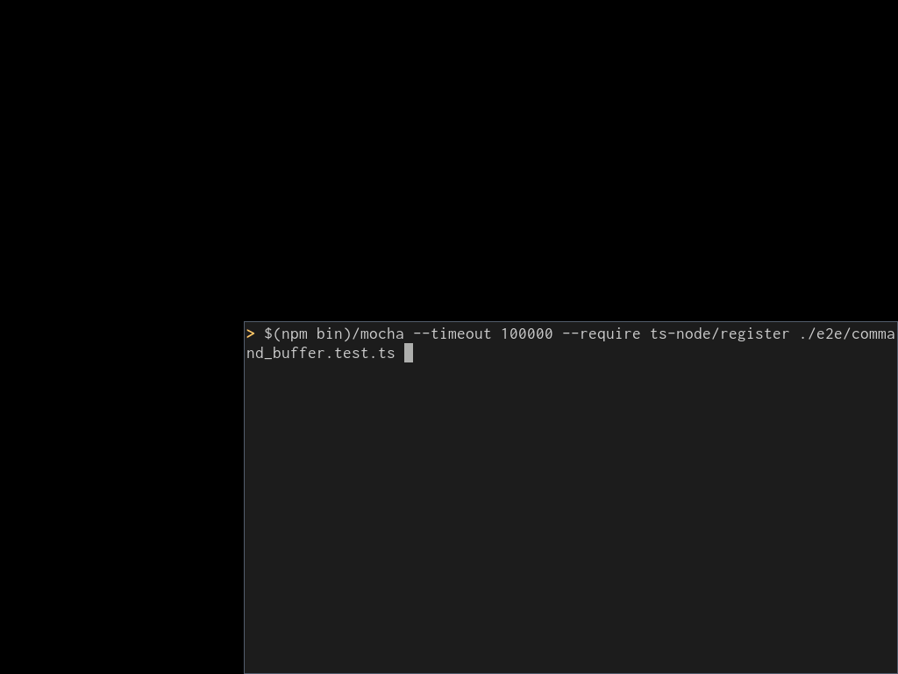

WebExtensionsのE2Eテスト自動化ツール『lanthan』を作りました。
元々はVim VixenのE2Eテストを自動化するために開発を始めたのですが、独立したモジュールとして切り出したため、様々なWebExtensionsのE2Eテストに利用できます。

{{}}

以前、WebExtensionsのE2Eテスト自動化の取り組みについて記事を書きました。

- [WebExtensionsでE2Eテストを自動化した](https://i-beam.org/2018/02/25/webextensions-e2e-testing/)

この仕組みは、テスト実行をKarmaなどを使ってブラウザ上で実行する必要があり、制限が多くメンテナンス性も乏しかったです。
この記事で紹介するlanthanは別のアプローチでWebExtensionsのE2Eテストを実行できます。
lanthanは設計を見直して1から作り直したライブラリで、現在のVim Vixenもlanthanを使ってE2Eテストを自動実行しています。

## インストール

lanthanは[npm][]パッケージとして公開しています。
`npm install`でインストールできます。

```shell
$ npm install -D lanthan
```

`package.json`の`devDependencies`に直接記述することでインストールできます。

```json
{
  "devDependencies": {
    "lanthan": "0.0.2"
  }
}
```

## クイックスタート

いくつかのサンプルをプロジェクトの[`examples`][examples]ディレクトリに用意してあります。

### lanthanのセットアップと終了処理 ([`examples/01_setup_teardown.js`][01_setup_teardown.js])

`lanthan` パッケージは、ビルダークラス `Builder` を提供しています。

```javascript
// Common JS
const { Builder } = require('lanthan');

// ES Module
import { Builder } from 'lanthan';
```

`Builder` はブラウザのセッションを作成して、ブラウザにアクセスするAPIを提供します。
`Builder` はstaticメソッド`forBrowser()`で初期化します。
現在は`"firefox"`のみサポートしてます。
`build()`を呼び出すことで、Firefoxが起動して、ブラウザにアクセスできる `Lanthan` オブジェクトを返します。

```javascript
let lanthan = await Builder
  .forBrowser('firefox')
  .build();
```

ブラウザのセッションを閉じるには `quit()` メソッドを呼び出します。

```javascript
await lanthan.quit();
```

### WebExtensions APIを取得する ([`examples/02_webext_api.js`][02_webext_api.js])

lanthanのブラウザセッションは、*リモート* WebExtensions APIを提供します。
これはWebExtensions互換のAPIですが、ブラウザの外から呼び出せます。
つまりNode.jsなどのローカル環境からブラウザを制御したり、WebExtensionsの振る舞いを検証できます。

`Lanthan` オブジェクトの `getWebExtBrowser()` メソッドはWebExtensions API互換のオブジェクトを返します。

```javascript
// WebExtensions APIを取得
let browser = lanthan.getWebExtBrowser();
```

たとえば、タブを作成したり、現在のタブを取得できます。

```javascript
// タブを作成する
await browser.tabs.create({ url: 'https://example.com/' });
await browser.tabs.create({ url: 'https://example.org/' });

// 全てのタブを取得する
let tabs = await browser.tabs.query({});

// 取得したタブを検証する
assert.strictEqual(tabs.length, 3);
```

### WebDriver APIを取得する ([`examples/03_webdriver_api.js`][03_webdriver_api.js])

lanthanはSelenium WebDriver APIも提供しています。
キーイベントを送信したり、DOMを検証したり、JavaScriptを実行できます。
このAPIはテスト自動化に役立ちます。

`Lanthan` オブジェクトの `getWebDriver()` メソッドは、Selenium WebDriver APIを返します。

```javascript
// WebDriver APIを取得
let webdriver = lanthan.getWebDriver();
```

たとえば、ページを開いてリンクをクリックする例は以下のとおりです。

```javascript
// Open https://example.com/
await webdriver.navigate().to('https://example.com/');

await webdriver.findElement(By.css('a')).click();
```

Selenium WebDriver APIの詳しい情報は、[Selenium project][selenium-project-document]や[JavaScipt APIドキュメント][selenium-webdriver-javascript-document]を参照してください。

### Add-onへのspy ([`examples/04_spy_addon.js`][04_spy_addon.js])

LanthanはリモートからWebExtensions APIを呼び出すために、HTTPサーバーを立てるadd-onをインストールします。
これは1つの独立したアドオンですが、既存のアドオンに組み込むこともできます（spy）。
既存のアドオンにspyすることで、内部状態（たとえばlocal storage）などにアクセスできます。

lanthanプロジェクトの[`examples/addon`][examples/addon]に、サンプルadd-onを用意しました。
このアドオンはページ内の打鍵数をカウントして、local storageにページoriginごとの打鍵回数を保存します。

lanthanがadd-onをspyするには、ビルダーオブジェクトの`spyAddon()`メソッドを呼び出します。

```javascript
let lanthan = await Builder
  .forBrowser('firefox')  // Lanthan currently supports only Firefox
  .spyAddon(path.join(__dirname, 'addon'))  // Spy to the add-on
  .build();
```

リモートWebExtensions APIはターゲットアドオンのlocal storageにアクセスできるので、テストなどで検証できます。

```javascript
let { count } = await browser.storage.local.get('count');
assert.strictEqual(count['https://example.com'], 1);
assert.strictEqual(count['https://example.org'], 3);
assert.strictEqual(count['https://example.net'], undefined);
```

## まとめ

lanthanはVim VixenのE2E自動化のために始めたプロジェクトですが、npmパッケージとして切り出してVim Vixen以外にも利用できるようにしました。
Vim Vixenは100を超えるテストケースを、lanthanを使ってCircleCI上でE2Eテストを実行しています。

lanthanの開発はGitHub上で進めています。
今後の開発の動向はそちらを参照してください。


[npm]: https://www.npmjs.com/package/lanthan
[examples]: https://github.com/ueokande/lanthan/blob/master/examples/
[examples/addon]: https://github.com/ueokande/lanthan/blob/master/examples/addon
[01_setup_teardown.js]: https://github.com/ueokande/lanthan/blob/master/examples/01_setup_teardown.js
[02_webext_api.js]: https://github.com/ueokande/lanthan/blob/master/examples/02_webext_api.js
[03_webdriver_api.js]: https://github.com/ueokande/lanthan/blob/master/examples/03_webdriver_api.js
[04_spy_addon.js]: https://github.com/ueokande/lanthan/blob/master/examples/04_spy_addon.js
[selenium-project-document]: https://www.seleniumhq.org/docs/
[selenium-webdriver-javascript-document]: https://seleniumhq.github.io/selenium/docs/api/javascript/module/selenium-webdriver/
