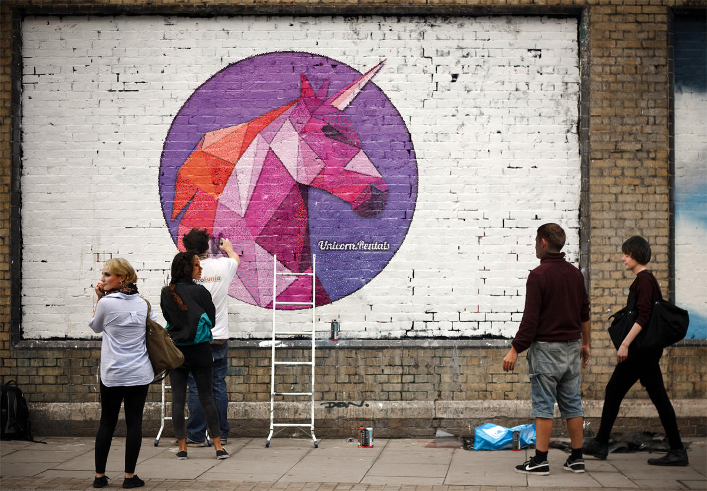

[AWS GameDay Tokyo][]に参加してきました。
詳しいコンテンツ内容の説明は控えますが、イベントの概要や所感などを簡単にお伝えしたいと思います。

{{}}

AWS GameDayとは
=============

[AWS GameDay][]とは、AWS上に構築したサービスの改善や、障害対応などでポイントを競う、ハッカソン形式のDevOpsのコンテストです。
AWS GameDayは毎年re:Inventで開催され、AWS GameDay Tokyoは日本人向けに翻訳されたコンテストです。
テーマは基本的に、本家のre:Inventの内容がそのままで、今回は”Microservices Madness”でした。
コンテストはチーム戦で行われ、あらかじめ運営によって振り分けられたチームで構成されました。

ポイントの計算方法は、単純に説明するとサービスが安定してるとポイントが加点されます。
逆にサービスがダウンしているとポイントが減点されます。
つまり普段の業務と同じで、障害が発生したらその原因を特定して、対処したり再発防止の手を打ちます。
またポイントを維持するには（つまり稼働率を維持するには）、冗長化や対障害性などの仕組みも必要になります。

結果と感想
==========

自分のチームはAWSができるメンバが多かったです。
後半は1位にまで上り詰めたのですが、最後に発生した障害の原因特定に時間がかかり、最終的に2位となりました。
時間切れ直前に原因特定ができたのですが、すでに1位との差が開いてて、追い抜くことができませんでした。

その後の懇親会で、改めてチームメンバとお話をしたのですが、その時初めて社会人1年目のメンバがいるということを知りました。
結果に影響するかわかりませんが、もっと事前にアイスブレイクをして、互いのメンバや得意なサービスについて知っておけばよかったと思いました。
実際の障害対応でも、チームメンバのことを知ることは大事です。

おわりに
========

AWS GameDayの参加で、初めて触ったAWSサービスもありましたが、良い刺激になりました。
AWSの腕に自身がある方や、普段の業務で使っているという方は、チャレンジしてみてはどうでしょうか？

[AWS GameDay]: https://aws.amazon.com/gameday/
[AWS GameDay Tokyo]: https://awsgamedaymicroservicestokyo.splashthat.com/
