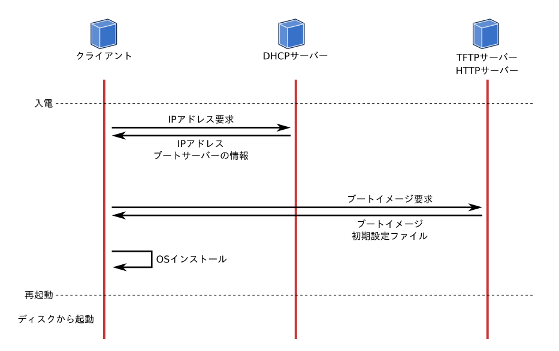

こんにちは、本日から「Goで作るモダン・ブートサーバ」という記事を書きます。
久々にブログ記事書くか〜〜〜と軽いノリで書き始めたら、思いの外長くなったので、不定期に連載します。
この記事では、Goでブートサーバーを書く前に、ブートサーバーの基本について説明します。

## ネットワークブート

個人のマシンや小規模なサーバー群なら、マシンに1台ずつOSをインストールしても大した手間ではありません。
しかし扱うマシンが多くなると、とても手動でOSインストールできなくなります。
**ネットワークブート** はその名の通り、ディスクではなくネットワーク経由でマシンをブートする方法です。
VMのようにイメージを用意できない物理マシンを管理するときは、OSのインストールや起動にネットワークブートを用いることが多いです。

ネットワークブートの環境を構築するといくつかのメリットがあります。

- OSインストールの手間が減る
- 複数のマシンを一元管理できる
- OSの状態管理がいらない

### OSインストールの手間が減る

1つめのメリットは、上記にも述べたOSインストールの手間が減ることです。
もちろんマシン側で、起動時にネットワークブートを有効にする必要はありますが、それさえ有効にすれば後はネットワーク経由でにインストールを開始できます。
インストーラーを自動で設定するようにカスタマイズすれば、入電さえすればマシンのOSインストールや初期設定を自動で終わらせることができます。

### 複数のマシンを一元管理できる

2つ目のメリットは、マシンの管理性の向上です。
ネットワークブートでは、起動するマシンはブートサーバーにマシンの情報を送信します。
この情報には、ネットワークのMACアドレスや、自身のシリアル番号、製品名などが含まれます。
そのため、シリアル番号毎にIPアドレスを管理したり、モデルごとに異なる設定を管理して適用できます。

### OSのメンテナンスがいらない

3つ目のメリットは、少し特殊なケースです。
通常OSをディスクにインストールすると、カーネルやパッケージのメンテナンスが必要になります。
例えば一部のパッケージに脆弱性が発見されると、そのパッケージをアップデートします。
アップデートを繰り返えして新規インストールの状態からどんどん乖離すると、問題発生時に再現する環境を用意するのも手間になります。
しかしOSインストールそのものをなくし、ネットワークから直接起動できれば、このメンテナンスコストも発生しません。

もちろんディスクインストールと比較すると、起動時のネットワークトラフィックは増えますが、管理コストを減らすことができます。
カーネルやパッケージのアップデートという概念がなくなり、OSの更新作業はマシンを再起動して最新のイメージをロードするのみです。
OSの状態は不変になり、[Immutable Infrastructure][] との親和性が高くなります。

## ブートサーバーを作ろう

この記事では、ネットワークブートを提供するサーバーを **ブートサーバー** と呼ぶことにします。
ブートサーバーを実装するには、いくつかのキーワードが登場します。

- DHCPサーバー
- PXEブート
- iPXEブート
- UEFI HTTPブート

### DHCPサーバー

まずはネットワークブートに欠かせないDHCPサーバーです。
DHCPサーバーは、ネットワークでおなじみのIPアドレスを自動で割り当てるプロトコルですが、ネットワークブートに必要な情報も送受信できます。
DHCPクライアントはIPアドレスの要求パケットと共に、MACアドレスやクライアント情報を送信できます。
またDHCPサーバーからの応答パケットには、割り当てるIPアドレスと共にブートに必要な情報（ブートサーバーのIPアドレスやブートイメージのURL）を載せられます。

### PXEブート

PXEブートは古くからあるネットワークブートの規格です。
PXEブートは、PXEに準拠したNIC（ネットワークインターフェイスカード）が搭載されているマシンで利用できます。
PXEブートはDHCPとTFTPを組み合わせた規格で、DHCPの応答パケットにTFTP上のパスが返されます。
それを受け取ったクライアントは、TFTPサーバーからブートイメージをロードして、マシンはOSを起動したりインストールを開始できます。

### iPXEブート

iPXEはPXEを拡張した規格およびオープンソースのファームウェアです。
iPXEではTFTP以外に、HTTPやiSCSIに対応しており、Wi-Fiからのブートもできます。
iPXEを組み込んでいるハードウェアは多くありませんが、柔軟性や実装の容易さから利用されることは多いです。
またQEMUなどで用意されている仮想NICのファームウェアは、iPXEが搭載されているものが多いです。

### UEFI HTTP Boot

UEFI HTTP Bootは、UEFI自身に組み込まれているブート方式です。
PXEやiPXEと同様に、DHCPの応答パケットにあるURLから、EFIアプリケーションをロードします。
UEFIはDHCPの応答パケットからEFIアプリケーションをロードして実行します。

## おわりに

さて、説明ばかりになりましたが、基礎知識編はここまでです。
次の記事では早速実装といきたいところですが、まずはネットワークブートに必要な環境構築をします。
QEMUを使った仮想マシンとLinuxの仮想ネットワークを使って、仮想的なブート環境を構築します。
それでは次回お楽しみに！

[Immutable Infrastructure]: http://chadfowler.com/2013/06/23/immutable-deployments.html
[PXE]: http://www.pix.net/software/pxeboot/
[iPXE]: https://ipxe.org/
