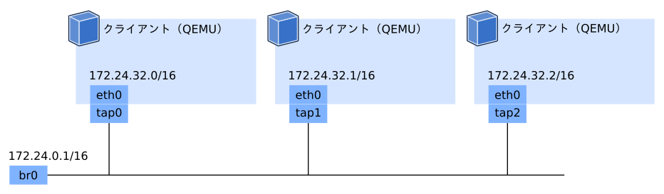

この記事は「Goで作るモダン・ブートサーバー」の2日目の記事です。
今回はブートサーバーを開発するための開発環境を構築します。
ブートサーバーの検証をするための、 Linux上で仮想ネットワークと仮想マシンを作る方法を紹介します。

シリーズの記事は以下のリンクからどうぞ。

- [Goで作るモダン・ブートサーバー Day 1 - 基礎知識編][day1]
- Goで作るモダン・ブートサーバー Day 2 - 環境構築編 <strong style='color:#ff3200'>← この記事</strong>
- [Goで作るモダン・ブートサーバー Day 3 - 雑DHCPサーバー実装編][day3]

## 環境構築

ブートサーバーの検証に物理マシンを利用しても良いのですが、仮想環境が用意できれば、デバッグや検証が捗ります。
まず想定する環境は、ブートサーバーとブートするマシン（クライアントと呼ぶ）を同じL2ネットワーク内に配置します。
クライアントは起動すると、IPアドレスとブート情報を、同じL2ネットワーク内にあるDHCPサーバーに要求します。

ネットワークは `172.24.0.0/16` のネットワークアドレスを持つとします（アドレスの範囲は `172.24.0.0/16`  - `172.24.255.255/16` です）。 
DHCPサーバーは `172.24.0.1`  というIPアドレスを持っています。
DHCPサーバーはクライアントに対して、`172.24.32.0` - `172.24.32.255` の範囲のアドレスを割り当てます。

上記の構成を、仮想マシンと仮想ネットワークを使って構築します。
ブートサーバーはVMホスト上に立てて、L2ネットワーク上にDHCPを提供します。
この構成を作るために、以下の3つの準備をします。

- ブリッジの作成
- TAP (Terminal Access Point) の作成
- クライアント (QEMU) の起動

図にすると以下のような構成です。



### ブリッジの作成

Linuxにはブリッジと呼ばれる仮想的なL2ネットワークを作成する機能があります。
ブリッジは `ip` コマンドから作成します（`ip` コマンドは多くのLinuxディストリビューションではiproute2パッケージから利用できます）。
まず以下のコマンドで、`br0` というブリッジの作成し、ブリッジを有効にします。

```sh
# ブリッジの作成
sudo ip link add br0 type bridge
# デバイスの状態をUPに
sudo ip link set br0 up
```

次にブリッジにホストが利用するIPアドレスの割当です。
VMホストから仮想ネットワークにはこのアドレスで接続します。

```sh
# アドレスを追加
sudo ip address add 172.24.0.1/16 dev br0
```

### TAPの作成

次にTAPと呼ばれる、VMが利用する仮想ネットワークインターフェイスを作成します。
TAPも `ip` コマンドから作成します。
まず `tap0` というTAPを作成します。

```sh
# TAPを作成
sudo ip tuntap add tap0 mode tap
```

そしてTAPをブリッジに接続して、有効化します。

```sh
# TAPをブリッジに接続
sudo ip link set tap0 master br0
# デバイスの状態をUPに
sudo ip link set tap0 up
```

### クライアント (QEMU) の起動

それでは作成したブリッジとTAPを使うクライアントを起動します。
クライアントはQEMUのVMで作成します。
QEMUの `-netdev` オプションで、作成したTAPを指定します。

```sh
# MACアドレス
mac_address="52:54:00:99:99:99"

# QEMU起動
qemu-system-x86_64 \
  -nodefaults \    # デフォルトオプションを利用しない
  -enable-kvm \    # KVMを利用する
  -boot n \        # ネットワークブート
  -nographic \	   # グラフィック出力を無効化
  -serial stdio \  # シリアル出力をstdioに
  -netdev tap,id=nic1,ifname=tap0,script=no,downscript=no \  # ネットワークデバイスを指定
  -device virtio-net-pci,netdev=nic1,mac=${mac_address}	     # NICのドライバとMACアドレスを指定
```

クライアントのMACアドレスに `52:54:00:99:99:99` を割り当てます。
先頭3オクテット (`52:54:00`) はQEMU用のベンダーIDで、QEMUで利用ときは `52:54:00:**:**:**` というMACアドレスを割り当てます。

## 導通テスト

上記の手順で、仮想的なL2ネットワーク上に接続するクライアントを作成できました。
ホスト側の `br0` に、クライアントからDHCPリクエストが届くか確認してみましょう。

DHCPのデバッグには`dhcpdump`というコマンドが便利です。
このコマンドではDHCPパケットの中身を見ることができます。
`-i` オプションでインターフェイスを指定できます。
`52:54:0:99:99:99` からのDHCPのリクエストが確認できます。

```sh
sudo dhcpdump -i br0
```

```sh
  TIME: 2020-03-01 16:32:47.362
    IP: 0.0.0.0 (52:54:0:99:99:99) > 255.255.255.255 (ff:ff:ff:ff:ff:ff)
    OP: 1 (BOOTPREQUEST)
 HTYPE: 1 (Ethernet)
<以下略>
```

## お掃除

最後に作成したVMと仮想ネットワークを破棄します。
QEMUは<kbd>Ctrl</kbd>+<kbd>C</kbd>で終了できます。
TAPと作成したTAPとブリッジは以下のコマンドで削除できます

```sh
# TAPの削除
sudo ip tuntap delete tap0 mode tap
# ブリッジの削除
sudo ip link delete br0 type bridge
```

## 環境構築のスクリプト化

さて、上記のコマンドを毎回手で打つのは大変です。
そこでネットワークの作成やVMのスタートを簡単にするスクリプトを用意しました。
今後の記事では、このスクリプトを使って環境の構築をします。

https://github.com/ueokande/building-boot-server/blob/master/bin/setup

```sh
# ネットワークの作成
sudo ./setup network --name br0 --address 172.24.0.1/16

# クライアントの起動
sudo ./setup node --network br0
```

## おわりに

この記事ではブートサーバーを開発するLinux上の環境構築について説明しました。
次回はいよいよ、ブートサーバーを作成していきます。
まずはブートサーバーの第一ステップとして、DHCPの仕様の説明とDHCPサーバーを実装します。

[day1]: /2020/02/25/go-modern-bootserver-01/
[day3]: /2020/03/18/go-modern-bootserver-03/
