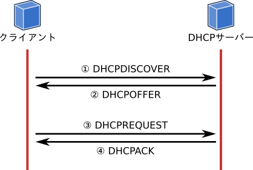
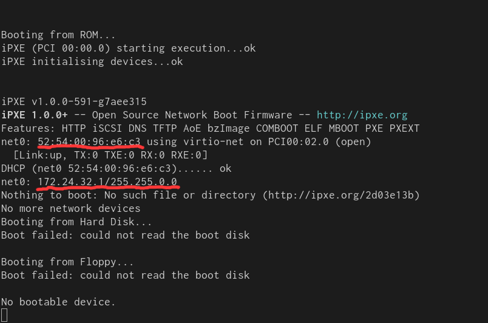

この記事は「Goで作るモダン・ブートサーバー」の3日目の記事です。
今回からはお待ちかねの、実装が始まります。
この回ではGoでDHCPサーバーを実装します。

シリーズの記事は以下のリンクからどうぞ。

- [Goで作るモダン・ブートサーバー Day 1 - 基礎知識編][day1]
- [Goで作るモダン・ブートサーバー Day 2 - 環境構築編][day2]
- Goで作るモダン・ブートサーバー Day 3 - 雑DHCPサーバー実装編 <strong style='color:#ff3200'>← この記事</strong>
- [Goで作るモダン・ブートサーバー Day 4 - PXEサーバー実装編][day4]

今回はDHCPサーバーを実装できればと思い記事を書きましたが、仕様の説明だけで長くなり（仕様も全部説明できなかった）、きちんとしたDHCPサーバーの実装まで至りませんでした。
そのためDHCPサーバーの実装も数段階に分けて進めたいと思います。
この記事ではDHCPの仕様を説明しつつ、固定IPアドレスを割り当てるガバガバDHCPサーバーを実装します。

今回作成するコードは以下のレポジトリで公開しています。



## DHCP (Dynamic Host Configuration Protocol) について

DHCP ([RFC 2131][])は、クライアントがIPアドレスやネットマスクなどの設定をネットワーク経由で自動的に取得するプロトコルです。
DHCPはBOOTP (Bootstrap Protocol, [RFC 951][]) を拡張したプロトコルで、IPアドレスのリース機能と追加の設定項目が利用可能になりました。
現在ではDHCPはネットワーク接続時の自動設定という印象が強いですが、名前にあるとおりBOOTP自体はマシンのブートストラップを想定したプロトコルです。

### DHCPメッセージ

DHCPのメッセージにはいくつかの種類があり、RFC 2131では8つのDHCPメッセージが定義されています。
このうちDHCPサーバーがクライアントにIPアドレスを割り当てる時に利用されるのは、DHCPDISCOVER、DHCPOFFER、DHCPREQUEST、DHCPACK の4つのメッセージです。
次の図はDHCPサーバーがIPアドレスをクライアントに割り当てるまでにやり取りするメッセージです。



1. DHCPDISCOVER: クライアントがDHCPサーバーを探すために、L2ネットワーク内にブロードキャストします。
2. DHCPOFFER: DHCPDISCOVERを受け取ったDHCPサーバーが、設定値をクライアントに返答します。
3. DHCPREQUEST: DHCPOFFERメッセージを受け取ったクライアントが、DHCPサーバーに返答します。
4. DHCPACK: DHCPREQUESTを受け取ったDHCPサーバーが、クライアントに設定値を使ってよいという返答します。

### パケット構造

DHCPはUDPのプロトコルです。
DHCPで送受信するパケット構造は、DHCPサーバーが送信するパケットとDHCPクライアントが送信するパケットで同じです。
それぞれのメッセージの種類ごとに、各フィールドに適切な値を埋めます。
以下がDHCPのパケット構造です。

    0                   1                   2                   3
    0 1 2 3 4 5 6 7 8 9 0 1 2 3 4 5 6 7 8 9 0 1 2 3 4 5 6 7 8 9 0 1
    +-+-+-+-+-+-+-+-+-+-+-+-+-+-+-+-+-+-+-+-+-+-+-+-+-+-+-+-+-+-+-+-+
    |     op (1)    |   htype (1)   |   hlen (1)    |   hops (1)    |
    +---------------+---------------+---------------+---------------+
    |                            xid (4)                            |
    +-------------------------------+-------------------------------+
    |           secs (2)            |           flags (2)           |
    +-------------------------------+-------------------------------+
    |                          ciaddr  (4)                          |
    +---------------------------------------------------------------+
    |                          yiaddr  (4)                          |
    +---------------------------------------------------------------+
    |                          siaddr  (4)                          |
    +---------------------------------------------------------------+
    |                          giaddr  (4)                          |
    +---------------------------------------------------------------+
    |                                                               |
    |                          chaddr  (16)                         |
    |                                                               |
    |                                                               |
    +---------------------------------------------------------------+
    |                                                               |
    |                          sname   (64)                         |
    +---------------------------------------------------------------+
    |                                                               |
    |                          file    (128)                        |
    +---------------------------------------------------------------+
    |                                                               |
    |                          options (variable)                   |
    +---------------------------------------------------------------+

### DHCPサーバーからの返答メッセージのフィールド

DHCPサーバーがクライアントに送信するDHCPOFFERとDHCPACKメッセージでは、それぞれのフィールドの値は以下のとおりです。
DHCPサーバーはこの仕様に従い、それぞれのパケットを埋めます。

| フィールド | DHCPOFFER                | DHCPACK                  | フィールドの説明
|-----       | ---------                | -------                  | -------
| op         | BOOTREPLY (2)            | BOOTREPLY (2)            | DHCPサーバーへの要求がBOOTREQUEST(1)、DHCPからの応答がBOOTREPLY (2)
| htype      | 1                        | 1                        | ハードウェアのタイプ。イーサネットは1
| hlen       | 5                        | 6                        | MACアドレスの長さ。イーサネットは1
| hops       | 0                        | 0                        | DHCPリレーエージェントのホップ数
| xid        | DHCPDISCOVERのxid        | DHCPREQUESTのxid         | クライアントが生成する一貫したID（ランダム）
| secs       | 0                        | 0                        | クライアントのリクエストが開始してからの経過秒数
| ciaddr     | 0                        | DHCPREQUESTのciaddr      | クライアントのIPアドレス
| yiaddr     | 割り当てアドレス         | 割り当てアドレス         | クライアントに割り当てるIPアドレス 
| siaddr     | ブートサーバーのアドレス | ブートサーバーのアドレス | ブートサーバーのアドレス             | 
| flags      | DHCPDISCOVERのflags      | DHCPREQUESTのflags       | ブロードキャストかユニキャストかを表す
| giaddr     | DHCPDISCOVERのgiaddr     | DHCPREQUESTのgiaddr      | リレーエージェントのIPアドレス
| chaddr     | DHCPDISCOVERのchaddr     | DHCPREQUESTのchaddr      | クライアントのMACアドレス
| sname      | サーバー名               | サーバー名               | DHCPサーバーのサーバー名
| file       | ブートファイル           | ブートファイル           | ブートに必要なブートサーバー上のファイル名 (TFTPのパス名やHTTPブートのURL) です。
| options    | options                  | options                  | オプション

optionsは予約された番号と対応する数値や文字列、IPアドレスを載せられるフィールドです。
例えば `54` はサーバー識別子を表す番号で、その値はDHCPサーバーのIPアドレスを載せられます。
この番号とその意味は [RFC 2132][] で定義されています。

## DHCPサーバーの実装

さて、上記の仕様に基づいた、IPアドレスの割り当てを実装してみましょう。
DHCPサーバーが受け取るのはDHCPDISCOVERとDHCPREQUESTで、それぞれのメッセージでDHCPOFFERとDHCPACKを返します。

上記のとおりにUDPパケットを組み立てても良いのですが（Goなら簡単ですよね）、
もっと簡単に実装するために [go.universe.tf/netboot][danderson/netboot] パッケージを使います。
このパッケージはDHCP4やDHCP6、そしてTFTPのライブラリを含みます。

### サーバーを建てる

それではDHCPDISCOVERを受け取った時にDHCPOFFERを返し、DHCPREQUESTを受け取った時にDHCPACKを返す簡単なサーバーを作ります。
go.universe.tf/netbootのdhcp4パッケージでは、op、htype、hlen、hopsは自動で埋めてくれます。
また何も設定しなければゼロ値が使われるので、上記表の0の部分は何も代入しなくて良いです。

固定アドレを割り当てるDHCPサーバーの実装が以下のとおりです。
ほんの50行ほどでできました。

```go
package main

import (
	"log"
	"net"

	"go.universe.tf/netboot/dhcp4"
)

func main() {
	listen := "0.0.0.0:67"
	conn, err := dhcp4.NewConn(listen)
	if err != nil {
		log.Fatalf("[FATAL] Unable to listen on %s: %v", listen, err)
	}
	defer conn.Close()

	log.Printf("[INFO] Starting DHCP server...")
	for {
		req, intf, err := conn.RecvDHCP() //    (1)
		if err != nil {
			log.Fatalf("[ERROR] Failed to receive DHCP package: %v", err)
		}

		log.Printf("[INFO] Received %s from %s", req.Type, req.HardwareAddr)
		resp := &dhcp4.Packet{    // (2)
			TransactionID: req.TransactionID,
			HardwareAddr:  req.HardwareAddr,
                        ClientAddr:    req.ClientAddr,
			YourAddr:      net.IPv4(172, 24, 32, 1),
			Options:       make(dhcp4.Options),
		}
		resp.Options[dhcp4.OptSubnetMask] = net.IPv4Mask(255, 255, 0, 0)

		switch req.Type {    // (3)
		case dhcp4.MsgDiscover:
			resp.Type = dhcp4.MsgOffer

		case dhcp4.MsgRequest:
			resp.Type = dhcp4.MsgAck

		default:
			log.Printf("[WARN] message type %s not supported", req.Type)
			continue
		}

		log.Printf("[INFO] Sending %s to %s", resp.Type, resp.HardwareAddr)
		err = conn.SendDHCP(resp, intf)   // (4)
		if err != nil {
			log.Printf("[ERROR] unable to send DHCP packet: %v", err)
		}
	}
}
```

1. パケットを受け取るとこのメソッドは処理を返します。返り値にパケットと、パケットを受け取ったインターフェイスが返ります。
2. それぞれのメッセージで共通するフィールドをあらかじめ設定します。
xid (`TransactionID`) 、chaddr (`HardwareAddr`)、ciaddr (`ClientAddr`)  はリクエストの値を使います。
yiaddr (`YourAddr`) とサブネットマスクは、固定で `172.24.32.1` と `255.255.0.0` を設定します。
3. リクエストのメッセージタイプごとに、クライアントに返すメッセージタイプを設定します。
4. 作成したパケットを返信します。

### 検証

それでは実装したDHCPサーバーが正常に動くか試してみましょう。
検証は[前回の記事][day2]で作成した環境を使用します。
環境を作成は[シェルスクリプト](https://github.com/ueokande/building-boot-server/tree/01-fixed-address-dhcp-server/bin)にまとめてあります。

まずは仮想ネットワークを作成します。

```sh
sudo ./bin/setup network --name br0 --address 172.24.0.1/16
```

そして上記のGoファイルをビルドして起動します。
67番ポートにLISTENするには管理者権限が必要なのでsudoで実行します。

```sh
go build . && sudo ./building-boot-server
```

そしてクライアントのVMを起動します。

```sh
sudo ./bin/setup node --network br0
```

すると、DHCPサーバーのログにパケットの受け渡しの様子が観測できます。

```txt
2020/03/18 21:55:22 [INFO] Starting DHCP server...
2020/03/18 21:56:37 [INFO] Received DHCPDISCOVER from 52:54:00:96:e6:c3
2020/03/18 21:56:37 [INFO] Sending DHCPOFFER to 52:54:00:96:e6:c3
2020/03/18 21:56:38 [INFO] Received DHCPDISCOVER from 52:54:00:96:e6:c3
2020/03/18 21:56:38 [INFO] Sending DHCPOFFER to 52:54:00:96:e6:c3
2020/03/18 21:56:40 [INFO] Received DHCPREQUEST from 52:54:00:96:e6:c3
2020/03/18 21:56:40 [INFO] Sending DHCPACK to 52:54:00:96:e6:c3
```

そしてクライアントの起動メッセージを見てみましょう。



まず起動時にNICのMACアドレス（この場合 `52:54:00:96:e6:c3`）が表示されます。
この値がDHCPサーバーのログと一致することが確認できます。
そしてDHCPサーバーが割り当てた（固定の）IPアドレス `172.24.32.1/16` が、クライアントに設定されていることが分かります。

無事DHCPサーバーが動き、クライアントにIPアドレスを割り当てることができました！

## おわりに

今回作成したコードは以下のレポジトリで公開しています。

- [ueokande/building-boot-server at 01-fixed-address-dhcp-server](https://github.com/ueokande/building-boot-server/tree/01-fixed-address-dhcp-server)

DHCPといえばなんとなくネットワークの設定をするものだとイメージしがちですが、仕様を調べてみると面白いです。
今回実装したDHCPサーバーは固定IPを割り当てるガバガバ実装ですが、この状態でブート情報を渡すときちんとブートストラップが開始します。

次回以降でもう少しマシなDHCPサーバーを実装していこうと思います。
それでは次回もお楽しみに！

## 参考文献

- [RFC 951 - Bootstrap Protocol][RFC 951]
- [RFC 2131 - Dynamic Host Configuration Protocol][RFC 2131]
- [danderson/netboot: Packages and utilities for network booting][danderson/netboot]

[day1]: /2020/02/25/go-modern-bootserver-01/
[day2]: /2020/03/01/go-modern-bootserver-02/
[day4]: /2020/04/28/go-modern-bootserver-04/
[RFC 951]: https://tools.ietf.org/html/rfc951
[RFC 2131]: https://tools.ietf.org/html/rfc2131
[RFC 2132]: https://tools.ietf.org/html/rfc2132
[bootp-dhcp-parameters]: https://www.iana.org/assignments/bootp-dhcp-parameters/bootp-dhcp-parameters.xhtml
[danderson/netboot]: https://github.com/danderson/netboot
