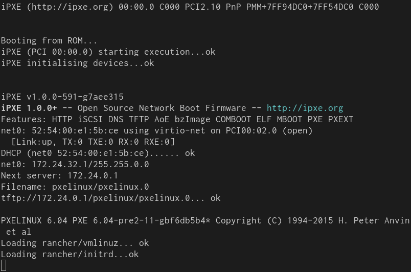
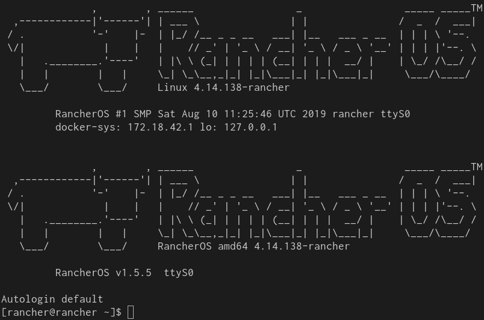

この記事は「Goで作るモダン・ブートサーバー」の4日目の記事です。
この記事ではPXEブートができるブートサーバーの実装をします。

シリーズの記事は以下のリンクからどうぞ。

- [Goで作るモダン・ブートサーバー Day 1 - 基礎知識編][day1]
- [Goで作るモダン・ブートサーバー Day 2 - 環境構築編][day2]
- [Goで作るモダン・ブートサーバー Day 3 - 雑DHCPサーバー実装編][day3]
- Goで作るモダン・ブートサーバー Day 4 - PXEサーバー実装編 <strong style='color:#ff3200'>← この記事</strong>
- [Goで作るモダン・ブートサーバー Day 5 - iPXEサーバー実装編][day5]

PXEブートは古くからあるネットワークブートの規格の1つです。
この記事では前回実装したDHCPサーバーを元に、新たにTFTPサーバーを実装します。
そしてPXEブート環境を構築して、実際にLinuxがネットワーク経由でブートするまでを実装します。
今回作成するコードは以下のレポジトリで公開しています。



## PXEブート

PXEブートは古くからあるネットワークブートの規格の1つです。
PXEブートはDHCPとTFTPを組み合わせたブート方式です。
PXEブートはブートするクライアントマシンが持つMACアドレスやUUIDに基づいた自動設定もできるよう設計されています。

### TFTP (Trivial File Transfer Protocol)
TFTP ([RFC 1350][]) はUDPベースのファイル転送プロトコルです。
FTPと比較するとシンプルなプロトコルで、認証やアクセス制限などの機能はありません。
TFTPクライアントは実装が容易で使用リソースも少なく済むので、ブートストラップで利用されたり、リソースが限られた組み込み機器の起動にも利用されます。
セキュリティ的な機能は無いため、極秘ファイルの転送や改ざんされると困る状況では利用できません。

### DHCPメッセージのブートオプション

PXEブートでは、DHCPサーバーが応答メッセージの `siaddr`、 `file` フィールドにブート情報を返します。
`siaddr` と `file` フィールドは、それぞれTFTPサーバーのアドレスとパスです
(その他のDHCPメッセージ上のフィールドについては [RFC 2131][]、または[前回の記事][day3]を参照)。

PXEクライアントは上記のフィールド情報をもとに、TFTPサーバーから実行ファイルをロードします。
PXEブートではまず最初にブートローダーを起動するのが慣例です。
今回はLinuxのブートストラップで広く利用されているPXELINUXを使います。
PXEブートで利用可能なブートローダーは、ほかにもGRUBなどがあります。

### PXELINUX

PXELINUXは、軽量ブートローダー[Syslinux][]をPXEブート向けにビルドしたPXEアプリケーションです。
PXELINUXはSyslinuxのようにブート設定をスクリプトで記述します。

PXELINUXを用いたLinuxのPXEブートのステップは以下のとおりです。

1. PXEクライアントは、TFTPサーバーからロードしたPXELINUXを起動する
2. PXELINUXは設定ファイルを、TFTPサーバーからロードする
3. PXELINUXは設定ファイルに基づいて、TFTPからカーネルを取得・起動する

PXELINUXは起動マシン毎に設定を切り替えるために、IPアドレスやMACアドレスに対する設定ファイルを探します。
たとえばTFTP上の `"/mybootdir/pxelinux.0"` から起動したPXELINUXが、MACアドレス `"88:99:AA:BB:CC:DD"`、IPアドレス  `"192.168.2.91"` を持ってるとします。
その場合、PXELINUXは以下の順序でTFTPサーバー上から設定ファイルをロードを試みます。

```
/mybootdir/pxelinux.cfg/01-88-99-aa-bb-cc-dd
/mybootdir/pxelinux.cfg/C0A8025B
/mybootdir/pxelinux.cfg/C0A8025
/mybootdir/pxelinux.cfg/C0A802
/mybootdir/pxelinux.cfg/C0A80
/mybootdir/pxelinux.cfg/C0A8
/mybootdir/pxelinux.cfg/C0A
/mybootdir/pxelinux.cfg/C0
/mybootdir/pxelinux.cfg/C
/mybootdir/pxelinux.cfg/default
```

## PXEブートサーバーの実装

### DHCPサーバーの改良

前回実装したDHCPサーバーを元に、TFTPの情報を加えて返すようにします。
DHCPサーバーからの応答パケットに、 `ServerAddr` フィールドと `BootFilename` フィールドを指定します
（GitHub上のサンプルはハードコードではなくパラメータとして与えます）。

```go
// dhcp.go

resp := &dhcp4.Packet{
	...

	ServerAddr:   net.IPv4(172, 24, 0, 1),  // siaddr
	BootFilename: "pxelinux/pxelinux.0",    // file

}
```

### TFTPサーバーの実装

TFTPの実装には `go.universe.tf/netboot/tftp` パッケージを使います。
このパッケージはブートサーバーの実装に必要な、最低限のTFTPサーバーの機能が提供されています。

TFTPサーバーの実装は以下のとおりです。
`TFTPServer` がTFTPサーバーが実装されたstructで、リクエストパスに対して `TFTPBootDir` からの相対パスのファイルを返します。

```go
// tftp.go

package main

import (
	"io"
	"log"
	"net"
	"os"
	"path/filepath"
	"sync"

	"go.universe.tf/netboot/tftp"
)

type TFTPServer struct {
	TFTPBootDir string

	conn   net.PacketConn
	closed bool
	m      sync.Mutex
}

func (s *TFTPServer) Start(listen string) error {
	srv := &tftp.Server{Handler: s.handle}

	log.Printf("[INFO] Starting TFTP server on %s ...", listen)

	var err error
	s.conn, err = net.ListenPacket("udp4", listen)
	if err != nil {
		return err
	}
	err = srv.Serve(s.conn)
	if err != nil {
		s.m.Lock()
		if s.closed {
			err = nil
		}
		s.m.Unlock()
	}
	return err
}

func (s *TFTPServer) handle(path string, addr net.Addr) (io.ReadCloser, int64, error) {
	log.Printf("[INFO] GET %s from %s", path, addr)

	f, err := os.Open(filepath.Join(s.TFTPBootDir, path))
	if err != nil {
		log.Printf("[ERROR] %v", err)
		return nil, 0, err
	}
	fi, err := f.Stat()
	if err != nil {
		log.Printf("[ERROR] %v", err)
		return nil, 0, err
	}
	return f, fi.Size(), err
}

func (s *TFTPServer) Shutdown() error {
	s.m.Lock()
	s.closed = true
	s.m.Unlock()

	return s.conn.Close()
}
```

## PXELINUXのセットアップ

ブートサーバーの実装ができると、TFTPサーバーが提供するLinuxカーネルとinitrdを配置します。
ここではRancher OSのネットワークブートイメージを起動します。
Rancher OSはコンテナ実行環境に最適化されたLinuxディストリビューションの1つです。

ブートサーバーを起動する作業ディレクトリに `tftpboot` というディレクトリを作成し、以下のレイアウトでファイルを配置します。

```
tftpboot
`-- pxelinux
    |-- pxelinux.0    ... PXELINUX本体
    |-- ldlinux.c32   ... Syslinux 5.0から必要になったたモジュール
    |-- pxelinux.cfg
    |   `-- default   ... デフォルトのPXELINUXの設定
    `-- rancher
        |-- vmlinuz   ... Rancher OSのカーネル
        `-- initrd    ... Rancher OSの設定initrd
```

### OSイメージを配置

`vmlinuz` と `initrd` は、Linuxのカーネルとinitrdです。
Rancher OSのイメージはGitHubレポジトリのReleasesで配布されています。



### PXELINUXを配置

PXELINUXはLinuxディストリビューションが提供してるパッケージ、またはSyslinuxの[ダウンロードページ][Syslinux-Download]から入手できます。
パッケージに含まれる`pxelinux.0` ファイルと `ldlinux.c32` を `tftpboot/pxelinux` 以下に配置します。

### PXELINUXの設定を配置

PXELINUXの設定ファイルは`pxelinux.cfg/default` に保存します。
設定ファイルは以下の通りです。

```
default rancher
prompt 0

label rancher
  kernel rancher/vmlinuz
  initrd rancher/initrd
  append console=ttyS0 rancher.autologin=ttyS0
```

`kernel` でカーネルイメージのパスを、`initrd` でinitrdのパスを指定します。
また `append` でカーネルオプションを追加します。
ここでは2つのオプションを指定します。

`console` パラメータには、カーネル起動メッセージの表示やログインに用いるコンソールを指定します。
QEMUはクライアントらかの標準入出力を、仮想シリアルコンソールに接続します。
そのときのシリアルコンソールが `ttyS0` で、これを指定しないと起動時に何も表示されません。

## ブートサーバーの起動

### TFTPのデバッグ

上記でTFTPサーバーの実装と準備が整いました。
それではTFTPサーバーが意図通り動くか確認してみましょう。

今回追記したGoのプログラムをビルドして起動します。
67番ポート、69版ポートにLISTENするには管理者権限が必要なのでsudoで実行します。

```console
go build . && sudo ./building-boot-server
```

TFTPのデバッグにはcurlコマンドが利用できます。
TFTPサーバー上のファイルが意図通り返されるか確認してみましょう。

```console
$ curl tftp://127.0.0.1/pxelinux/pxelinux.cfg/default
default rancher
prompt 0
...
```

### VMを起動

さて、TFTPサーバーのチェックができればいよいよ起動です。
VMの起動は[第1回][day1]に利用したシェルスクリプトを利用します。

まずは仮想ネットワークを作成します。

```console
sudo ./bin/setup network --name br0 --address 172.24.0.1/16
```

そしてクライアントのVMを起動します。

```console
sudo ./bin/setup node --network br0
```

するとブートサーバーの標準出力に、DHCPリクエストやTFTPリクエストのログが流れるはずです。

クライアントマシンは、DHCPの応答からIPアドレスを設定すると、まずTFTPサーバーからPXELINUXをロードします。
そしてPXELINUXは設定ファイルをロードして、その設定ファイルに基づきカーネルとinitrdをロードします。

{{}}

カーネルとinitrdをロードできるとLinuxの起動を開始します。
しばらく待ってRancher OSのログイン画面が表示されれば成功です。

{{}}

## おわりに

遂にLinuxがブートしました。
簡単なコードでしたが、ネットワークブートやLinuxのブートストラップの手順がなんとなくわかったかと思います。
また今回はPXELINUXの設定ファイルを固定ファイルから渡しましたが、もちろんTFTPサーバーがプログラマブルに返すこともできます。

途中のコードは若干省略している部分もあるので、フルバージョンは以下のレポジトリを参照してください。



それでは次回もお楽しみに！

[day1]: /2020/02/25/go-modern-bootserver-01/
[day2]: /2020/03/01/go-modern-bootserver-02/
[day3]: /2020/03/18/go-modern-bootserver-03/
[day5]: /2020/05/25/go-modern-bootserver-05/
[RFC 951]: https://tools.ietf.org/html/rfc951
[RFC 1350]: https://tools.ietf.org/html/rfc1350
[RFC 2131]: https://tools.ietf.org/html/rfc2131
[PXELINUX]: https://wiki.syslinux.org/wiki/index.php?title=PXELINUX
[Syslinux]: https://wiki.syslinux.org/wiki/
[Syslinux-Download]: https://wiki.syslinux.org/wiki/index.php?title=Download
