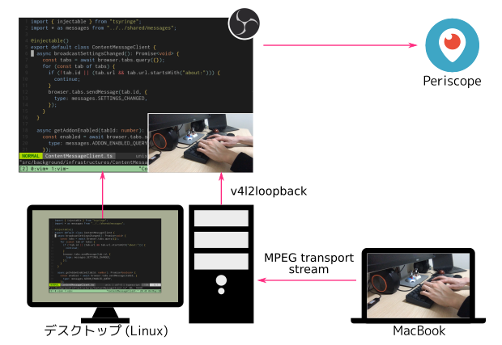

先日、Periscopeというストリーム配信サービスを使って、Vim Vixenのライブコーディングをしてみました。
配信用のWebカメラがほしかったのですが、あいにく自分はWebカメラを持っていません。
そこでMacBookに内蔵されているWebカメラを、遠隔のWebカメラとして利用できたのでその設定メモです。

## 全体の構成

以下の構成で配信をしました。
作業用のデスクトップマシン (Linux) は、配信用のマシンも兼ねています。
MacBookからはネットワーク経由でデスクトップマシンに映像を届けます。
デスクトップマシン上ではOBS (Open Broadcaster Software) を使って、作業風景とWebカメラの映像を合成して、Periscopeに配信します。

{{}}

MacBook上のWebカメラの映像は同じネットワーク内にあります。
MacBookのカメラの映像は、MPEG transport streamという配信用の動画形式でデスクトップマシンに映像を送ります。
ffmpegを使うことで、Webカメラの映像をMPEG transport streamとして任意のIPアドレスとポートにUDP形式で送信できます。
Mac OSでは[Homebrew][homebrew]からffmpegをインストールできます。

OBSではMPEG transport streamの映像を入力ソースとして扱えません。
そこでデスクトップ上で、MPEG transport streamの映像を仮想ビデオデバイス (v4l2loopback) に流します。
するとOBS上からは、あたかもWebカメラのように入力ソースとして選択できます。

## Webカメラ用のラップトップの準備

上記の構成はMacBookで配信しましたが、Linuxのラップトップでも動作確認ができたので、両方の手順を残します。

### MacBookの場合

まず利用するビデオデバイスを探します。
Mac OS上上で以下のコマンドで利用可能なビデオデバイス一覧は `ffmpeg` コマンドで取得できます。

```console
$ ffmpeg -f avfoundation -list_devices true -i ""
ffmpeg version 4.2.1 Copyright (c) 2000-2019 the FFmpeg developers
...
[AVFoundation input device @ 0x7ff8ee904340] AVFoundation video devices:
[AVFoundation input device @ 0x7ff8ee904340] [0] FaceTime HD Camera (Built-in)
[AVFoundation input device @ 0x7ff8ee904340] [1] Capture screen 0
...
```

MacBookの場合は "FaceTime xxxxxx" というデバイスが、搭載されているWebカメラの名前です。
`ffmpeg` コマンドでカメラの映像を、MPEG transport stream形式でデスクトップに対して配信します。
ここでは配信用のマシンのIPアドレスが `192.168.1.100` だとします。

```console
$ ffmpeg \
    -framerate 30.000030 \  # カメラのフレームレート
    -f avfoundation \       # Appleの動画配信用の形式
    -pix_fmt uyvy422 \      # カメラのピクセルフォーマット
    -i "FaceTime HD Camera (Built-in)" \  # デバイス名
    -vcodec libx264 \     # ビデオコーデックにx264を使う
    -preset ultrafast \   # 低遅延用なプリセット
    -tune zerolatency \   # 低遅延用のチューニング
    -f mpegts \           # MPEG transport stream
    udp://192.168.1.100:12000?pkt_size=1316 # 送信先のアドレス、ポートとパケットサイズ
```

次に配信用マシン上で、Webカメラの映像が送られているかをチェックします。
MPEG transport streamの映像をチェックするには `ffplay` コマンドを使います。

```console
$ ffplay -fflags nobuffer udp://192.168.1.100:12000
```

### Linuxラップトップの場合

Linuxラップトップでもほぼ同じ手順です。
Linuxの場合は、Webカメラのデバイスには `/dev/video*` というデバイスファイルからアクセスします。
`v4l2-ctl` コマンドでデバイスの詳細を確認できるので、Webカメラ用のデバイスを特定できます。

```console
$ v4l2-ctl --device /dev/video0 --info
```

デバイスの名前がわかれば、先程と同じようにffmpegで配信用マシンにMPEG transport streamで映像を流します。

```console
$ ffmpeg \
    -i /dev/video0 \
    -vcodec libx264 \
    -preset ultrafast \
    -tune zerolatency \
    -f mpegts \
    udp://192.168.1.100:12001?pkg_size=1316
```

確認も、配信用マシン上で `ffplay` コマンドを使います。

```console
$ ffplay -fflags nobuffer udp://192.168.1.100:12001
```

## v4l2loopbackに接続

以上で、配信用マシンに映像が届きました。
次に届いた映像をOBSの入力ソースとして扱えるように、仮想ビデオデバイスに映像を流します。

Linuxではv4l2loopbackというドライバを使うと、いろいろな映像をビデオデバイスとして扱えます。
たとえばOBSだけでなく、ZoomやブラウザからもWebカメラとしてアクセスできます。
v4l2loopbackは以下のレポジトリからインストールできます。



インストールが完了すると `modprobe` でモジュールをロードします。

```console
$ sudo modprobe v4l2loopback            # 1つの仮想デバイスを作成
$ sudo modprobe v4l2loopback devices=4  # 複数の仮想デバイスを作成
```

そして配信用マシン上で `ffmpeg` コマンドを実行して、MPEG transport streamの映像をv4l2loopbackに流します。

```console
$ ffmpeg \
    -loglevel fatal \   # ログレベル
    -fflags nobuffer \  # バッファしない
    -i udp://192.168.1.6:12000 \  # 配信機材自身のアドレス、ポート
    -f v4l2          # Linuxのビデオドライバの形式
    -pix_fmt yuv420p # ピクセルフォーマット
    /dev/video0      # 出力先デバイス (v4l2loopback)
```

これでOBSからVideo Capture Device (V4L2) を選択すると、作成した仮想デバイスを選択できるようになっています。
以上の手順で、MacBookのWebカメラの映像が、OBSにも流れるようになりました。

## まとめ

以上の配信環境では、Webカメラの体感的な遅延は0.5秒程度でした。
この機会にOBSも触ってみましたが、お手軽で便利ですね。
元々自分は配信はしたことがありませんでしたが、配信環境を揃えたいという機運が高まってきています。
しばらく配信環境の探求が続きそうです。

[homebrew]: https://brew.sh/
