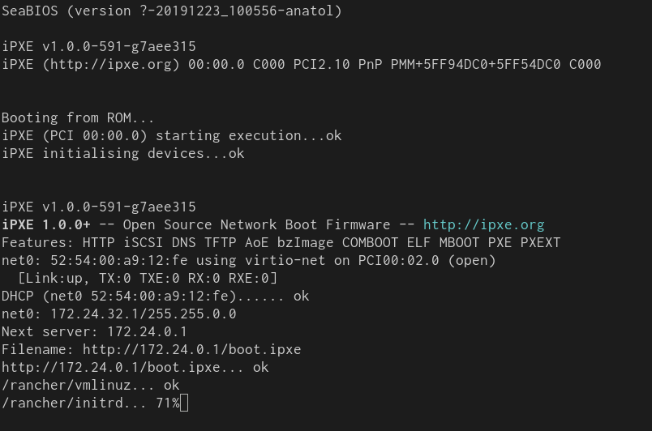

この記事は「Goで作るモダン・ブートサーバー」の5日目の記事です。
この記事ではiPXEブートに対応したブートサーバーを実装します。

シリーズの記事は以下のリンクからどうぞ。

- [Goで作るモダン・ブートサーバー Day 1 - 基礎知識編][day1]
- [Goで作るモダン・ブートサーバー Day 2 - 環境構築編][day2]
- [Goで作るモダン・ブートサーバー Day 3 - 雑DHCPサーバー実装編][day3]
- [Goで作るモダン・ブートサーバー Day 4 - PXEサーバー実装編][day4]
- Goで作るモダン・ブートサーバー Day 5 - iPXEサーバー実装編 <strong style='color:#ff3200'>← この記事</strong>

前回はPXEブートを実装しました。
この記事では、iPXEブートを実装します。

前回はPXEブートができるブートサーバーを実装しました。
それを元に、iPXEブートもできるように改良します。
今回作成するコードは以下のレポジトリで公開しています。



## iPXEブート

[iPXE][]はPXEのオープンな実装の1つで、TFTPブート以外にも様々なプロトコルからブートできます

- HTTP
- iSCSI
- Fibre Channel SAN over Ethernet
- ATA over Ethernet
- ワイヤレス・ネットワーク
- WAN
- InfiniBand

またiPXEでは、[独自のスクリプト記法][ipxe-scripting]を記述することで、ブートの設定を柔軟に設定できます。

実は前回の記事で、検証時に利用したクライントマシンは、PXEではなくiPXEです。
多くのLinuxディストリビューションのパッケージには、QEMUと一緒にPXEではなくiPXEが同梱されているためです。

前回はiPXEの判定をしなかったため、強制的にPXEブートが開始しました。
ブートサーバーは、クライアントの種類を判断して、正しいブート方法を提供する方法があります。
クライアントの種類は、DHCPリクエストメッセージの [Vendor class identifierオプション(60)][vendor class identifier] と [User Classオプション (77)][user class] から判定できます。


### Vendor class identifierオプション (60)

Vendor class identifierはクライアントのブート方式やCPUアーキテクチャの情報があります。
代表的なPXEクライアントは、以下のプレフィックスを持ちます。

| クライアントの種類                | プレフィクス            |
|---                                |---                      |
| PXEクライアント (BIOS)            | `PXEClient:Arch:00000:` | 
| PXEクライアント (x86 UEFI)        | `PXEClient:Arch:00006:` | 
| PXEクライアント (x64 UEFI)        | `PXEClient:Arch:00007:` | 
| PXEクライアント (32-bit arm UEFI) | `PXEClient:Arch:00018:` | 
| PXEクライアント (64-bit arm UEFI) | `PXEClient:Arch:00019:` | 

ブートサーバーはこの値をみて適切なパラメータを返します。
たとえばクライアントがx64 UEFIなら、x64 UEFI用のバイナリを返す、などです。
その他の値については[IETFで定義][processor architecture]されています。

### User classオプション (77)

もう1つ、User classオプション (77) がクライアントの種類を表します。
iPXEの場合は、このオプションに `"iPXE"` という値を設定します。
ブートサーバーはこの値を見て、クライアントがiPXEなのか否かを判定できます。

| クライアントの種類  | 値     |
|---                  |---     |
| iPXE                | `iPXE` |

## DHCPサーバーの改良

`go.universe.tf/netboot/dhcp4` パッケージでは、 `dhcp4.Packet` の `Options` フィールドからDHCPオプションを取得できます。
値の先頭を比較して、クライアントの種類を判定できます。

DHCPオプションに値を載せないDHCPクライアントもあるので、事前にオプションの有無をチェックします。

```go
_, ok := req.Options[dhcp4.OptVendorIdentifier]
if !ok {
	return errors.New("vendor class identifier not set")
}
opt, err := req.Options.String(dhcp4.OptVendorIdentifier)
if err != nil {
	return err
}
if strings.HasPrefix(opt, "PXEClient:Arch:00000:") {
	// PXEクライアント (BIOS) 用のブート情報を返す
} else if strings.HasPrefix(opt, "PXEClient:Arch:00006:") {
	// PXEクライアント (x86 UEFI) 用のブート情報を返す
} else if strings.HasPrefix(opt, "PXEClient:Arch:00007:") {
	// PXEクライアント (x64 UEFI) 用のブート情報を返す
} else if strings.HasPrefix(opt, "HTTPClient:Arch:00015:") {
	// PXEクライアント (32-bit arm UEFI) 用のブート情報を返す
} else if strings.HasPrefix(opt, "HTTPClient:Arch:00016:") {
	// PXEクライアント (64-bit arm UEFI) 用のブート情報を返す
}
```

コード中の `PXEClientBIOS` や `VendorClass` 型は、クライアントの種類を表す型です。

UserClassも同じ方法で取得できます。


```go
userclass, err := req.Options.String(77)
ipxe := err == nil && userclass == "iPXE"
if ipxe {
	// iPXEクライアント用のブート情報を返す
}
```

クライアントの種類が判定できれば、ブート情報をDHCPメッセージに設定します。

PXEブートでは `file` オプションにTFTP上のパスを指定しました。
iPXEでHTTPブートからブートするには、`file` フィールドにパスだけでなく `http://...` で始まるURLを渡します。

iPXEクライアントも互換性のために、単純なパスを指定するとTFTPからブートします。
そしてプロトコルとアドレスを指定するとそれぞれのプロトコルから起動情報をロードします。
またiPXEではPXELINUXのようなバイナリだけでなく、iPXE独自のスクリプトもロードできます。

```go
// PXE TFTP Boot
resp.BootFilename = "/path/to/pxelinux/pxelinux.0"

// iPXE HTTP Boot
resp.BootFilename = "http://http-server-address/path/to/script.ipxe"
```

## HTTPサーバーの実装

HTTPサーバーの実装は特に難しいことはありません。
Go標準パッケージの `http.FileServer()` と　`http.Dir()` を使ってファイルサーバーを実装します。
詳しくは [`http.go`](https://github.com/ueokande/building-boot-server/blob/03-pxe-boot-with-http-server/http.go)を参照してください。

## iPXEスクリプト

iPXEスクリプトはSyslinuxの設定ファイルのように、ブートの設定を記述できます。
例えば以下のスクリプトで、Linux (Rancher OS) のブートができます。

iPXEクライアントはこのスクリプトをロードすると、`kernel`, `initrd` で指定されたHTTPサーバー上のパスから、それぞれカーネルとinitrdのロードを試みます。
このスクリプトを、DHCPレスポンスの `file` フィールドで設定したパスから取得できるように、HTTPサーバーを設定しましょう。

```
#!ipxe

kernel /rancher/vmlinuz
initrd /rancher/initrd
imgargs vmlinuz console=ttyS0 rancher.autologin=ttyS0
boot
```

## VMを起動

さて、HTTPサーバーのチェックができればいよいよ起動です。
VMの起動は[第1回][day1]に利用したシェルスクリプトを利用します。

まずは仮想ネットワークを作成します。

```console
sudo ./bin/setup network --name br0 --address 172.24.0.1/16
```

そしてクライアントのVMを起動します。

```console
sudo ./bin/setup node --network br0
```

するとブートサーバーの標準出力に、DHCPリクエストやHTTPリクエストのログが流れるはずです。
またVMのiPXEのログに、以下のような `http://...` というログが出力されるのにも注目してください。

{{}}

## おわりに

この記事ではiPXEを使ったLinuxのブート手順を解説しました。
途中のコードは若干省略している部分もあるので、フルバージョンは以下のレポジトリを参照してください。



HTTPサーバーは標準ライブラリのみで実装できる言語も多く、TFTPよりも柔軟なリクエストが書けます。
そのため実際のデータセンターでも、iPXEを使うことが多いです。
一方でiPXEを実際に組み込んでいるNICは少ないです。
そのためUEFI HTTPブートやPXEクライアントから、iPXEをロードして使われることが多いです。

次回の記事では、UEFI HTTPブートや、UEFIからiPXEの起動について触れたいともいます。
それでは次回お楽しみに！

[iPXE]: https://ipxe.org/
[ipxe-scripting]: https://ipxe.org/scripting
[processor architecture]: https://www.ietf.org/assignments/dhcpv6-parameters/dhcpv6-parameters.xml#processor-architecture
[vendor class identifier]: https://tools.ietf.org/html/rfc2132#section-9.13
[user class]: https://tools.ietf.org/html/rfc3004#section-4
[day1]: /2020/02/25/go-modern-bootserver-01/
[day2]: /2020/03/01/go-modern-bootserver-02/
[day3]: /2020/03/18/go-modern-bootserver-03/
[day4]: /2020/04/28/go-modern-bootserver-04/

