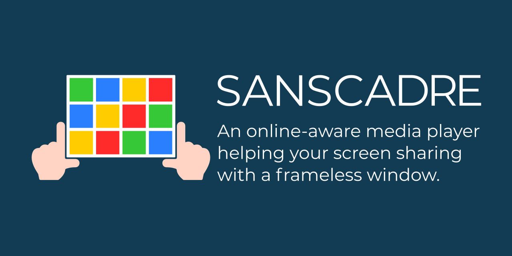
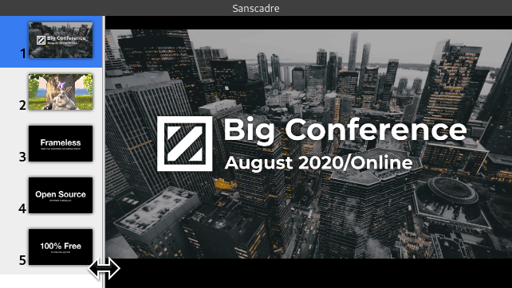

{{}}

こんにちは、ご無沙汰してます。
タイトルの通り、オンライン配信で使えるメディアプレイヤーを作りました
これはElectronを使ったデスクトップソフトウェアです。
フレームレスウィンドウ上での画像の表示、ビデオの再生、PDFの表示ができます。



## モチベーション

ここ数ヶ月、勉強会はオンライン開催の流れになっています。
弊社でも[Cybozu Tech Meetup][]という名でオンライン配信をスタートしました。
自分はこのイベントの企画、運営、配信に関わっています。
オンライン勉強会の開催を通して解決したい問題が出てきたので、このソフトウェアをつくりました。

Cybozu Tech Meetupでは、自分は毎度オープニングを担当しています。
そのときの当日の手順は以下のとおりです。

1. 待機用のループ映像流す。これはQuick Time上で動画を流しZoomで共有
2. オープニング用スライドに切り替え。これはZoomで共有しているウィンドウを、PowerPointまたはPreviewに切り替える。
3. PowerPointまたはPreviewのページを送りながらオープニングを始める

一見単純な手順ですが、この方法の問題点もいくつかあります。

1. 本番中に共有するウィンドウを切り替えたくない。うっかり社内情報が載った画面を共有しそうで怖い。
2. PDFやPowerPointだとウィンドウ共有でタイトルバーが表示されてかっこ悪い。

とくに1.の問題が大きいです。
当日は最新の注意を払い、本番前にデスクトップはキレイにしていますが、それでも切り替えトラブルが発生しないかドキドキます。
Webサービスの運用と同じで本番環境で複雑なオペレーションをすると、いずれは事故に繋がります。
これらの問題を解決すべく、フレームレスで画像や映像を切り替えられるデスクトップソフトウェアを作りました。

## Sanscadre、それはフランス語で“Frameless”

Sanscadreは上記の問題を解決する、フレームレスでシンプルなプレイヤーです。
これまでの既存のメディアプレイヤーやビューアは、ウィンドウの画面共有をあまり意識してデザインされていません。
また画像ビューアやビデオプレーヤーは、PDFサポートをしてません。

Sanscadreは、画像、動画、そしてPDFをサポートしています。
サイドバーを折りたためば、タイトルバーやコントロールパネルも表示されません。
動画、画像、PDFが混同していても、複雑な手順もいりません。
Zoom上での画面共有オペレーションも発生しないので、共有するウィンドウ切り替えによる事故を防ぎます。
またタイトルバーも映りません。

{{}}

## インストール

Windows、macOS、Linuxをサポートしてます。
アプリケーション本体は[GitHub Releases][releases]からダウンロードできます。

## おわりに

数年ぶりにElectronアプリを作ってみましたが、Electronのエコシステムやフロントエンドライブラリが以前よりも充実してて、気持ちよく開発を進められいました。
Sanscadreの開発はGitHubレポジトリ上で進めています。
機能の要望やバグがあれば報告お願いします！



ここ数ヶ月で生活様式が大きく変化しただけでなく、ソフトウェアが要求される機能も大きく変わりました。
たとえば2020年7月9日にアップデートされたKeynoteで、[「スライドショーをウインドウで再生」][keynote-in-window]をサポートしました。
これからも、配信やオンライン勉強会のためのツールはいくつも出てくることでしょう。
自分も、自社のオンライン勉強会の運営を通して、欲しいソフトウェアが思いつけばまた公開することにします。

[Cybozu Tech Meetup]: https://cybozu.connpass.com/
[keynote-in-window]: https://support.apple.com/en-us/HT207247
[releases]: https://github.com/ueokande/sanscadre/releases
