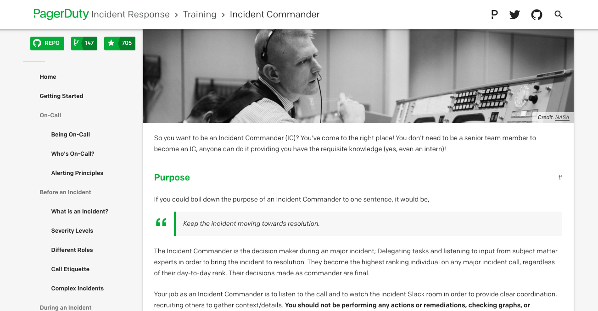

{{}}

こんにちは、ご無沙汰してます。
早速ですが、皆さんのチームにはインシデント発生時のプロセスが決められていますか？

インシデント管理サービスを提供している[PagerDuty][]は、「PagerDuty Incident Response」というドキュメントを公開しています。
このドキュメントがすごく良いものだったので、このたび邦訳した物を公開することにしました。

- https://ueokande.github.io/incident-response-docs-ja/

## このドキュメントはなに？

このドキュメントは、PagerDutyにおけるインシデントの対応プロセスが紹介されています。
インシデント対応の準備や、新しくオンコールを始める社員のトレーニングに利用しているドキュメントです。
このドキュメントはもともとPagerDutyの社内ドキュメントとして利用していたものを、公開可能なものに編集、切り出したものです。
インシデントへの対策だけではなく、インシデント発生中にやるべきこと、やっていはいけないことや、インシデント対応後のアクション（事後処理やポストモーテム）についても触れられています。

このドキュメントを邦訳した感想としては、SRE本などの書籍と比べると、より具体的なアクションに落とされていました。
インシデントの対応にはそれぞれの目的が違う役割があります。
たとえばインシデント対応には、全体を指揮する人（インシデントコマンダー）や、インシデントに実際に問題を解決する人（内容領域専門家）がいます。
それぞれの役割はインシデント対応中にどういったアクションをして、復旧や再発防止のために何をすべきかが詳しく説明されています。
そしてそれぞれの役割のためのトレーニング資料も載っています。

## ライセンス

オリジナルのPagerDuty Incident Responseおよびその邦訳版は、Apache License 2.0の元で提供されます。
このドキュメントの使用および変更ができ、商用および個人利用の両方が認められます。
ただし元の著作権情報と、LICENSEファイルを含める必要があります。

このドキュメントを自社の内部ドキュメントとして利用できます。
GitHub上でオリジナルおよび邦訳版の全てのソースコードを閲覧できます。
レポジトリをフォークして、独自のドキュメントのベースとして自由に利用できます。

- オリジナル: https://github.com/PagerDuty/incident-response-docs
- 邦訳版: https://github.com/ueokande/incident-response-docs-ja

[PagerDuty]: https://www.pagerduty.com/
