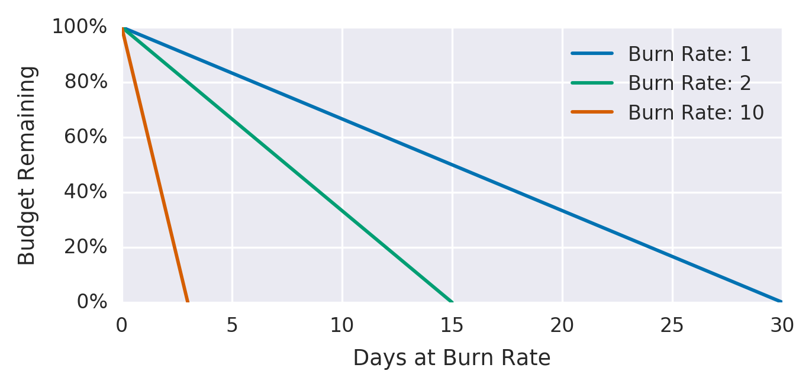

SREやサービスを運用している皆さんは、アラートの閾値をどのように決めていますか？
The Site Reliability Workbookの[Chapter 5 - Alerting on SLOs][alerting-on-slos]には、アラートに関する興味深い記述があるので、改めてこの記事で説明してみようと思います。

## SLOとアラート

Webサービスやシステムは、予期せぬパフォーマンス劣化やエラーが発生する事があります。
このとき緊急対応できるように、管理者はアラートを設定します。
このアラートの基準に **SLO（Service Level Objective: サービスレベル目標）** を用いるのがプラクティスの1つです。

SLOに基づくアラートは、ユーザーに影響がある障害や、SLOを守ることができない重大障害に気づけます。
アラートの閾値にSLOの基準値を利用するのが、明快で理解しやすいアラートの設定方法の1つです。
SLOに「月間リクエストの成功率が99.9%」を設定しているのならば、10分ウィンドウでエラーレートが0.1%を超えたらアラートを鳴らす、などです。
しかし一方で、アラートが機敏すぎるという問題もあります。
ロールアウトに伴う一時的なエラーや、SLOを達成できるほどエラーバジェットが十分残っている場合でもアラートが鳴る可能性もあります。

アラートはサービスの健康状態を守るために必要ですが、対応チームの健康状態にも気をつける必要があります。
The Site Reliability Workbookの[Chapter 5 - Alerting on SLOs][alerting-on-slos]には、エラーバジェットを消費する速度に注目した **バーンレート** を使って、適切なアラートを設定する方法が説明されています。
この記事ではSLOの基準値を使ったアラートの問題点と、バーンレートに基づくアラートを紹介します。

## SLOの基準値に基づくアラート

まずは広く用いられている、固定の時間内でSLOの基準値を元にしたアラートです。
基準値がわかりやすく計算も簡単なので、この方針を採用している人は多いのでは無いでしょうか？

たとえばSLOに「月間のリクエスト成功率が99.9%」を設定しているとします。
まずは10分ウィンドウでエラーレート0.1%を超えた場合にアラートを鳴らしてみましょう。

```promql
- alert: HighErrorRate
  expr: job:slo_errors_per_request:ratio_rate10m{job="myjob"} >= 0.001
```

このアラートは、エラーが発生してから即座に検出できますが、一方で過敏すぎるというデメリットがあります。
たとえば10分ウィンドウで0.1%のエラーレートが発生した場合、1ヶ月のエラーバジェットの0.02%しか消費しません。
極端な例で例えると、1日に最大144回のアクションがいらないアラートを毎日受け取っても、SLOを満たせる可能性があるのです。

## ウィンドウ幅の拡大

さきほどのアラート基準は過敏だというのがわかりました。
今度は10分ではなく、36時間ウィンドウで集計します。


```promql
- alert: HighErrorRate
  expr: job:slo_errors_per_request:ratio_rate36h{job="myjob"} > 0.001

```

この基準値では、全断（エラーレート100%）した場合でも、2分10秒で検知でき、相変わらず優れた検出時間です。
しかし一方で、ウィンドウが長くなると、アラートがリセットされるまでの時間も長くなります。
例えばエラーレート100%で一度閾値を上回ると、次の36時間後まで正常な値に戻りません。
その間に再びエラーレートが上がったとしても、新たな障害に気付くことができません。

## バーンレートに基づくアラート

**バーンレート** はエラーバジェットの消費速度を表す指標です。
バーンレートに基づくアラートは、エラーバジェットが枯渇する勢いのエラーが発生したときにのみアラートを鳴らすことができます。
SLOを達成できないリスクがある時に緊急対応をして、それ以外の一時的なエラーやエラーバジェットが十分残っているならアラートは鳴りません。

以下の図はバーンレートとエラーバジェットの消費量の関係です（The Site Reliability Workbook [Figure 5-4][fig5-4]）。
SLOの期間内でちょうどエラーバジェットを使い切る消費速度を、バーンレート1とします。
バーンレート1はちょうど1ヶ月後にエラーバジェットが0になります。
バーンレート2はその2倍の速度でエラーバジェットを消費し、15日後にエラーバジェットが0になります。



バーンレートベースのアラートにおける、検出時間は以下の式で表せます。

- ((1 - SLO) / エラーレート) * ウィンドウサイズ * バーンレート

また検出までの時間に消費するエラーバジェットの割合は以下のとおりです。

- (バーンレート * ウィンドウサイズ) / SLOの期間

例えばSLOが「月間リクエストの成功率が99.9%」で、ウィンドウサイズ1時間でエラーバジェットのうち5%を消費した場合に知りたいとします。
1時間でエラーバジェットの5%を消費する速度はバーンレート36です。

```promql
- alert: HighErrorRate
  expr: job:slo_errors_per_request:ratio_rate1h{job="myjob"} > 36 * 0.001
```

## 複数バーンレートの組み合わせ

The Site Reliability Workbookには、まずは1時間でエラーバジェットの2%を消費、または6時間でエラーバジェットの5%を消費するときに緊急対応をして、3日間で10%のエラーバジェットを消費した時にチケットで対応するところから始めるのが良いとあります。

エラーバジェット消費量 | ウィンドウ幅 | バーンレート | 通知方法
---                    | ---          | ---          | ---
2%                     | 1時間        | 14.4         | 緊急対応
5%                     | 6時間        | 6            | 緊急対応
10%                    | 3日          | 1            | チケット

```promql
expr: (
        job:slo_errors_per_request:ratio_rate1h{job="myjob"} > (14.4*0.001)
      or
        job:slo_errors_per_request:ratio_rate6h{job="myjob"} > (6*0.001)
      )
severity: page

expr: job:slo_errors_per_request:ratio_rate3d{job="myjob"} > 0.001
severity: ticket
```

ここでもまた、アラートがリセットされる時間は長いです。
例えばエラーレート100%で閾値を上回ると、次の6時間後まで正常な値に戻りません。
SLO 99.9%に設定しているのなら、エラーレートが再上昇しても気付かずに、エラーバジェットを使い切ってしまいます。
そこで次に示す、短いウィンドウとの組み合わせる方法があります。

## 短いウィンドウとバーンレートの組み合わせ

先程のアラートはリセットまでの時間が長いという問題がありました。
そこでウィンドウ幅が1時間/6時間/3日それぞれに対して、さらに短いウィンドウを組み合わせるというテクニックがあります。
The Site Reliability Workbookには、短いウィンドウに1/12の長さを使うと良いとあります。

```promql
expr: (
        job:slo_errors_per_request:ratio_rate1h{job="myjob"} > (14.4*0.001)
      and
        job:slo_errors_per_request:ratio_rate5m{job="myjob"} > (14.4*0.001)
      )
    or
      (
        job:slo_errors_per_request:ratio_rate6h{job="myjob"} > (6*0.001)
      and
        job:slo_errors_per_request:ratio_rate30m{job="myjob"} > (6*0.001)
      )
severity: page

expr: (
        job:slo_errors_per_request:ratio_rate24h{job="myjob"} > (3*0.001)
      and
        job:slo_errors_per_request:ratio_rate2h{job="myjob"} > (3*0.001)
      )
    or
      (
        job:slo_errors_per_request:ratio_rate3d{job="myjob"} > 0.001
      and
        job:slo_errors_per_request:ratio_rate6h{job="myjob"} > 0.001
      )
severity: ticket
```

たとえばエラーレート100%になると、長いウィンドウと短いウィンドウの両方で閾値を上回ります。
エラーレートが下がってからしばらく経つと、短いウィンドウのエラーレートが閾値を下回り、アラートも正常値に戻ります。
再びエラーレートが上がった場合には、またアラートが異常値を知らせて問題の再発を検知できます。
このアラートは長い期間待たずとも一度アラートが正常値に戻るので、知らず知らずのうちにエラーバジェットが枯渇するのを防ぎます。

## おわりに

エラーバジェットに基づくアラートは理にかなっている一方で、少し計算が難しく自分も理解に時間がかかりました。
Googleが推奨している1時間/6時間もスタート地点であり、ここからサービスやリクエストの特性に応じてチューニングすることになると思います。
現在アラート地獄に悩まされている方や、それによってアドホックにアラートを緩和している人は、エラーバジェットに基づくアラートを検討してみてはいかがでしょうか？


[sre-workbook]: https://landing.google.com/sre/workbook/toc/
[alerting-on-slos]: https://landing.google.com/sre/workbook/chapters/alerting-on-slos/
[practical-monitoring]: https://www.oreilly.co.jp/books/9784873118642/
[fig5-4]: https://landing.google.com/sre/workbook/chapters/alerting-on-slos/#error_budgets_relative_to_burn_rates

