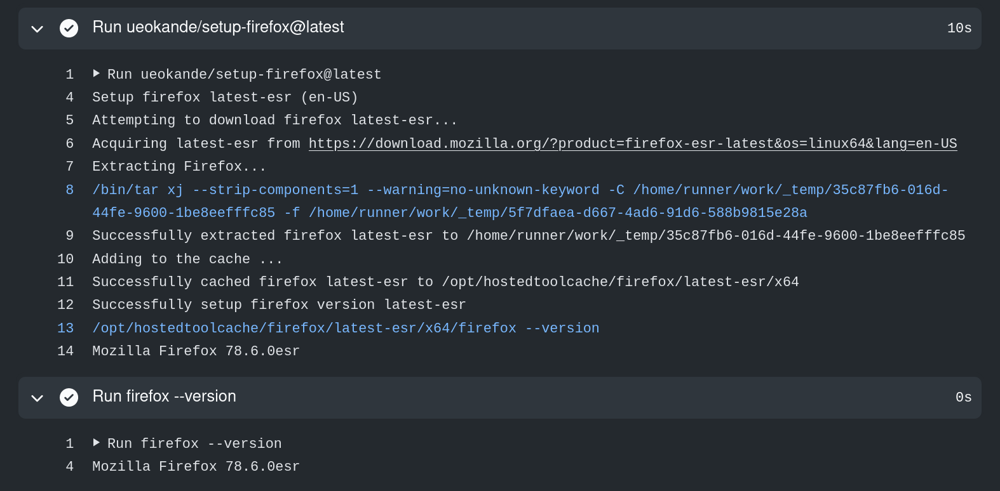

年末は[Vim Vixen][]で使っていたCircleCIをGitHub Actionsに移行しました。
それに伴い、ブラウザテスト自動化のカスタムGitHub Actionsを作っていました。

Vim Vixenの対象ブラウザは、Mozillaがサポートする最も古いFirefoxのバージョン（ESR）です。
それを保証するために[WebExtensionsのE2Eテストを自動化][lanthan-introduction]しています。


GitHub Actionsの標準イメージにもFirefoxとGeckodriverはありますが、Ubuntuディストリビューションやインストールスクリプトによってバージョンが固定されています。
そこで任意バージョンのFirefoxとGeckodriverをセットアップするカスタムアクションを作成しました。

- [setup-firefox][]
- [setup-geckodriver][]

## 使い方

### setup-firefox

アクション名 `ueokande/setup-firefox@latest` で利用できます。
`firefox-version` パラメータでインストールするバージョンを指定します。
インストール後、PATHにFirefoxのインストールディレクトリが追加され、指定したバージョンを利用できます。

```yaml
steps:
  - uses: ueokande/setup-firefox@latest
    with:
      firefox-version: '78.3.0esr'

  - run: firefox --version
```

Firefoxのバージョンは、特定のバージョンだけでなく `latest-esr` や `latest-beat` も利用できます。

```yaml
steps:
  - uses: ueokande/setup-firefox@latest
    with:
      firefox-version: latest-esr  # 最新のESR

  - run: firefox --version
```

`firefox-version` を指定しない場合は最新の安定版をインストールします。

```yaml
steps:
  - uses: ueokande/setup-firefox@latest
```

### setup-geckodriver

アクション名 `ueokande/setup-geckodriver@latest` で利用できます。
`geckodriver-version` パラメータでインストールするバージョンを指定します。

```yaml
steps:
  - uses: ueokande/setup-geckodriver@latest
    with:
      geckodriver-version: '0.26.0'

  - run: geckodriver --version
```

`geckodriver-version` を指定しない場合は最新の安定版をインストールします。

```yaml
steps:
  - uses: ueokande/setup-geckodriver@latest
```

## Vim Vixenでの利用例

Vim Vixenではサポートされている一番古いESR上でE2Eテストを実行します。
GitHub Actionsで明示的にFirefoxのバージョンを指定してインストールしています。

E2Eテスト（WebDriver）でテストを実行する前に、Xvfbで仮想ディスプレイを `:99` に作成します。

```yaml
steps:
- uses: actions/checkout@v2
- uses: actions/setup-node@v2
  with:
    node-version: '14.15.1'
- uses: ueokande/setup-firefox@latest
  with:
    firefox-version: '78.3.0esr'
- uses: ueokande/setup-geckodriver@latest
  with:
    geckodriver-version: '0.28.0'

# 依存ライブラリのダウンロード
- name: Install dependencies
  run: yarn install

# E2Eテストの実行
- name: Run test
  run: |
    export DISPLAY=:99

    # geckodriverの起動
    geckodriver &
    # 仮想ディスプレイの起動
    Xvfb -ac :99 -screen 0 1280x1024x24 >/dev/null 2>&1 &

    # テストの実行
    yarn test:e2e
```

## おわりに

（´-`）.｡oO（Chromium/ChromeDriverをセットアップするカスタムアクションも作ろうかなぁ）

[Vim Vixen]: https://addons.mozilla.org/en-US/firefox/addon/vim-vixen/
[lanthan-introduction]: https://i-beam.org/2019/10/14/lanthan-introduction/
[setup-firefox]: https://github.com/marketplace/actions/setup-firefox
[setup-geckodriver]: https://github.com/marketplace/actions/setup-geckodriver
