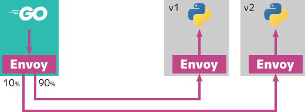

こんにちは、以前「サービスメッシュとAWS App Meshに入門した」という記事を書きました。

- [サービスメッシュとAWS App Meshに入門した](https://i-beam.org/2020/11/15/aws-app-mesh/)

AWS App Meshでは、メッシュ上にデプロイされているアプリケーションのトラフィックは、すべてサイドカーとしてデプロイされているEnvoy Proxyを経由します。
これはPod内からPod外への通信と、Pod外からPod内のアプリケーションの両方です。

{{}}

しかし既存のサービスにAWS App Meshを導入するときは、クライアントやサーバーの指し先をlocalhostに書き換えることはありません。
この記事では、AWS App Meshがどのようにして、各PodがEnvoy Proxyをプロキシするのかを解決します。

## カスタムコントローラによる注入

前回の記事で説明したとおり、Amazon EKS上なら[カスタムコントローラ][appmesh-controller]によって、PodにEnvoy Proxyサイドカーが注入されます。
カスタムコントローラはPodに対して、以下の2つのコンテナを注入します。

1. ネットワークを初期化するinitコンテナ
2. サイドカーコンテナとなるEnvoy Proxy

同じPod内のコンテナは同じネットワークを利用します。
initコンテナがネットワークを設定することで、サービスが利用するネットワークを初期化できます。

## initコンテナの処理

App Mesh上にデプロイするPodは、Egress（Pod外への通信）とIngress（Podへの通信）の両方がサイドカーコンテナのEnvoy Proxyを経由します。
initコンテナは、Pod外への通信をEnvoy ProxyのEgressポートに流し、Podへの通信をEnvoy ProxyのIngressポートに流すよう初期化します。

このコンテナの内部ではシェルスクリプトで、 `iptables` や `ip` コマンドによってPod内のネットワークを設定します。
スクリプト全体は[こちら][sidecar-proxy-route-manager.sh]から確認できます。
このスクリプトは主に3つの処理をします。

- `initialize()` ... ネットワーク設定の初期化
- `enable_egress_routing()` Egressネットワークの設定
- `enable_ingress_redirect_routing()` ... Ingressネットワークの設定

### ネットワーク設定の初期化

まずはネットワーク設定の初期化です。
これはスクリプトとの `initialize()` に記述されています。

まずはネットワークルールをする前に、 `iptables` コマンドで新たなチェインを作成します。
チェインとは`iptables` のルールまとめた単位で、チェインに対してルールを追加したり、条件を元に利用するチェインを選択できます。

```sh
if [ ! -z "$APPMESH_APP_PORTS" ]; then
    iptables -t nat -N APPMESH_INGRESS
fi
iptables -t nat -N APPMESH_EGRESS
```

`$APPMESH_APP_PORTS` はPod内のサービスが待ち受けるポート番号で、サービスがリクエストを受け付けるならIngressネットワークのチェインを作成します。
（スクリプトには他にもmangleテーブルを設定していますが、現在は[利用されていないようです][mangle-no-longer-needed]）

[mangle-no-longer-needed]: https://github.com/aws/aws-app-mesh-controller-for-k8s/issues/402#issuecomment-746967145

### Egressネットワークの設定

Pod内からPod外へのネットワーク設定は `enable_egress_routing()` に記述されています。
Pod内からの通信を全て、Envoy Proxyの `$APPMESH_ENVOY_EGRESS_PORT` （15001）に転送するよう設定します。
ただしEnvoy Proxy自身は直接Pod外に通信する必要があります。

```sh
# (1) Envoy Proxy自身のUID/GIDからの通信はEnvoy Proxyを経由しない
[ ! -z "$APPMESH_IGNORE_UID" ] && \
    iptables -t nat -A APPMESH_EGRESS \
    -m owner --uid-owner $APPMESH_IGNORE_UID \
    -j RETURN

[ ! -z "$APPMESH_IGNORE_GID" ] && \
    iptables -t nat -A APPMESH_EGRESS \
    -m owner --gid-owner $APPMESH_IGNORE_GID \
    -j RETURN

# (2) 特定のポート、アドレスもEnvoy Proxyを経由しない
[ ! -z "$APPMESH_EGRESS_IGNORED_PORTS" ] && \
    iptables -t nat -A APPMESH_EGRESS \
    -p tcp \
    -m multiport --dports "$APPMESH_EGRESS_IGNORED_PORTS" \
    -j RETURN

[ ! -z "$APPMESH_EGRESS_IGNORED_IP" ] && \
    iptables -t nat -A APPMESH_EGRESS \
    -p tcp \
    -d "$APPMESH_EGRESS_IGNORED_IP" \
    -j RETURN

# (3) それ以外の通信はEnvoy ProxyのEgressポートにリダイレクト
iptables -t nat -A APPMESH_EGRESS \
    -p tcp \
    -j REDIRECT --to $APPMESH_ENVOY_EGRESS_PORT

# (4) ローカル宛以外の全ての通信にAPPMESH_EGRESSチェインを使う
iptables -t nat -A OUTPUT \
    -p tcp \
    -m addrtype ! --dst-type LOCAL \
    -j APPMESH_EGRESS
```

1. Envoy ProxyのUID（1337） と、GID（1337） からのパケットは、RETURNターゲットを指定します。
2. `$APPMESH_ENVOY_INGRESS_PORT` （22、SSHポート）宛と、 `$APPMESH_EGRESS_IGNORED_IP` （169.254.169.254、EC2インスタンスのメタデータ）宛のTCPパケットは、 RETURNターゲットを指定します。
3. それ以外のTCPパケットはREDIRECTターゲットでAPPMESH_ENVOY_EGRESS_PORT（15001）に転送します。
4. ローカル宛以外の全てのTCPパケットに、APPMESH_EGRESSチェインを適用します。

RETURNターゲットは、以降のパケットの評価をやめます。
これにより一部のパケットを、Envoy ProxyではなくPod外と直接やりとりできます。

### Ingressネットワークの設定

Pod外からPod内へのネットワーク設定は `enable_ingress_redirect_routing()` に記述されています。
本来アプリケーションがlistenしているポート （`$APPMESH_APP_PORTS`）宛のパケットを、 Envoy Proxyの `$APPMESH_ENVOY_INGRESS_PORT` ポート（15000）に転送するよう設定します。

```sh
# (1) 全ての$APPMESH_APP_PORTS宛のパケットをEnvoy ProxyのIngressポートにリダイレクト
iptables -t nat -A APPMESH_INGRESS \
    -p tcp \
    -m multiport --dports "$APPMESH_APP_PORTS" \
    -j REDIRECT --to-port "$APPMESH_ENVOY_INGRESS_PORT"

# (2) ローカル以外からの全ての通信にAPPMESH_INGRESSチェインを使う
iptables -t nat -A PREROUTING \
    -p tcp \
    -m addrtype ! --src-type LOCAL \
    -j APPMESH_INGRESS
```

1. 全ての`$APPMESH_APP_PORTS`宛のパケットをEnvoy ProxyのIngressポートにリダイレクトします。
2. ローカル以外からの全ての通信にAPPMESH_INGRESSチェインを適用します。

## まとめ

以上がKubernetesマニフェストをほぼ修正することなく、App Meshを導入できる仕組みです。
透過的にサービスメッシュが使える背景には、トラディッショナルな方法でネットワークを設定しているんですね。
App Meshが動く仕組みがわかると、トラブル時のデバッグやネットワークの知識が深まりますね。

[sidecar-proxy-route-manager.sh]: https://gist.github.com/ueokande/333e5e6e8ea3a2bdc29345ac8a7b8313
[appmesh-controller]: https://github.com/aws/aws-app-mesh-controller-for-k8s
[ec2-instance-metadata]: https://docs.aws.amazon.com/AWSEC2/latest/UserGuide/instancedata-data-retrieval.html
[marking-packets]: https://tldp.org/HOWTO/Adv-Routing-HOWTO/lartc.netfilter.html
