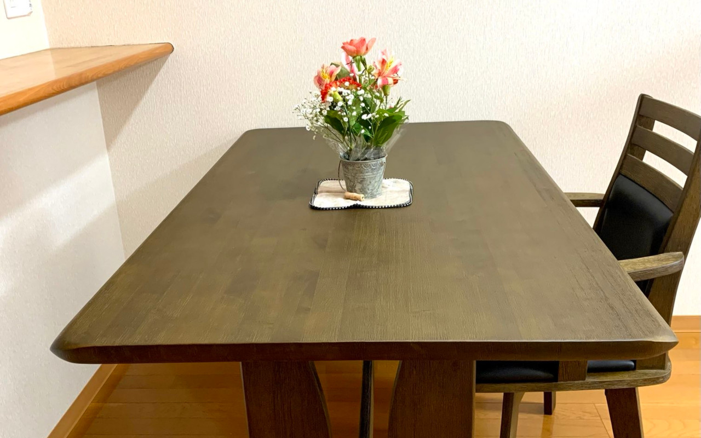

{{}}

自分で自分をミニマリストとは言わないが、物を持たない生活が好きだ。
家には、作業用PCと生活に必要な最低限のものしか置いてこなかった。
恥ずかしながら、これまで家にダイニングテーブルもなく、いつもローテーブルと座布団でご飯を食べていた。
不便はしなかったが、客観的に観て悲しい気持ちになったので、思い切ってダイニングテーブルを買ってみた。
ダイニングテーブルで生活水準が上がるのは、予想の範囲内で驚きはなかった。
しかしその時に一緒に買ったお花で、これまでの考えが少し変わった。

組み立てたテーブルをSNSで報告するために、少しでも映えればと、近所のお花屋さんにお花を買いに行った。
仏花を除いて、お金を払ってお花を買うのは人生初かもしれない。
そして飾った。心の中で何かが満たされた気がした。
500円のフラワーセットだったが、自分の中で物を買わないよう縛り付けていた糸が、ぷっつりと切れた音がした。

生活に必要ないものこそが、生活水準を上げる。
そう感じた春だった。
