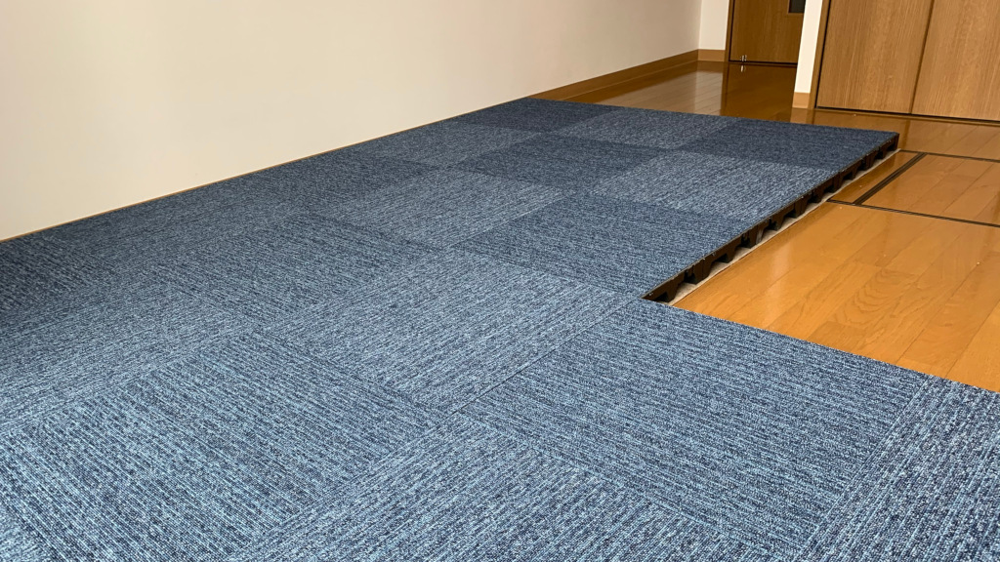

{{}}

部屋をフリーアクセスフロアしました。
オフィスとかで、床から電源ケーブルやネットワークケーブルが生えているあれです。
OAフロアとも呼ばれています。

フリーアクセスフロアは、カーペットの下に数cm〜数十cm浮かせて、その下にケーブルを這わせます。
オフィス用ビルなんかは、標準でフリーアクセスフロアになっていることも多いですが、そうでなくても後からパネルを敷くことでフリーアクセスフロアにすることができます。
今の家に引っ越して、せっかくならばとフリーアクセスフロアにすることにしました。

## 配置設計

まずフリーアクセスフロアの面積と、フロアパネル・タイルカーペットが何枚必要か計算します。
今の家はフリーアクセスフロアを前提にして設計されていないので、全面フリーアクセスにするのは無理でした。
部屋には折戸式のクローゼットであったり、部屋の扉が内開きだったりして、その前には物を置けません。
そして部屋の真ん中に床下収納用のハッチがあり、それを完全に防ぐと機能が失われていまいます。
それらを考慮して、フリーアクセス化する箇所を決めます。

自分はCADソフトを使ったことがないので、使い慣れているBlenderで設計しました。
結果的に以下のような配置にしました。
25mm×25mmのフロアパネル86枚分です。
床下収納のハッチを半分覆っていますが、ここから隣の部屋と床下収納経由で配線するためです。
光コンセントが隣のリビングにあるため、床下からネットワークを引き込みます。




## 下地材

フロアパネルを床に直接敷くと、フローリングを傷つけてしまう恐れがあります。
そのためフロアパネルの下に、パンチカーペットを購入しました。
レッドカーペットや展示場にあるような、薄手のフェルトのようなカーペットです。
これはフロアパネルに合わせてカッティングする必要があり、4m分を購入しました。



## フロアパネル

続いてフロアパネルを敷いていきます。
ネットで中古を探したところ、たまたま車で30分ほどの距離にある中古ショップで取り扱いしているのを見つけました。
なにか運命的な物を感じて、車を借りて買い取りに行きました。
枚数は86枚です。

中古ということで、タイルカーペット接着用の糊が残っていたり、糊にホコリがついていたりとしていました。
そのまま室内には持ち込めないので、ブラシで1枚1枚磨いてホコリを落としました。
上にタイルカーペットを敷いてしまうので、糊はきれいに落としませんでした。
写真のフロアパネルが若干汚れているのはそのためです。



## タイルカーペット

タイルカーペットは、パンチカーペットと一緒に、近くのホームセンターで買いました。
大きさは50mm×50mmを、22枚購入します。
タイルカーペットの配置にも色々あるようで、2色を市松模様にしたり、1色の中にアクセントカラーを置いたりできます。
自分の感覚では納得のいく物を作る自信がなかったので、無難に1色にすることにします。

色はオフィスでありがちな青色です。
仕事部屋は気持ちを切り替えるため、あえて生活感のない色を選びました。
端っこは0.5枚分の幅が必要で、カッターナイフでタイルカーペットを2つに割りました。
意外と簡単に切れて、ちょうど半分に切れると気持ちがいいです。



## まとめ

かかった費用は以下のとおりです。
面積も小さいためか、意外と現実的なコストです。

フロアパネル: 130円 × 86枚 = 11,180円  
パンチカーペット: 1031円/m × 4m = 4,124円  
タイルカーペット: 305円×22円 = 6710円  
合計: 22,014円

## 余談

中古のフロアパネルを1枚130円で購入しましたが、なんと新品がその値段より[安く販売](https://stepline.jp/item/6085.html)してるのを後から知りました。
送料と中古を買いに行く手間を比較するとどっこいどっこいですが、新品だとホコリを落とす作業も無ければ糊も付着してません。
また同サイトで、フロアパネル用の下地材がパンチカーペットより安く変えます。
自分の知識不足や事前調査が足りておらず、ちょっとここは失敗したなという感想です。

とはいえ中古ショップでは1枚単位でフロアパネルが買えるので、欲しくなったらまた行くかもしれません。
