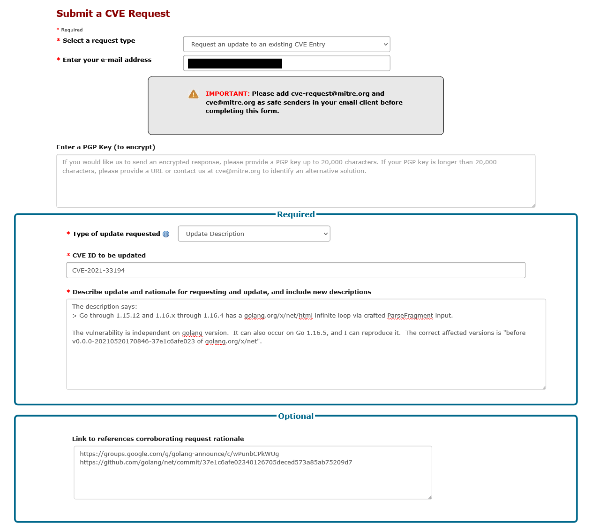
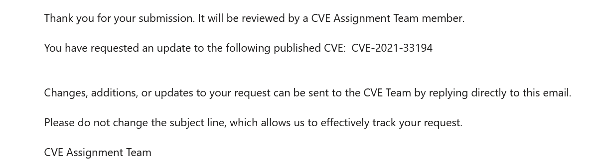
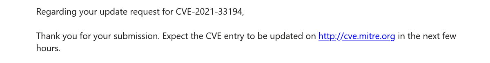

こんにちは、ご無沙汰しています。
本日はCVEにコントリビュートしてみた話をします。

CVE (Common Vulnerabilities and Exposures) は、アメリカの非営利団体であるMITRE社が管理している脆弱性のデータベースです。
先日、CVEの中に誤った情報を発見しました。
CVEは多くの人に参照されるので、いい機会だと思いCVEの修正リクエストを投げてみることにしました。


CVE-2021-33194
--------------

[CVE-2021-33194][]はGoのgolang.org/x/netパッケージに存在していた脆弱性です。
悪意のある文字列をパースさせようとすると、プログラムが無限ループするというものでした。
攻撃者は悪意のある文字列を送信することで、サーバーにDoS攻撃を仕掛けたり、クライアントのプログラムをクラッシュさせることができます。

> **Description**  
> golang.org/x/net before v0.0.0-20210520170846-37e1c6afe023 allows attackers
> to cause a denial of service (infinite loop) via crafted ParseFragment input. 

以前はCVE-2021-33194のDescriptionが以下のように掲載されていました（Internet Archive[2021年5月26日の記録][internetarchive]より）。

> **Description**  
> Go through 1.15.12 and 1.16.x through 1.16.4 has a golang.org/x/net/html
> infinite loop via crafted ParseFragment input. 

この脆弱性はgolang.org/x/net内の不具合なので、Goのバージョンには依存しません。
おそらく、同時期に報告された[CVE-2021-31525][]とDescriptionや影響範囲が似ていることから、間違った情報が掲載されたのだと思われます。
現在は正しいDescriptionが反映されています。

CVEリクエストを送る
-------------------

まずリクエストを送る前に、本当にGoのバージョンに依存しないかを確認しました。
Google Groupの[アナウンス][golang-announce]や[修正パッチ][patch]から、脆弱性の中身や再現手順を確認します。
幸いにも修正パッチには、脆弱性を再現するテストケースに追加されていました。

```go
srcs := []string{
        "<math><html><template><mn><template></template></template>",
        "<math><math><head><mi><template>",
}
```

この文字列を使い該当の脆弱性を手元で再現させて、本当にGoのバージョンが関係ないかを確認しました。

Goのバージョンが関係ないという確証が得られると、次はCVEに対して変更リクエストを送ります。
CVEに関する問い合わせは[CVE Request Web Form][cveform]から送信できるのを知りました。
自分はCVEリクエストの作法は知りませんでしたが、以下のように拙い英語で説明しまいｓた。



フォームの情報を送信すると、指定したメールアドレスにメールが届きます。



そして1日以内に、送ったリクエストが受理されたというメールが届きました。



このメールを受け取った数時間後、自分が送ったCVEの変更リクエストが反映されているのを確認しました。

まとめ
------

自分の中ではセキュリティ界隈は（GitHubの議論より）厳格なものだと思ってたのですが、あっさりと受理してもらえました。
CVEフォームの向こう側にいるのも同じ人間なので、丁寧にリクエストを送ると真摯に対応してもらえます。
今回のケースは決して大きな修正ではないですが、同じ脆弱性を参照する人が正しい情報を参照できれば幸いです。

CVEリクエストを送るのはOSS活動と似ている部分があります。
OSSでも提案やバグ報告をするだけで、立派なコントリビュートです。
CVEも同じで、管理者が気づかないミスや、改善できる点がまだ眠っているかもしれません。
そういった観点で眺めることができると、CVEをより楽しむことができるでしょう。

[CVE-2021-33194]: https://cve.mitre.org/cgi-bin/cvename.cgi?name=CVE-2021-33194
[CVE-2021-31525]: https://cve.mitre.org/cgi-bin/cvename.cgi?name=CVE-2021-31525
[golang-announce]: https://groups.google.com/g/golang-announce/c/wPunbCPkWUg
[patch]: https://github.com/golang/net/commit/37e1c6afe02340126705deced573a85ab75209d7
[internetarchive]: https://web.archive.org/web/20210526160108/https://cve.mitre.org/cgi-bin/cvename.cgi?name=CVE-2021-33194
[cveform]: https://cveform.mitre.org/
