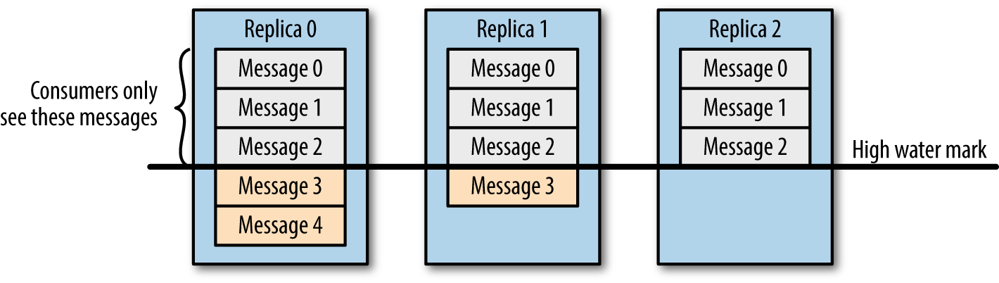

この記事は [Distributed computing Advent Calendar 2017](https://qiita.com/advent-calendar/2017/distributed-computing) 20日目の記事です。

Kafkaのレプリケーションは、高可用性と高信頼性を実現するための、重要な機能の1つです。
この記事では、Kafkaのレプリケーションの仕組みについて紹介します。

レプリケーションの基礎
----------------------

Kafkaのキューの最小単位はパーティションで、レプリケーションもパーティション単位で行われます。
Kafkaのレプリカは、どれか1つが**リーダー**になりなり、それ以外のレプリカは**フォロワー**と呼びます。
Producerの書き込み、およびConsumerの読み込みは、リーダーのみが処理します。
クライアントがリーダー以外のパーティションに対して読み書きを行おうとすると。ブローカーは`NotLeaderForPartition` を返します。
フォロワーはレプリケーションするとき、リーダーからメッセージを取得します。
またリーダーは、フォロワーのレプリケーション状況を把握します。

フォロワーがリーダーに追いついているレプリカを、**in-syncレプリカ (in-sync replica または ISR)** と呼びます。
またリーダーもin-sync replicaです。
in-sync replicaになったレプリカは、ZooKeeper内に記録され、クラスタ内でその状態が共有されます。
実際には若干リーダーとフォロワーには若干の遅延が許され、その遅延量は `replica.lag.time.max.ms` で設定できます。

メッセージがKafkaに保存されるまで
---------------------------------

ProducerがKafkaに書き込んだデータは、Consumerはすぐに読み込めるというわけではありません。
もしそれが可能なら、Consumer間で処理するデータの一貫性が失われるからです。

Kafkaのキューには**high-water mark**という概念があります。
high water markは「ここまではデータが保証されている」という印で、Consumerはhigh water markまでのデータのみ取得できます。
Producer書き込み時に、全てのin-sync replicaがメッセージを受け取ると、igh water markが進みます。
そのとき存在が全てのin-sync replicaが書き込めたメッセージは**コミット**された、とよびます（オフセットのコミットとは異なるので注意）。

  

  Consumerはin-sync replicaに保存されたデータのみ取得できる (Kafka: The Definitive Guideより)

仮にConsumerがhigh-water mark以降のデータを取得できたとします。
あるConsumer *C*が図中のreplica 0のMessage 4を取得できます。
その後Replica 0を持つBrokerがクラッシュしてデータが失われたとします。
するとMessage 4が永久に失われ、結果として*C*と他のConsumerで取得できるメッセージで不整合が生じます。
Kafkaはhigh-water markまでのメッセージを読み込めるようにすることで、Consumer間の一貫性を保ちます。

ここで、あるレプリカのフォロワーが、ネットワーク遅延でin-sync replicaで無くなった状況を考えます。
high-water markの定義に従うと、全てのin-sync replicaとはリーダーのみで、この時点でリーダーがメッセージを受け取るとコミットされます。
これは正しい動作ですが、そのメッセージを持つのはリーダーのみなので、信頼性を保証できません。
これを防ぐために、ブローカーに **minimum in-sync replica** を設定します。

ブローカーの設定 `min.insync.replicas` は、書き込みするin-sync replicaの数を指定できます。
たとえば `min.insync.replicas=2` に設定すると、`in-sync replica` が最低限2つ存在することを要求するので、in-sync replicaがリーダーのみの場合メッセージを書き込めません。
このときbrokerはProducerに `NotEnoughReplicas` を返します。

acks
----

上記の話は、Producerは全てのin-sync replicaがメッセージを受け取るまで待ちます。
この挙動は、 これはProducerの設定の `acks` で変更可能です。

`acks=all` が設定されていると、Producerは全ての in-sync replicaにメッセージが書かれるまで待ちます。
そして、仮にin-sync replicaの数が `min.insync.replicas` に満たない時、Producerはデータを書き込むことができません。

`acks=1` は、リーダーのみに書き込まれた時点で、Producerにackを返します。
このとき、in-sync replicaの数が `min.insync.replicas` より少なくても、Producerはメッセージを書き込まれたものとして扱います。
またリーダーのみがメッセージを持っている状態でクラッシュすると、データを失う可能性があります。

`acks=0` は、Producerのソケットバッファに追加されると、Producerは送信したとみなします。
これは非常にスループットは高いですが、信頼性は低いので使うことをおすすめしません。
たとえば送り先がリーダーじゃない場合でも、Producerはネットワークに書き込みをした時点で送信できたことになるので、データを失う可能性が非常に高いです。

ブローカー死亡時の復帰処理
--------------------------

Kafkaはブローカーは耐故障性と可用性のためにレプリケーションします。
Kafkaは他の分散システムのように、ブローカー死亡時したとき、別のノードに最レプリケーションは行われません。
ブローカーが死亡したとしても、レプリカの配置情報は、ZooKeeperに残り続けます。
なのでBrokerが復帰した時、続きをリーダーから取得すれば良いので、高速にクラスタを復帰できます。
リーダーが死亡すると、残った別のin-sync replicaから、新たなノードが再選出されます。

高信頼性のために
----------------

以上の設定は、Kafkaの信頼性や可用性を担保するために必要なパラメータです。
システムの目的により、 これらのパラメータの値を調整する必要があります。
また信頼性や可用性は、 リソースのキャパシティやスループットとトレードオフの関係にあります。
たとえばレプリカ数を増やすと、耐故障性は向上しますが、必要なディスク容量も増えます。

たとえば、Kafka Documentの[A Production Server Config](https://kafka.apache.org/documentation/#prodconfig) には、
例として `min.insync.replicas=2` `default.replication.factor=3` が設定されてます。
これで、可用性とデータ損失については1ノードの故障まで耐えれます。データ損失に対しては2ノードまでの故障に耐えれます。

Kafkaではメッセージがコミットされるタイミングは、ディスクに書かれたタイミングではないです。
なのでシビアなタイミングでクラッシュするとデータが消える恐れがあります。
より信頼性を高めたい場合は、`flush.ms`, `flush.messages` を設定することで、fsynの間隔を設定できます。

参考文献
--------

- [Kafka: The Definitive Guide - O'Reilly Media](http://shop.oreilly.com/product/0636920044123.do)
- [Apache Kafka Documentation](https://kafka.apache.org/documentation/)
- [Kafka Replication - Apache Kafka](https://cwiki.apache.org/confluence/display/KAFKA/Kafka+Replication)
