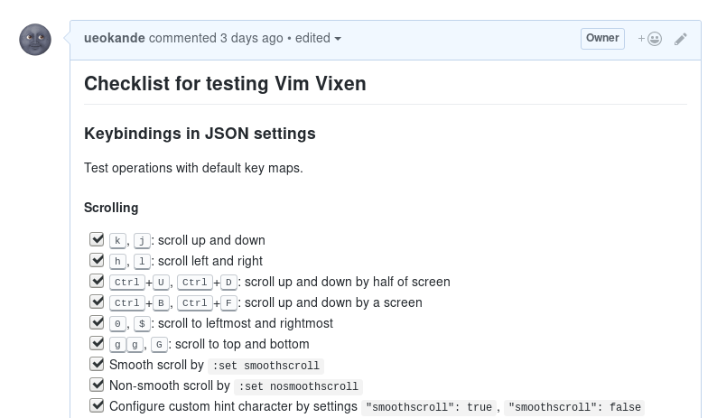

昨日Vim Vixen 0.10をリリースしました。
おかげさまでVim Vixenのユーザ数も8,000人に届こうとしてます。

このVim Vixen 0.10では、クリップボードからURLを開く、Inputにフォーカスするなど、新たに4つのキーマップが新たに加わりました。
またプロパティという仕組みを追加し、スムーズスクロールと、ヒントのカスタムキーマップを設定できるようになりました。
詳しくはリリースノートをご覧ください。  
[Vim Vixen – Add-ons for Firefox](https://addons.mozilla.org/en-US/firefox/addon/vim-vixen/versions/)

この記事ではVim Vixenの開発について紹介します。
Vim VixenはGitHub上で開発していおり、IssueやPull Requestは大歓迎です。

![github][ueokande/vim-vixen]

## 開発環境

Firefox Add-onはJavaScriptで記述します。
現在はサポートしている動作環境はFirefoxのみで、ある意味安心してJavaScriptを記述できます。
JavaScriptはES2015で書いて、webpack + Babelでビルドして1つのファイルに結合します。

全体の設計方針として、状態管理で消耗したくないと思い、Reduxを元にしたフレームワークを作りました。
content scriptやbackground scriptごとにActionやReducerを定義して、content scriptとbackground scriptの間を非同期メッセージでやり取りします。
オプション画面はReact互換の軽量フレームワーク[Preact](https://github.com/developit/preact)を使っており、よくあるReact/Reduxのように設計しました。

コードは最初からキレイに書くことに気をつけており、プロジェクト初期からeslintを導入してCIでチェックしてます。
テストも同じくプロジェクトの初期段階から書くようにしてます。
ユニットテストをmochaで記述しており、テストランナーにKarmaを使ってFirefox上でテストします。
上記のようにRedux風の設計をしてるため、ActionやReducer単位でテストを記述することができます。

## バージョニング

Vim Vixenのバージョン番号はシンプルに、0.XXXという連番をつけてます。
メジャーバージョンやマイナーバージョンのように、複数のバージョン番号をを管理するのは、自分もユーザも疲れます。
バックポートが無くバージョン番号が単調増加というのも理由の1つです。

明確に区別はしてませんが、**大きなバージョンアップと小さなバージョンアップを交互に行ってます**。
偶数番のバージョンは細かなバグフィックスや改善が中心で、新たな機能追加やドラスティックな変更は、奇数番のバージョンアップで行います。
（しかし先日、バージョン0.9で破損したパッケージを配信してしまい0.10で修正したので、奇数番と偶数番が入れ替わってしまいました。）
この方針は不具合の原因の特定しやすくする目的があります。
また明確なバグフィックス・改善を目的としたリリースを行うことで、集中してコードの品質を上げることができます。
とはいえあくまで自分の中の方針なので例外はあります。
どちらにせよバージョン番号は単調増加なので、ユーザにはさほど影響はありません。

どの機能をリリースに盛り込むかは基本的に直感ですが、小さな修正はすぐに取り込むことが多いですし、issuesで要望が多い物を優先に取り込んだりします。
またスペルミスなどの些細な変更は、どのバージョンであっても即取り込む事が多いです。

## 下位互換に気をつける

各リリースで何より気をつけてることは、**下位互換を保つ**ことです。
基本的にユーザの操作が変わるような変更は入れません。
しかしそれ以上の大きな理由として、Firefox Add-onの配信方式にあります。

Firefox Add-onに限らず、Chrome Extensionなどのブラウザ拡張は、データは開発者がユーザの届かないローカルに保存されます。
またこれらのブラウザ拡張では、自動アップデートが有効になってます。
つまり設定を破棄したり、古い設定が使えなくなるなどの変更が入ると、急にブラウザ拡張が動作しなくなったということがありえます。
ブラウザ拡張は、使える言語こそWeb技術で成熟したJavaScriptで記述できますが、配信方式はどちらかというとモバイルアプリに近いです。
そのためリリース時はいつも緊張します。

## 試験

Vim Vixenではユニットテストを努力して書いてますが、Karma上で完全なWebExtensionsをテストするのは難しいため、テストカバレッジは高くないです。
そして各リリース前には**フルリグレッションテスト**を毎回行ってます。
もちろん自動化もできてないので、温かみある手動テストです。

テスト項目はプロジェクト直下の[`QA.md`](https://github.com/ueokande/vim-vixen/blob/master/QA.md)で管理しており、GitHub flaved Markdownで記述してます。
リリース前に追加される機能や変更点を確認し、試験設計をして新たな機能が増えたら試験項目も増やします。
とはいえコーナーケースを突いた試験まで毎回実施するのは辛いので、正常系のテストがほとんどです。

GitHub flaved Markdownでチェックリストが使えるので、リリースごとに[試験のPull Request](https://github.com/ueokande/vim-vixen/pull/314)を作って、本文に試験項目を貼ります。
そのPull Request上で試験をして、問題があれば修正をして、全ての試験がパスすればPull Requestをマージします。

## Vim Vixenのこれから

Vim Vixenはこれからも、新しい機能をどんどん実装する予定です。
Issueも100個以上溜まっており、多くの機能の要望が溜まってます。

しかし今一番実装したいのは、E2Eテストの自動化です。
先程述べたとおりリリース毎に毎回100を超えるテストケースを手で実施するのは辛いです。
自動で実施するようにしてCIでチェックすることで、バグの早期発見と安心感を得たいです。

またMozillaがブラウザ上でWebExtensionsをテストする方法を公開してるので、それを元にいまテストできてない部分もテストしてゆきたいと思ってます。

![github][mdn/webextensions-examples]
