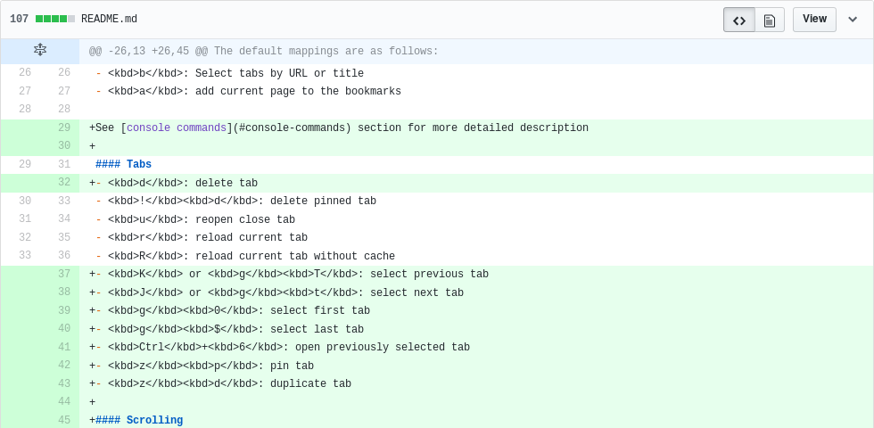

先日、Vim VixenでREADME修正のPull Req.をいただきました。

- [#418 Update README.md](https://github.com/ueokande/vim-vixen/pull/418)

あまりにも嬉しくて勢いで記事を書きました。

## ドキュメントのメンテナンスは面倒くさい、なのでドキュメントの修正は嬉しい

ドキュメントのメンテナンスはソースコード以上に面倒です。
個人プロジェクトなんかは、作ってる本人は仕様が頭に入ってるので、文章が無くなったら引き継ぎができないなんてことはありません。
READMEが無くとも自分は全く困ってなかったので、これまでもメンテナンスは手を抜いてました。
さらに母国語でないと慣れば、なおのことメンテナンスは面倒です。

これは個人じゃないプロジェクトでも共通することだと思っています。
ドキュメント専門のチームが、ユーザーマニュアルをメンテし続けているのなら話は別ですが、開発者向けのツールなんかは、実装したプログラマが同時にドキュメントを書くことが多いです。

個人プロジェクトにせよ、団体や企業が抱えるプロジェクトにせよ、ドキュメントのメンテナンスコストはソースコード以上に高いです。
例えばGetting starttedやTutorialなどは、その手順が正しいかを毎回検証するのはとても手間です。
正直プログラマの自分はやりたくないです。
そしてドキュメントは、ソースコードのように自動化がしにくい部分もあって、そのへんを継続的にチェックするのも難しいです。

## オープンソース活動はドキュメントから始められる

オープンソース活動はドキュメントから始めることができます。
他人のプロジェクトにパッチを送るのは敷居が高く感じるかも知れませんが、ドキュメントの修正も立派なオープンソース活動です。
そして上記の理由で、ドキュメントのメンテナンスコストはとても高く、好んで行われるものではないです。
そのためドキュメントの修正は、とても歓迎されます。
チュートリアルで不明な点や説明が足りてない部分があれば「オレがわからないんだからこのドキュメントは情報が不足している」くらいのスタンスでPull Req.を投げても全然構いません。

オープンソースに貢献したいけど、敷居が高いと感じる人は、まずはドキュメントの修正から始めてみてはいかがでしょうか？

