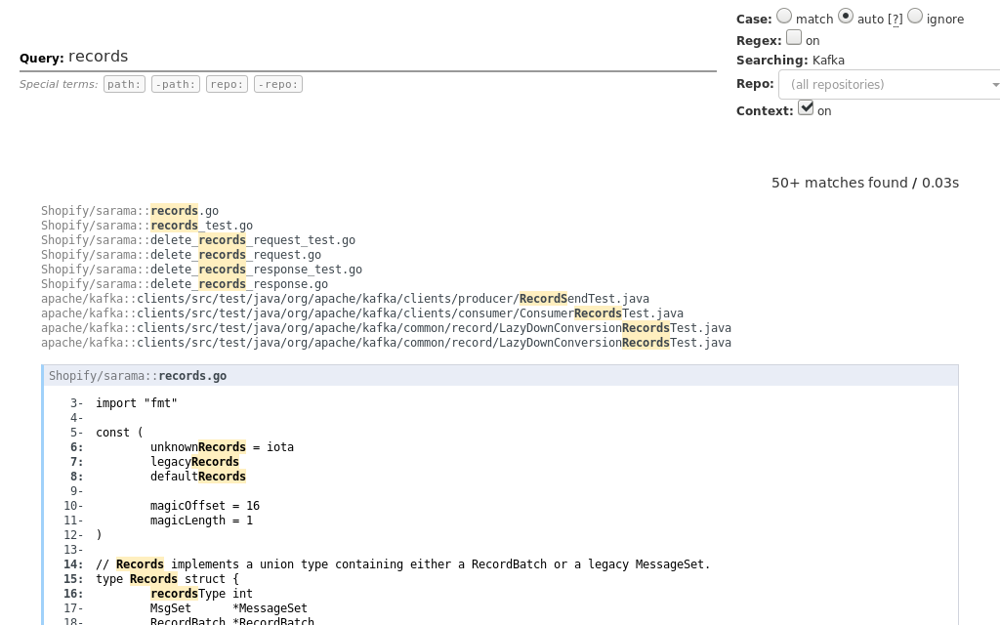

DigitalOcean TIDE NYC 2018のセッションをなんとなく眺めていたら、「Livegrep」というソースコード検索ツールが紹介されました。
面白そうだったので、手元にも構築してみました。



Livegrepとは
------------

Livegrepとはソースコード検索ツールです。
Livegrepの使用感は公式ページにアクセスすればわかります。
以下のリンクから、Linuxのカーネルを対象に検索できます。

- [livegrep.com/search/linux](https://livegrep.com/search/linux)

Livegrepはリアルタイムのソースコード検索ツールです。
GitHub上でも全文検索できますが、Livegrepはファイルシステムに対して検索します。
そのためGitHub以外のソースコードや、バージョン管理されてないコードも検索の対象にできます。
またGitHubの全文検索と違い、ユーザー所望のいくつかのレポジトリを対象にもできます。

Livegrepの構築
--------------

ソースコードは [GitHubレポジトリ](https://github.com/livegrep/livegrep) から取得可能ですが、Docker Hubにも公開されてるのでそちらを利用します。

Livegrepは `codesearch` と呼ばれる検索エンジンと、`livegrep` と呼ばれるWebインターフェイスから構成されます。
2つのコンポーネントはgRPCで通信します。
`codesearch` はソースコードからインデックスをオンメモリに作成してgRPCを提供します。
またはあらかじめ作成したインデックスファイルをロードすることもできます。
今回は後者の方法でLivegrepを構築します。

以下のような構成でLivegrepを構築します。


`codesearch` は2回利用します。
1度目がソースコードからインデックスファイルを作るためです。
2度目は生成したインデックスをロードしてgRPCを提供します。
インデックスは `LivegrepIndex` というdocker volumeに保存します。

### Volumeの作成

まずはdocker volumeを作成します。

```console
$ docker volume create --name LivegrepRepos
$ docker volume create --name LivegrepIndex
```

### ソースコードの取得

`LivegrepRepos` ボリュームにソースコードを保存します。
`LivegrepRepos` を `/mnt/livegrep-repos` にマウントして、そこにレポジトリを `git clone` します。
`alpine/git` コンテナを使って `git clone` します。
今回は自分の好きな[Kafka][]と[sarama][]のコードを取得します。


```console
$ docker run --rm --read-only \
    -v LivegrepRepos:/mnt/livegrep-repos:rw \
    alpine/git clone https://github.com/apache/kafka /mnt/livegrep-repos/github.com/apache/kafka
Cloning into '/mnt/livegrep-repos/github.com/apache/kafka'...
$ docker run --rm --read-only \
    -v LivegrepRepos:/mnt/livegrep-repos:rw \
    alpine/git clone https://github.com/Shopify/sarama /mnt/livegrep-repos/github.com/Shopify/sarama
Cloning into '/mnt/livegrep-repos/github.com/Shopify/sarama'...
```

### インデックスの作成

取得したソースコードからインデックスファイルを出力します。
まずはどのソースコードを読むかをjsonファイルで記述します。
このファイルを `manifest.json` という名前で適当な場所に保存します。

```json
{
  "name": "Kafka",
  "fs_paths": [
    {
      "name": "Shopify/sarama",
      "path": "/mnt/livegrep-repos/github.com/Shopify/sarama",
      "metadata": {
        "url-pattern": "https://github.com/{name}/blob/HEAD/{path}#L{lno}"
      }
    },
    {
      "name": "apache/kafka",
      "path": "/mnt/livegrep-repos/github.com/apache/kafka",
      "metadata": {
        "url-pattern": "https://github.com/{name}/blob/HEAD/{path}#L{lno}"
      }
    }
  ]
}
```

`fs_paths` はファイルシステムからソースコードを読み込みます。
`url-pattern` でクリックしたときのリンク先を指定できて、 `{name}` などのプレースホルダーでURLを組み立てることができます。
`fs_paths` 以外にも `repositories` フィールドも利用できるようです。
詳しくは[設定例][example] を参照してください（ただしドキュメントの情報量は極めて少ないです）。


つぎに取得したソースコードからインデックスを作成します。
`LivegrepRepos` を `/mnt/livegrep-repos` に、`LivegrepIndex` を `/mnt/livegrep-index` にマウントします。
そして先程のjsonを `/mnt/manifest.json` にマウントします。
インデックスの出力先は `/mnt/livegrep-index/kafka.idx` です。

```console
$ docker run --rm --read-only \
    -v LivegrepRepos:/mnt/livegrep-repos:ro \
    -v LivegrepIndex:/mnt/livegrep-index:rw \
    -v /path/to/manifest.json:/mnt/manifest.json:ro \
    livegrep/base:ac5078ceb8-0 /livegrep/bin/codesearch \
      -index_only -dump_index /mnt/livegrep-index/kafka.idx /mnt/manifest.json
Walking path_spec name=Shopify/sarama, path=/mnt/livegrep-repos/github.com/Shopify/sarama
  walking full tree
done
Walking path_spec name=apache/kafka, path=/mnt/livegrep-repos/github.com/apache/kafka
  walking full tree
done
Finalizing...
......
== end metrics ==
```

### サーバーを起動する。

ここまでで準備が整いました。
あとはサーバーを起動するだけです。

まずは作成したインデックスをロードして、gRPCを提供します。
先程のインデックスをコンテナにマウントして、 `codesearch` プロセスを起動します。
これでコンテナの `0.0.0.0:9999` にgRPCで公開されました。

```console
$ docker run --read-only --name=codesearch --hostname=codesearch \
    -v LivegrepIndex:/mnt/livegrep-index:ro \
    livegrep/base:ac5078ceb8-0 /livegrep/bin/codesearch -load_index /mnt/livegrep-index/kafka.idx -grpc 0.0.0.0:9999
```

つづいてWebインターフェイスの起動です。
こちらは `livegrep` という実行ファイルです。
まずは設定ファイルを記述します。
`"backends"` はバックエンドの`codesearch` サーバーです。
`codesearch` コンテナが名前解決ができるように、`livegrep` コンテナ起動時に `--link` オプションを付与します。

```json
{
  "backends": [
    {
      "id": "kafka",
      "addr": "codesearch:9999"
    }
  ],
  "listen": "0.0.0.0:8910"
}
```

設定がかけたら `livegrep.json` という名前で保存します。

最後に `livegrep` 本体を起動します。
記述した設定ファイルは `/etc/livegrep/livegrep.json` にマウントします。

```console
$ docker run --read-only --name=livegrep --hostname=livegrep --link codesearch -p 8910:8910\
    -v /path/to/livegrep.json:/etc/livegrep/livegrep.json:ro \
    livegrep/base:ac5078ceb8-0 /livegrep/bin/livegrep -docroot /livegrep/web/ /etc/livegrep/livegrep.json
```

これでブラウザから `http://localhost:8910` を開くと、Kafkaとsaramaのコードを検索できるようになりました。

まとめ
------

今回は一度きりのインデックス更新でしたが、ポーリングなどでリモートレポジトリに追従すると、より新しいコードを検索できるようになります。
もし読者がレポジトリの管理者なら、CIなどで更新することも可能でしょう。

Livegrepは良いツールだとは思うのですが。日本語の記事も英語の記事も全然見つかりませんでした。
なのでこの記事が読者の役に立てば幸いです。

今回は全手動でdockerコマンドを叩いてLivegrepを構築しましたが、公式サイトのlivegrep.comはKubernetsでデプロイされてるようです。

![github][livegrep/livegrep.com]

[example]: https://github.com/livegrep/livegrep/blob/master/doc/examples/livegrep/index.json
[Kafka]: https://github.com/apache/kafka
[sarama]: https://github.com/Shopify/sarama
